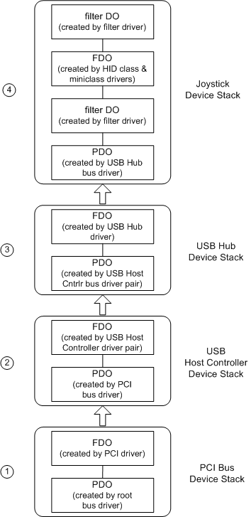
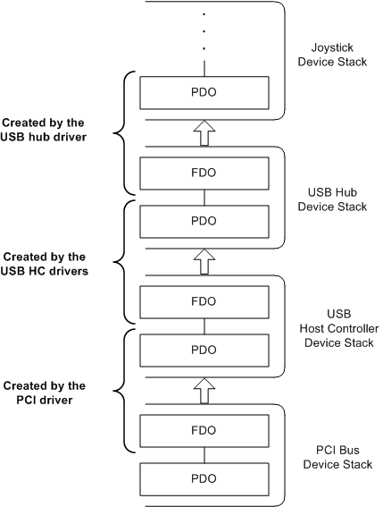

# Example WDM Device Stack

## 

This section describes the device objects created by a possible set of drivers for USB hardware to illustrate WDM device objects and how they are layered.

The following figure shows the device objects that are created by the sample drivers described in [WDM Driver Layers: An Example](wdm-driver-layers---an-example.md).

Starting at the bottom of this figure, the device objects in the sample device stacks include:

1.  A PDO and an FDO for the PCI bus.

    The root bus driver enumerates the internal system bus (the root bus) and creates a PDO for each device it finds. One of these PDOs is for the PCI bus. (The PDO and FDO for the root bus are not shown in the figure.)

    The PnP manager identifies the PCI driver as the function driver for the PCI bus, loads the driver (if it is not already loaded), and passes the PDO to the PCI driver. In its [*AddDevice*](https://msdn.microsoft.com/library/windows/hardware/ff540521) routine, the PCI driver creates an FDO for the PCI bus ([**IoCreateDevice**](https://msdn.microsoft.com/library/windows/hardware/ff548397)) and attaches the FDO to the device stack ([**IoAttachDeviceToDeviceStack**](https://msdn.microsoft.com/library/windows/hardware/ff548300)) for the PCI bus. The PCI driver creates and attaches this FDO as part of its responsibilities as the function driver for the PCI bus.

    There are no filter drivers for the PCI bus in this example.

2.  A PDO and an FDO for the USB host controller.

    The PnP manager directs the PCI driver to start its device ([**IRP\_MN\_START\_DEVICE**](https://msdn.microsoft.com/library/windows/hardware/ff551749)) and then queries the PCI driver for its children ([**IRP\_MN\_QUERY\_DEVICE\_RELATIONS**](https://msdn.microsoft.com/library/windows/hardware/ff551670) with relation type of **BusRelations**). In response, the PCI driver enumerates the devices on its bus. In this example, the PCI driver finds a USB host controller and creates a PDO for that device. The wide arrow in the figure indicates that the USB host controller is a "child" of the PCI bus. The PCI driver creates PDOs for its child devices as part of its responsibilities as the bus driver for the PCI bus.

    The PnP manager identifies the USB host controller miniclass/class driver pair as the function driver for the USB host controller and loads the driver pair. The PnP manager calls the driver pair at the appropriate time to create and attach an FDO for the USB host controller.

    There are no filter drivers for the USB host controller in this example.

3.  A PDO and an FDO for the USB hub.

    The USB host controller enumerates its bus, locates the USB hub in the sole port, and creates a PDO for the hub. The USB hub driver creates and attaches an FDO for the hub.

    There are no filter drivers for the USB hub in this example.

4.  A PDO, an FDO, and two filter DOs for the joystick device.

    The USB hub driver enumerates its bus, locates a HID device (the joystick), and creates a PDO for the joystick.

    In this example, a lower-level filter driver has been set up in the registry for joystick devices, so the PnP manager loads the filter driver. The filter driver determines that it is relevant to the device and creates and attaches a filter DO to the device stack.

    The PnP manager determines that the function driver for the joystick device is the HID class/miniclass driver pair and loads those drivers. The driver pair consists of a miniclass driver linked to a class driver DLL; together they act as one function driver for the device. The class/miniclass driver pair creates one device object, the FDO, and attaches it to the device stack.

    An upper-level filter driver creates and attaches a filter DO to the device stack, in a manner similar to the lower-level filter.

Note that the PDO created by the parent bus driver is always at the bottom of the device stack for a particular device. When drivers handle PnP or power IRPs, they must pass each IRP all the way down the device stack to the PDO and its associated bus driver.

The following figure shows the same device stacks as the previous figure, but emphasizes which device objects are created and managed by which drivers.

A bus driver spans more than one device stack. A bus driver creates the FDO for its bus adapter/controller and creates a PDO for each of its child devices.

 

 

--------------------
[Send comments about this topic to Microsoft](mailto:wsddocfb@microsoft.com?subject=Documentation%20feedback%20%5Bkernel\kernel%5D:%20Example%20WDM%20Device%20Stack%20%20RELEASE:%20%286/14/2017%29&body=%0A%0APRIVACY%20STATEMENT%0A%0AWe%20use%20your%20feedback%20to%20improve%20the%20documentation.%20We%20don't%20use%20your%20email%20address%20for%20any%20other%20purpose,%20and%20we'll%20remove%20your%20email%20address%20from%20our%20system%20after%20the%20issue%20that%20you're%20reporting%20is%20fixed.%20While%20we're%20working%20to%20fix%20this%20issue,%20we%20might%20send%20you%20an%20email%20message%20to%20ask%20for%20more%20info.%20Later,%20we%20might%20also%20send%20you%20an%20email%20message%20to%20let%20you%20know%20that%20we've%20addressed%20your%20feedback.%0A%0AFor%20more%20info%20about%20Microsoft's%20privacy%20policy,%20see%20http://privacy.microsoft.com/default.aspx. "Send comments about this topic to Microsoft")

