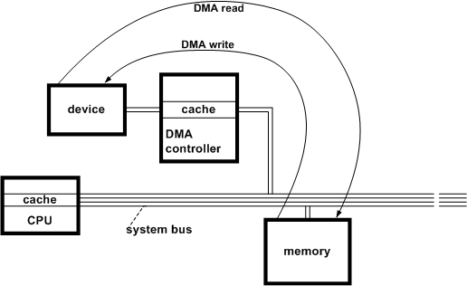

# Flushing Cached Data during DMA Operations

In some platforms, the processor and system DMA controller (or bus-master DMA adapters) exhibit cache coherency anomalies. The following guidelines enable drivers that use version 1 or 2 of the DMA operations interface (see [**DMA\_OPERATIONS**](https://msdn.microsoft.com/library/windows/hardware/ff544071)) to maintain coherent cache states across all supported processor architectures, including architectures that do not contain hardware to automatically enforce cache coherency.

**Note**  The guidelines in this topic apply only to drivers that use versions 1 and 2 of the DMA operations interface. Drivers that use version 3 of this interface must follow a different set of guidelines. For more information, see [Version 3 of the DMA Operations Interface](version-3-of-the-dma-operations-interface.md).

 

**To maintain data integrity during DMA operations, lowest-level drivers must follow these guidelines**

1.  Call [**KeFlushIoBuffers**](https://msdn.microsoft.com/library/windows/hardware/ff552041) before beginning a transfer operation to maintain consistency between data that might be cached in the processor and the data in memory.

    If a driver calls [**AllocateCommonBuffer**](https://msdn.microsoft.com/library/windows/hardware/ff540575) with the *CacheEnabled* parameter set to **TRUE**, the driver must call **KeFlushIoBuffers** before beginning a transfer operation to/from its buffer.

2.  Call [**FlushAdapterBuffers**](https://msdn.microsoft.com/library/windows/hardware/ff545917) at the end of each device transfer operation to be sure any remainder bytes in the system DMA controller's buffers have been written into memory or to the subordinate device.

    Or, call **FlushAdapterBuffers** at the end of each transfer operation for a given IRP to be sure all data has been read into system memory or written out to a bus-master DMA device.

The following figure shows why it is important to flush the processor cache before a read or write operation using DMA if the host processor and DMA controller do not automatically maintain cache coherency.

An asynchronous DMA read or write operation accesses data in memory, not in the processor cache. Unless this cache has been flushed by calling **KeFlushIoBuffers** just before a read, the data transferred into system memory by the DMA operation could be overwritten with stale data if the processor cache is flushed later. Unless the processor cache has been flushed by calling **KeFlushIoBuffers** just before a write, the data in this cache might be more up-to-date than the copy in memory.

**KeFlushIoBuffers** does nothing if the processor and DMA controller can be relied on to maintain cache coherency, so calls to this support routine have almost no overhead in such a platform.

As also shown in the previous figure, DMA controllers, which are represented by adapter objects, can have internal buffers. Such a DMA controller can transfer cached data in fixed-size chunks, usually eight or more bytes at a time. Moreover, these DMA controllers can wait until their internal buffers are full before each transfer operation.

Consider the case of a lowest-level driver that uses subordinate DMA to read data in variable-sized chunks or in fixed-size chunks that are not an integral multiple of a system DMA controller's cache size. Unless this driver calls **FlushAdapterBuffers** at the end of each device transfer, it cannot be sure when every byte the driver requested actually will be transferred.

The driver of a bus-master DMA device also should call **FlushAdapterBuffers** at the end of each transfer operation for an IRP to be sure that all data has been transferred into system memory or out to the device.

**FlushAdapterBuffers** returns a Boolean, value that indicates whether the requested flush operation was successful. A driver can use this value to determine how to set the I/O status block when completing an IRP for a DMA read or write operation.

 

 

