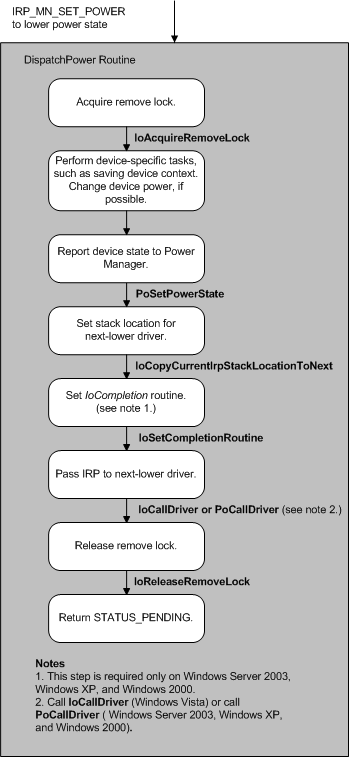

# Handling Device Power-Down IRPs

A device power-down IRP specifies the minor function code [**IRP\_MN\_SET\_POWER**](https://msdn.microsoft.com/library/windows/hardware/ff551744) and a device power state (**PowerDeviceD0**, **PowerDeviceD1**, **PowerDeviceD2**, or **PowerDeviceD3**) that is less-powered or equal to the current device power state. Drivers must handle the power-down IRP as the IRP travels down the device stack. Higher-level drivers must handle the IRP before lower-level drivers. Drivers that have no device-specific tasks to perform should promptly pass the IRP to the next-lower driver.

The following figure shows the steps involved in handling such an IRP.

If the IRP specifies **PowerDeviceD3**, the function driver should typically perform the following tasks:

-   Call [**IoAcquireRemoveLock**](https://msdn.microsoft.com/library/windows/hardware/ff548204), passing the current IRP, to ensure that the driver does not receive a PnP [**IRP\_MN\_REMOVE\_DEVICE**](https://msdn.microsoft.com/library/windows/hardware/ff551738) request while handling the power IRP.

    If **IoAcquireRemoveLock** returns a failure status, the driver should not continue processing the IRP. Instead, beginning with Windows Vista, the driver should call [**IoCompleteRequest**](https://msdn.microsoft.com/library/windows/hardware/ff548343) to complete the IRP and then return the failure status. In Windows Server 2003, Windows XP, and Windows 2000, the driver should call **IoCompleteRequest** to complete the IRP, then call [**PoStartNextPowerIrp**](https://msdn.microsoft.com/library/windows/hardware/ff559776) to start the next power IRP, and then return the failure status.

-   Perform any device-specific tasks that must be done before device power is removed, such as closing the device, completing or flushing any pending I/O, disabling interrupts, [queuing subsequent incoming IRPs](queuing-i-o-requests-while-a-device-is-sleeping.md), and saving device context from which to restore or reinitialize the device.

    The driver should not cause a long delay (for example, a delay that a user might find unreasonable for this type of device) while handling the IRP.

    The driver should queue any incoming I/O requests until the device has returned to the working state.

-   Possibly check the value at **Parameters.Power.ShutdownType**. If a system set-power IRP is active, the **ShutdownType** provides information about the system IRP. For more information about this value, see [System Power Actions](system-power-actions.md).

    Drivers of devices on the hibernate path must inspect this value. If the **ShutdownType** is **PowerActionHibernate**, the driver should save any context required to restore the device but should not power down the device.

-   Change the physical power state of the device if the driver is capable of doing so and if the change is appropriate.

-   Call [**PoSetPowerState**](https://msdn.microsoft.com/library/windows/hardware/ff559765) to notify the power manager of the new device power state.

-   Call [**IoCopyCurrentIrpStackLocationToNext**](https://msdn.microsoft.com/library/windows/hardware/ff548387) to set up the stack location for the next-lower driver.

-   Set an *IoCompletion* routine that calls [**PoStartNextPowerIrp**](https://msdn.microsoft.com/library/windows/hardware/ff559776) that indicates that the driver is ready to handle the next power IRP. This step is not required in Windows 7 and Windows Vista.

-   Call [**IoCallDriver**](https://msdn.microsoft.com/library/windows/hardware/ff548336) (in Windows 7 and Windows Vista) or call [**PoCallDriver**](https://msdn.microsoft.com/library/windows/hardware/ff559654) (in Windows Server 2003, Windows XP, and Windows 2000) to pass the IRP to the next-lower driver. The IRP must be passed all the way down to the bus driver, which completes the IRP.

-   Call [**IoReleaseRemoveLock**](https://msdn.microsoft.com/library/windows/hardware/ff549560) to release the previously acquired lock.

-   Return STATUS\_PENDING.

Drivers must save any device context information and set the new power state before forwarding the IRP. The context information should contain, at minimum, the requested new power state. It should also include any additional information the driver will need upon power-up. After the IRP has been completed and the device has been powered off, the driver can no longer access the device and device context is not available.

Each driver must pass the IRP to the next-lower driver. When the IRP reaches the bus driver, the bus driver powers off the device (if it is capable of this), calls [**PoSetPowerState**](https://msdn.microsoft.com/library/windows/hardware/ff559765) to inform the power manager, and completes the IRP.

However, if the bus driver services the hibernation device, it should check whether the value of **ShutdownType** in the IRP is PowerSystemHibernate. If so, the bus driver should call **PoSetPowerState** to report PowerDeviceD3 but should not power down the device. The device will power down after the hibernate file is saved, along with the rest of the system.

After all of its child devices power down, a bus driver might choose to power down its bus also. Such behavior is device-dependent.

If the IRP specifies any other state (D0, D1 or D2), required driver actions are device-dependent. Typically, devices that support these states can quickly return to the working state when an I/O request arrives. A driver for such a device must complete any pending I/O requests, queue any new requests, and save all necessary context before forwarding the IRP to the next-lower driver. When the IRP reaches the bus driver, it sets the hardware in the requested state. A driver cannot access the device while it is asleep.

Under some circumstances, a function or filter driver might receive a device power IRP specifying PowerDeviceD0 when the device is already in the D0 state. The driver should handle this IRP as it would any other set-power IRP: complete pending I/O requests, queue incoming I/O requests, set an [*IoCompletion*](https://msdn.microsoft.com/library/windows/hardware/ff548354) routine, and pass the IRP down to the next-lower driver. A driver must not, however, change the device's hardware settings. When the bus driver receives the IRP, it should simply complete the IRP. When the IRP completes, function and filter drivers can handle any queued requests. Queuing I/O until the IRP completes eliminates any possibility of lower drivers attempting to change device registers while a higher driver attempts I/O.

 

 

