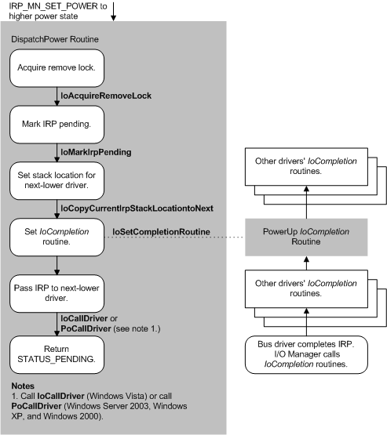

# Handling Device Power-Up IRPs

Device power-up IRPs specify [**IRP\_MN\_SET\_POWER**](./irp-mn-set-power.md) and a device power state that requires more power than the current device power state. Typically, a power-up IRP specifies the device working state **PowerDeviceD0**.

Requests to power up a device must be handled first by the underlying bus driver for the device, and then by each successive driver going back up the stack.

The following figure shows the steps involved in handling a power-up IRP.

When handling an **IRP\_MN\_SET\_POWER** request for power-up, a function or filter driver must:

-   Call [**IoAcquireRemoveLock**](/windows-hardware/drivers/ddi/wdm/nf-wdm-ioacquireremovelock) to ensure that the driver does not receive an [**IRP\_MN\_REMOVE\_DEVICE**](./irp-mn-remove-device.md) request while handling the power-up IRP.

    If **IoAcquireRemoveLock** returns a failure status, the driver should not continue processing the IRP. Instead, beginning with Windows Vista, the driver should call [**IoCompleteRequest**](/windows-hardware/drivers/ddi/wdm/nf-wdm-iocompleterequest) to complete the IRP and then return the failure status. In Windows Server 2003, Windows XP, and Windows 2000, the driver should call **IoCompleteRequest** to complete the IRP, then call [**PoStartNextPowerIrp**](/windows-hardware/drivers/ddi/ntifs/nf-ntifs-postartnextpowerirp) to start the next power IRP, and then return the failure status.

-   Call [**IoMarkIrpPending**](/windows-hardware/drivers/ddi/wdm/nf-wdm-iomarkirppending) to mark the IRP pending.

-   Call [**IoCopyCurrentIrpStackLocationToNext**](/windows-hardware/drivers/ddi/wdm/nf-wdm-iocopycurrentirpstacklocationtonext) to set the IRP stack location. A driver must not call **IoSkipCurrentIrpStackLocation** if it sets an [*IoCompletion*](/windows-hardware/drivers/ddi/wdm/nc-wdm-io_completion_routine) routine.

-   Call [**IoSetCompletionRoutine**](/windows-hardware/drivers/ddi/wdm/nf-wdm-iosetcompletionroutine) to set a power-up *IoCompletion* routine.

    When handling a device power-up IRP, the driver should set an *IoCompletion* routine to restore context, release the remove lock, and perform other required tasks after the IRP is complete and the device powers on. The driver should not restore context before the IRP has completed. For more information, see [IoCompletion Routines for Device Power IRPs](iocompletion-routines-for-device-power-irps.md).

-   Call [**IoCallDriver**](/windows-hardware/drivers/ddi/wdm/nf-wdm-iocalldriver) (in Windows 7 and Windows Vista) or [**PoCallDriver**](/windows-hardware/drivers/ddi/ntifs/nf-ntifs-pocalldriver) (Windows Server 2003, Windows XP, and Windows 2000) to pass the IRP to the next-lower driver. The IRP must travel all the way down the device stack to the bus driver. Only the bus driver is allowed to complete the IRP.

-   Return STATUS\_PENDING.

When the bus driver receives the IRP, it should first check to ensure the device is still present and has not been removed or replaced while asleep. If the device is no longer present, the bus driver should call [**IoInvalidateDeviceRelations**](/windows-hardware/drivers/ddi/wdm/nf-wdm-ioinvalidatedevicerelations) on the parent device to notify the Plug and Play manager that the device has disappeared. In this situation, the bus driver can fail the device power-up IRP.

If the device is still present, the bus driver then performs the tasks required to return the device to an operating condition, calls [**PoSetPowerState**](/windows-hardware/drivers/ddi/ntifs/nf-ntifs-posetpowerstate) to inform the power manager of the new device power state, and completes the IRP ([**IoCompleteRequest**](/windows-hardware/drivers/ddi/wdm/nf-wdm-iocompleterequest)). If drivers have queued I/O while the device was sleeping, or if the device requires inrush power, the bus driver applies power to the device. Otherwise, the bus driver applies power as soon as it has to communicate with the device.

For a list of best practices to achieve fast startup times from power-off, standby, and hibernation states, see [Improving System Startup Performance](improving-system-startup-performance.md).

 

