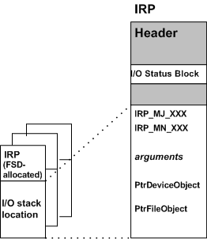

# I/O Stack Locations

The I/O manager gives each driver in a chain of layered drivers an I/O stack location for every IRP that it sets up. Each I/O stack location consists of an [**IO\_STACK\_LOCATION**](https://msdn.microsoft.com/library/windows/hardware/ff550659) structure.

The I/O manager creates an array of I/O stack locations for each IRP, with an array element corresponding to each driver in a chain of layered drivers. Each driver owns one of the stack locations in the packet and calls [**IoGetCurrentIrpStackLocation**](https://msdn.microsoft.com/library/windows/hardware/ff549174) to obtain driver-specific information about the I/O operation.

Each driver in such a chain is responsible for calling [**IoGetNextIrpStackLocation**](https://msdn.microsoft.com/library/windows/hardware/ff549266), then setting up the next-lower driver's I/O stack location. Any higher-level driver's I/O stack location can also be used to store context about an operation so that the driver's [*IoCompletion*](https://msdn.microsoft.com/library/windows/hardware/ff548354) routine can perform its cleanup operations.

The [Processing IRPs in Layered Drivers](example-i-o-request---the-details.md#ddk-example-i-o-request---the-details-kg) figure shows two I/O stack locations in the original IRP because it shows two drivers, a file system driver and a mass-storage device driver. The driver-allocated IRPs in the [Processing IRPs in Layered Drivers](example-i-o-request---the-details.md#ddk-example-i-o-request---the-details-kg) figure do not have a stack location for the FSD that created them. Any higher-level driver that allocates IRPs for lower-level drivers also determines how many I/O stack locations the new IRPs should have, according to the **StackSize** value of the next-lower driver's device object.

The following figure shows the contents of the IRP in more detail.

As shown in the figure, each driver-specific I/O stack location in an IRP contains the following general information:

- The major function code (**IRP\_MJ\_*XXX***), indicating the basic operation the driver should carry out

- For some major function codes handled by FSDs, higher-level SCSI drivers, and all PnP drivers, a minor function code (**IRP\_MN\_*XXX***), indicating which subcase of the basic operation the driver should carry out

- A set of operation-specific arguments, such as the length and starting location of a buffer into which or from which the driver transfers data

- A pointer to the driver-created device object, representing the target (physical, logical, or virtual) device for the requested operation

- A pointer to the file object, representing an open file, device, directory, or volume

  A file system driver accesses the file object through its I/O stack location in IRPs. Other drivers usually ignore the file object.

The set of IRP major and minor function codes that a particular driver handles can be device-type-specific. However, lowest-level drivers and intermediate drivers (including PnP function and filter drivers) usually handle the following set of basic requests:

-   [**IRP\_MJ\_CREATE**](https://msdn.microsoft.com/library/windows/hardware/ff550729) — open the target device object, indicating that it is present and available for I/O operations

-   [**IRP\_MJ\_READ**](https://msdn.microsoft.com/library/windows/hardware/ff550794) — transfer data from the device

-   [**IRP\_MJ\_WRITE**](https://msdn.microsoft.com/library/windows/hardware/ff550819) — transfer data to the device

-   [**IRP\_MJ\_DEVICE\_CONTROL**](https://msdn.microsoft.com/library/windows/hardware/ff550744) — set up (or reset) the device, according to a system-defined, device-type-specific I/O control code (IOCTL)

-   [**IRP\_MJ\_CLOSE**](https://msdn.microsoft.com/library/windows/hardware/ff550720) — close the target device object

-   [**IRP\_MJ\_PNP**](https://msdn.microsoft.com/library/windows/hardware/ff550772) — perform a Plug and Play operation on the device. An **IRP\_MJ\_PNP** request is sent by the PnP manager through the I/O manager.

-   [**IRP\_MJ\_POWER**](https://msdn.microsoft.com/library/windows/hardware/ff550784) — perform a power operation on the device. An **IRP\_MJ\_POWER** request is sent by the power manager through the I/O manager.

For more information about the major IRP function codes that drivers are required to handle, see [IRP Major Function Codes](https://msdn.microsoft.com/library/windows/hardware/ff550710).

In general, the I/O manager sends IRPs with at least two I/O stack locations to mass-storage device drivers because a file system is layered over other drivers for mass-storage devices. The I/O manager sends IRPs with a single stack location to any driver that has no other driver layered above it.

However, the I/O manager provides support for adding a new driver to any chain of existing drivers in the system. For example, an intermediate [*mirror driver*](https://msdn.microsoft.com/library/windows/hardware/ff556308#wdkgloss-mirror-driver) that backs up data on a given disk partition might be inserted between a pair of drivers, such as the file system driver and lowest-level driver shown in the [Processing IRPs in Layered Drivers](example-i-o-request---the-details.md#ddk-example-i-o-request---the-details-kg) figure. When this new driver attaches itself to the device stack, the I/O manager adjusts the number of I/O stack locations in all IRPs it sends to the file system, mirror, and lowest-level drivers. Every IRP that the file system in the [Processing IRPs in Layered Drivers](example-i-o-request---the-details.md#ddk-example-i-o-request---the-details-kg) figure allocated would also contain another I/O stack location for such a new mirror driver.

Note that this support for adding new drivers to an existing chain implies certain restrictions on any particular driver's access to the I/O stack locations in IRPs:

- A higher-level driver in a chain of layered drivers can safely access only its own and the next-lower-level driver's I/O stack locations in any IRP. Such a driver must set up the I/O stack location for the next-lower-level driver in IRPs. However, when designing such a higher-level driver, you cannot predict when (or whether) a new driver will be added to the existing chain just below your driver.

  Therefore, you should assume that any subsequently added driver will handle the same IRP major function codes (**IRP\_MJ\_*XXX***) as the displaced next-lower-level driver did.

- The lowest-level driver in a chain of layered drivers can safely access only its own I/O stack location in any IRP. When designing such a driver, you cannot predict when (or whether) a new driver will be added to the existing chain above your device driver.

  In designing a lowest-level driver, assume that the driver can continue to process IRPs using the information passed in its own I/O stack location, whatever the originating source of a given IRP and however many drivers are layered above it.

 

 

