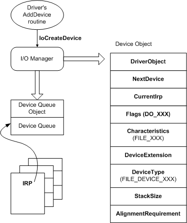

# Introduction to Device Objects

The operating system represents devices by *device objects*. One or more device objects are associated with each device. Device objects serve as the target of all operations on the device.

Kernel-mode drivers must create at least one device object for each device, with the following exceptions:

-   Minidrivers that have an associated class or port driver do not have to create their own device objects. The class or port driver creates the device objects, and dispatches operations to the minidriver.

-   Drivers that are part of device type-specific subsystems, such as NDIS miniport drivers, have their device objects created by the subsystem.

See the documentation for your particular device type to determine if your driver creates its own device objects.

Some device objects do not represent physical devices. A software-only driver, which handles I/O requests but does not pass those requests to hardware, still must create a device object to represent the target of its operations.

For more information about how your driver can create device objects, see [Creating a Device Object](creating-a-device-object.md).

Devices are usually represented by multiple device objects, one for each driver in the driver stack that handles I/O requests for the device. The device objects for a device are organized into a *device stack*. Whenever an operation is performed on a device, the system passes an [**IRP**](https://msdn.microsoft.com/library/windows/hardware/ff550694) data structure to the driver for the top device object in the device stack. Each driver either handles the IRP or passes it to the driver that is associated with the next-lower device object in the device stack. For more information about device stacks, see [WDM Device Objects and Device Stacks](wdm-device-objects-and-device-stacks.md). For more information about IRPs, see [Handling IRPs](handling-irps.md).

Device objects are represented by [**DEVICE\_OBJECT**](https://msdn.microsoft.com/library/windows/hardware/ff543147) structures, which are managed by the object manager. The object manager provides the same capabilities for device objects that it does for other system objects. In particular, a device object can be named, and a named device object can have handles opened on it. For more information about named device objects, see [Named Device Objects](named-device-objects.md).

The system provides dedicated storage for each device object, called the device extension, which the driver can use for device-specific storage. The device extension is created and freed by the system along with the device object. For more information, see [Device Extensions](device-extensions.md).

The following figure illustrates the relationship between device objects and the I/O manager.

The figure shows the members of the **DEVICE\_OBJECT** structure that are of interest to a driver writer. For more information about these members, see [Creating a Device Object](creating-a-device-object.md), [Initializing a Device Object](initializing-a-device-object.md), and [Properties of Device Objects](properties-of-device-objects.md).

 

 

