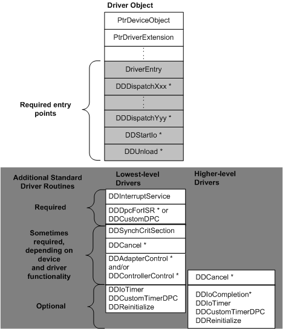

# Introduction to Driver Objects

The I/O manager creates a *driver object* for each driver that has been installed and loaded. Driver objects are defined using [**DRIVER\_OBJECT**](/windows-hardware/drivers/ddi/wdm/ns-wdm-_driver_object) structures.

When the I/O manager calls a driver's [**DriverEntry**](/windows-hardware/drivers/ddi/wdm/nc-wdm-driver_initialize) routine, it supplies the address of the driver's driver object. The driver object contains storage for entry points to many of a driver's standard routines. The driver is responsible for filling in these entry points.

The following figure illustrates a driver object, with the set of system-defined standard routines that lowest-level and higher-level drivers can or must have.

Each standard routine with an asterisk beside its name receives an I/O request packet (IRP) as input. Each of these standard routines also receives a pointer to the target device object for the I/O request.

The I/O manager defines the driver object type and uses driver objects to register and track information about the loaded images of drivers. Note that the dispatch entry points (**DDDispatch***Xxx* through **DDDispatch***Yyy*) in the driver object correspond to the major function codes (**IRP\_MJ\_*XXX***) that are passed in the I/O stack locations of IRPs.

The I/O manager routes each IRP first to a driver-supplied dispatch routine. A lowest-level driver's dispatch routine usually calls an I/O support routine ([**IoStartPacket**](/windows-hardware/drivers/ddi/ntifs/nf-ntifs-iostartpacket)) to queue (or pass on) each IRP that has valid arguments to the driver's [*StartIo*](/windows-hardware/drivers/ddi/wdm/nc-wdm-driver_startio) routine. The *StartIo* routine starts the requested I/O operation on a particular device. Higher-level drivers usually do not have *StartIo* routines, but they can.

 

