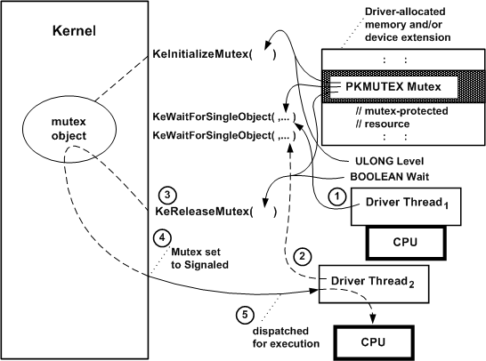

# Introduction to Mutex Objects

As its name suggests, a mutex object is a synchronization mechanism designed to ensure mutually exclusive access to a single resource that is shared among a set of kernel-mode threads. Only highest-level drivers, such as file system drivers (FSDs) that use executive worker threads, are likely to use a mutex object.

Possibly, a highest-level driver with driver-created threads or worker-thread callback routines might use a mutex object. However, any driver with pageable threads or worker-thread callback routines must manage the acquisitions of, waits on, and releases of its mutex objects very carefully.

Mutex objects have built-in features that provide system (kernel-mode only) threads mutually exclusive, deadlock-free access to shared resources in SMP machines. The kernel assigns ownership of a mutex to a single thread at a time.

Acquiring ownership of a mutex prevents the delivery of normal kernel-mode asynchronous procedure calls (APCs). The thread will not be preempted by an APC unless the kernel issues an APC\_LEVEL software interrupt to run a special kernel APC, such as the I/O manager's IRP completion routine that returns results to the original requester of an I/O operation

A thread can acquire ownership of a mutex object that it already owns (recursive ownership), but a recursively acquired mutex object is not set to the Signaled state until the thread releases its ownership completely. Such a thread must explicitly release the mutex as many times as it acquired ownership before another thread can acquire the mutex.

The kernel never permits a thread that owns a mutex to cause a transition to user mode without first releasing the mutex and setting it to the Signaled state. If any FSD-created or driver-created thread that owns a mutex attempts to return control to the I/O manager before releasing ownership of the mutex, the kernel brings down the system.

Any driver that uses a mutex object must call [**KeInitializeMutex**](https://msdn.microsoft.com/library/windows/hardware/ff552147) once before it waits on or releases its mutex object. The following figure illustrates how two system threads might use a mutex object.

As the previous figure shows, a driver that uses a mutex object must provide the storage for the mutex object, which must be resident. The driver can use the [device extension](device-extensions.md) of a driver-created device object, the controller extension if it uses a [controller object](using-controller-objects.md), or nonpaged pool that is allocated by the driver.

When a driver calls **KeInitializeMutex** (typically from its [*AddDevice*](https://msdn.microsoft.com/library/windows/hardware/ff540521) routine), it must pass a pointer to the driver's storage for the mutex object, which the kernel initializes to the Signaled state.

After such a highest-level driver has initialized, it can manage mutually exclusive access to a shared resource as shown in the previous figure. For example, a driver's dispatch routines for inherently synchronous operations and threads might use a mutex to protect a driver-created queue for IRPs.

Because **KeInitializeMutex**always sets the initial state of a mutex object to Signaled (as the previous figure shows):

1.  A dispatch routine's initial call to [**KeWaitForSingleObject**](https://msdn.microsoft.com/library/windows/hardware/ff553350) with the *Mutex* pointer puts the current thread immediately into the ready state, gives the thread ownership of the mutex, and resets the mutex state to Not-Signaled. As soon as the dispatch routine resumes running, it can safely insert an IRP into the mutex-protected queue.

2.  When a second thread (another dispatch routine, driver-supplied worker-thread callback routine, or driver-created thread) calls **KeWaitForSingleObject** with the *Mutex* pointer, the second thread is put into the wait state.

3.  When the dispatch routine finishes queuing the IRP as described in step 1, it calls [**KeReleaseMutex**](https://msdn.microsoft.com/library/windows/hardware/ff553140) with the *Mutex* pointer and a Boolean *Wait* value, which indicates whether it intends to call **KeWaitForSingleObject** (or [**KeWaitForMutexObject**](https://msdn.microsoft.com/library/windows/hardware/ff553344)) with the *Mutex* as soon as **KeReleaseMutex** returns control.

4.  Assuming the dispatch routine released its ownership of the mutex in step 3 (*Wait* set to **FALSE**), the mutex is set to the Signaled state by **KeReleaseMutex**. The mutex currently has no owner, so the kernel determines whether another thread is waiting for that mutex. If so, the kernel makes the second thread (see step 2) the mutex owner, possibly boosts the thread's priority to the lowest real-time priority value, and changes its state to ready.

5.  The kernel dispatches the second thread for execution as soon as a processor is available: that is, when no other thread with a higher priority is currently in the ready state and there are no kernel-mode routines to be run at a higher IRQL. The second thread (a dispatch routine queuing an IRP or the driver's worker-thread callback routine or driver-created thread dequeuing an IRP) can now safely access the mutex-protected queue of IRPs until it calls **KeReleaseMutex**.

If a thread acquires ownership of a mutex object recursively, that thread must explicitly call **KeReleaseMutex** as many times as it waited on the mutex in order to set the mutex object to the Signaled state. For example, if a thread calls **KeWaitForSingleObject** and then **KeWaitForMutexObject** with the same *Mutex* pointer, it must call **KeReleaseMutex** twice when it acquires the mutex in order to set that mutex object to the Signaled state.

Calling **KeReleaseMutex** with the *Wait* parameter set to **TRUE** indicates the caller's intention to immediately call a **KeWait*Xxx*** support routine on return from **KeReleaseMutex**.

**Consider the following guidelines for setting the Wait parameter to KeReleaseMutex:**

A pageable thread or pageable driver routine that runs at IRQL PASSIVE\_LEVEL should never call **KeReleaseMutex** with the *Wait* parameter set to **TRUE**. Such a call causes a fatal page fault if the caller happens to be paged out between the calls to **KeReleaseMutex** and **KeWait*Xxx*Object**(s).

Any standard driver routine that runs at an IRQL greater than PASSIVE\_LEVEL cannot wait for a nonzero interval on any dispatcher objects without bringing down the system. However, such a routine can call **KeReleaseMutex** if it owns the mutex while running at an IRQL less than or equal to DISPATCH\_LEVEL.

For a summary of the IRQLs at which standard driver routines run, see [Managing Hardware Priorities](managing-hardware-priorities.md).

 

 

