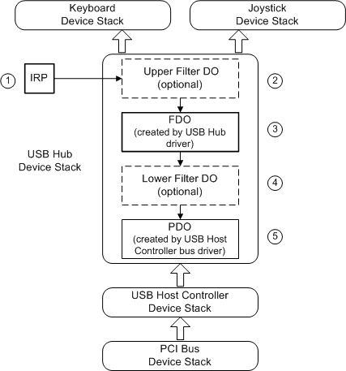

# IRP\_MN\_QUERY\_DEVICE\_RELATIONS


The PnP manager sends this request to determine certain relationships among devices. The following types of drivers handle this request:

-   Bus drivers must handle **BusRelations** requests for their adapter or controller (bus FDO). Filter drivers might handle **BusRelations** requests.

-   Bus drivers must handle **TargetDeviceRelation** requests for their child devices (child PDOs).

-   Function and filter drivers might handle **RemovalRelations** and **PowerRelations** requests.

-   Bus drivers might handle **EjectionRelations** requests for their child devices (child PDOs).

Major Code
----------

[**IRP\_MJ\_PNP**](irp-mj-pnp.md)
When Sent
---------

The PnP manager sends this IRP to gather information about devices with a relationship to the specified device.

The PnP manager queries a device's **BusRelations** (child devices) when the device is enumerated and at other times while the device is active, such as when a driver calls the [**IoInvalidateDeviceRelations**](https://msdn.microsoft.com/library/windows/hardware/ff549353) routine to indicate that a child device has arrived or departed.

The PnP manager queries a device's **RemovalRelations** before it removes a device's drivers. The PnP manager queries for **RemovalRelations** and **EjectionRelations** before it ejects a device.

The PnP manager queries a device's **TargetDeviceRelation** when a driver or user-mode application registers for PnP notification of an **EventCategoryTargetDeviceChange** on the device. The PnP manager queries for the device that is associated with a particular file object. **IRP\_MN\_QUERY\_DEVICE\_RELATIONS** is the only PnP IRP that has a valid file object parameter. A driver can query a device stack for **TargetDeviceRelation**. A driver does not need to supply a file object when sending its **TargetDeviceRelation** query.

The PnP manager queries a device's **PowerRelations** when the driver for the device calls **IoInvalidateDeviceRelations** to indicate that the set of devices with which this device has an implicit power management relationship has changed. **PowerRelations** requests are supported starting with Windows 7.

For **BusRelations**, **RemovalRelations**, **EjectionRelations**, and **PowerRelations** requests, the PnP manager sends **IRP\_MN\_QUERY\_DEVICE\_RELATIONS** at IRQL = PASSIVE\_LEVEL in the context of a system thread.

For **TargetDeviceRelation** requests, the PnP manager sends this IRP at IRQL = PASSIVE\_LEVEL in an arbitrary thread context.

## Input Parameters


The **Parameters.QueryDeviceRelations.Type** member of the [**IO\_STACK\_LOCATION**](https://msdn.microsoft.com/library/windows/hardware/ff550659) structure specifies the type of relations that are being queried. Possible values include **BusRelations**, **EjectionRelations**, **RemovalRelations**, **TargetDeviceRelation**, and **PowerRelations**.

The **FileObject** member of the current **IO\_STACK\_LOCATION** structure points to a valid file object only if **Parameters.QueryDeviceRelations.Type** is **TargetDeviceRelation**.

## Output Parameters


Returned in the I/O status block.

## I/O Status Block


A driver sets **Irp-&gt;IoStatus.Status** to STATUS\_SUCCESS or to a failure status such as STATUS\_INSUFFICIENT\_RESOURCES.

On success, a driver sets **Irp-&gt;IoStatus.Information** to a PDEVICE\_RELATIONS pointer that points to the requested relations information. The **DEVICE\_RELATIONS** structure is defined as follows:

```cpp
typedef struct _DEVICE_RELATIONS {
  ULONG  Count;
  PDEVICE_OBJECT  Objects[1];  // variable length
} DEVICE_RELATIONS, *PDEVICE_RELATIONS;
```

Operation
---------

If a driver returns relations in response to this **IRP\_MN\_QUERY\_DEVICE\_RELATIONS**, the driver allocates a **DEVICE\_RELATIONS** structure from paged memory that contains a count and the appropriate number of device object pointers. The PnP manager frees the structure when it is no longer needed. If a driver replaces a **DEVICE\_RELATIONS** structure that another driver allocated, the driver must free the previous structure.

A driver must reference the PDO of any device that it reports in this IRP ([**ObReferenceObject**](https://msdn.microsoft.com/library/windows/hardware/ff558678)). The PnP manager removes the reference when appropriate.

A function or filter driver should be prepared to handle this IRP for a device any time after its [*AddDevice*](https://msdn.microsoft.com/library/windows/hardware/ff540521) routine has completed for the device. Bus drivers should be prepared to handle a query for **BusRelations** immediately after a device is enumerated.

For the general rules about handling [Plug and Play minor IRPs](plug-and-play-minor-irps.md) see [Plug and Play](https://msdn.microsoft.com/library/windows/hardware/ff547125).

The following subsections describe the specific actions for handling the various queries.

**BusRelations Request**

When the PnP manager queries for the bus relations (child devices) of an adapter or controller, the bus driver must return a list of pointers to the PDOs of any devices physically present on the bus. The bus driver reports all devices, regardless of whether they have been started. The bus driver might need to power up its bus device to determine which children are present.

**Warning**   A device object cannot be passed to any routine that takes a PDO as an argument until the PnP manager creates a device node ([*devnode*](https://msdn.microsoft.com/library/windows/hardware/ff556277#wdkgloss-devnode)) for that object. (If the driver does pass a device object, the system will bug check with [**Bug Check 0xCA: PNP\_DETECTED\_FATAL\_ERROR**](https://msdn.microsoft.com/library/windows/hardware/ff560209).) The PnP manager creates the devnode in response to the **IRP\_MN\_QUERY\_DEVICE\_RELATIONS** request. The driver can safely assume that the PDO's devnode has been created when it receives an [**IRP\_MN\_QUERY\_RESOURCE\_REQUIREMENTS**](irp-mn-query-resource-requirements.md) request.

 

The bus driver that responds to this IRP is the function driver for the bus adapter or controller, not the parent bus driver for the bus that the adapter or controller is connected to. Function drivers for non-bus devices do not handle this query. Such drivers just pass the IRP to the next lower driver. (See the following figure.) Filter drivers typically do not handle this query.

On Windows Vista and later operating systems, we recommend that drivers always pend the **IRP\_MN\_QUERY\_DEVICE\_RELATIONS** IRP and complete its processing later. This order enables the system to process bus relation queries asynchronously. (On operating systems before Windows Vista, drivers can safely return STATUS\_PENDING from their dispatch routines, but the PnP manager does not overlap the bus relation query with any other operation.)

The following diagram shows how drivers handle a query for bus relations.



In the example shown in the figure, the PnP manager sends an **IRP\_MN\_QUERY\_DEVICE\_RELATIONS** for **BusRelations** to the drivers for the USB hub device. The PnP manager is requesting a list of the hub device's children.

1.  As with all PnP IRPs, the PnP manager sends the IRP to the top driver in the device stack for the device.

2.  An optional filter driver might be the top driver in the stack. A filter driver typically does not handle this IRP; it passes the IRP down the stack. A filter driver might handle this IRP, for example, if the driver exposes a non-enumerable device on the bus.

3.  The USB hub bus driver handles the IRP.

    The USB hub bus driver:

    -   Creates a PDO for any child device that does not already have one.

    -   Marks the PDO inactive for any device that is no longer present on the bus. The bus driver does not delete such PDOs.For more information about when to delete the PDOs, see [Removing a Device](https://msdn.microsoft.com/library/windows/hardware/ff561046).

    -   Reports any child devices that are present on the bus.

        For each child device, the bus driver references the PDO and puts a pointer to the PDO in the DEVICE\_RELATIONS structure.

        There are two PDOs in this example: one for the joystick device and one for the keyboard device.

        The bus driver should check whether another driver already created a DEVICE\_RELATIONS structure for this IRP. If so, the bus driver must add to the existing information.

        If there is no child device present on the bus, the driver sets the count to zero in the DEVICE\_RELATIONS structure and returns success.

    -   Sets the appropriate values in the I/O status block and passes the IRP to the next lower driver. The bus driver for the adapter or controller does not complete the IRP.

4.  An optional lower filter, if present, typically does not handle this IRP. Such a filter driver passes the IRP down the stack. If a lower-filter driver handles this IRP, it can add PDO(s) to the list of child devices but it must not delete any PDOs created by other drivers.

5.  The parent bus driver does not handle this IRP, unless it is the only driver in the device stack (the device is in raw mode). As with all PnP IRPs, the parent bus driver completes the IRP with [**IoCompleteRequest**](https://msdn.microsoft.com/library/windows/hardware/ff548343).

    If there are one or more bus filter drivers in the device stack, such drivers might handle the IRP on its way down to the bus driver and/or on the IRP's way back up the device stack (if there are [*IoCompletion*](https://msdn.microsoft.com/library/windows/hardware/ff548354) routines). According to the PnP IRP rules, such a driver can add PDOs to the IRP on its way down the stack and/or modify the relations list on the IRP's way back up the stack (in *IoCompletion* routines).

**EjectionRelations Request**

A driver returns pointers to PDOs of any devices that might be physically removed from the system when the specified device is ejected. Do not report the PDOs of children of the device; the PnP manager always requests that child devices be removed before their parent device.

The PnP manager sends an [**IRP\_MN\_EJECT**](irp-mn-eject.md) IRP to a device that is being ejected. The driver for such a device also receive a remove IRP. The device's ejection relations receive an [**IRP\_MN\_REMOVE\_DEVICE**](irp-mn-remove-device.md) IRP (not an **IRP\_MN\_EJECT** IRP).

Only a parent bus driver can respond to an **EjectionRelations** query for one of its child devices. Function and filter drivers must pass it to the next lower driver in the device stack. If a bus driver receives this IRP as the function driver for its adapter or controller, the bus driver is performing the tasks of a function driver and must pass the IRP to the next lower driver.

**PowerRelations Request**

Starting with Windows 7, the **PowerRelations** query enables a driver to specify a power management relationship outside of the conventional relationship between a parent bus that supports PnP enumeration and an enumerated child device on the bus. For example, if a bus driver cannot enumerate a child device on the bus, or if a device is a child of more than one bus, the **PowerRelations** query can describe the child device's power relations with the bus or buses.

The PnP manager issues a **PowerRelations** query for a device when the driver for the device calls the [**IoInvalidateDeviceRelations**](https://msdn.microsoft.com/library/windows/hardware/ff549353) routine and specifies a *Type* parameter value of **PowerRelations**.

In response to this query, the driver for the target device (that is, the device that is the target for the query) supplies a **DEVICE\_RELATIONS** structure that contains pointers to the PDOs of any other devices that must be turned on by the power manager before the target device is turned on. Conversely, these other devices must be turned off only after the target device is turned off. The power manager uses the information from the query to guarantee that these devices are turned on and off in the correct order.

This ordering guarantee applies only to global system sleep state transitions, which include transitions to and from the S1, S2, S3 (*sleep*), S4 (*hibernate*), and S5 (*shutdown*) system power states. The **PowerRelations** ordering guarantee does not apply if the target device or any other device whose PDO is supplied for the **PowerRelations** query performs transitions to and from low-power Dx device power states while the system stays in the S0 (*running*) system state.

If the target device is on the device path for a special file (such as the paging file, hibernate file, or crash dump file), the driver for the target device must perform an additional step when it handles an [**IRP\_MN\_DEVICE\_USAGE\_NOTIFICATION**](irp-mn-device-usage-notification.md) IRP in which **InPath** is **TRUE**. This driver must ensure that the devices whose PDOs are supplied for the **PowerRelations** query can also support being in the device path for the special file. To confirm this support, the driver for the target device must first send the **IRP\_MN\_DEVICE\_USAGE\_NOTIFICATION** IRP to each of these devices, and this IRP must specify the same **UsageNotification.Type** as the target device. Only if all the devices that receive this IRP complete the IRP with a success status code can the driver for the target device complete its **IRP\_MN\_DEVICE\_USAGE\_NOTIFICATION** IRP successfully. Otherwise, this driver must complete this IRP with a failure status code.

When this same driver handles an **IRP\_MN\_DEVICE\_USAGE\_NOTIFICATION** IRP for which **InPath** is **FALSE**, the driver must send the **IRP\_MN\_DEVICE\_USAGE\_NOTIFICATION** IRP to the same set of dependent devices as for the case in which **InPath** is **TRUE**. However, the driver should never complete this IRP with a failure status code when **InPath** is **FALSE**.

The driver that responds to the **PowerRelations** query should register for target device change notifications on all devices whose PDOs are supplied for the **PowerRelations** query. To register for these notifications, the driver can call the [**IoRegisterPlugPlayNotification**](https://msdn.microsoft.com/library/windows/hardware/ff549526) routine and specify an *EventCategory* parameter value of **EventCategoryTargetDeviceChange**.

**RemovalRelations Request**

A driver returns pointers to PDOs of any devices whose drivers must be removed when the drivers for the specified device are removed. Do not report the PDOs of children of the device; the PnP manager already requests the removal of child devices before removing a device.

The order in which removal relations are removed is undefined.

Any driver in the device stack can handle this type of relations query. A function or filter driver handles the IRP before passing it to the next lower driver. A bus driver handles the IRP and then completes it.

**TargetDeviceRelation Request**

The **TargetDeviceRelation** query enables the PnP manager to query a non-PnP device stack for the PDO in the PnP device stack that controls the hardware.

In general, drivers forward the **IRP\_MN\_QUERY\_DEVICE\_RELATIONS** IRP down their stack until the IRP reaches the bottom of a particular device stack. A driver at the bottom of a non-PnP stack then forwards or re-issues the IRP to the relevant PnP stack. For example, the PnP manager might send a **TargetDeviceRelation** query to the device object at the top of the file system stack, which is a non-PnP stack. Each device object in the file system stack would pass the query to the device object below it until the query reached the device object at the bottom of the stack. The lowest device object in the stack would forward or re-issue the **TargetDeviceRelation** query to the device object at the top of the PnP storage volume stack, and then the query would be passed down to the PDO at the bottom of the storage volume stack.

The following list summarizes the situations in which you can safely acquire a pointer to the PDO at the bottom of a PnP device stack:

-   Device object in a PnP

    A device object that is in a PnP device stack learns about the stack's PDO when the [*AddDevice*](https://msdn.microsoft.com/library/windows/hardware/ff540521) routine for the device is called. The driver can safely cache the pointer to the PDO if the use of the pointer is properly synchronized with incoming [**IRP\_MN\_REMOVE\_DEVICE**](irp-mn-remove-device.md) messages by using the [remove lock routines](https://msdn.microsoft.com/library/windows/hardware/ff561042).

-   Device object in a non-PnP stack, not at bottom of stack

    For a device object that is not at the bottom of a non-PnP stack, a driver can send a **TargetDeviceRelation** query to obtain a pointer to the PDO at the bottom of the corresponding PnP device stack.

-   File object for the device

    Given a file object for the device, a driver can call [**IoGetRelatedDeviceObject**](https://msdn.microsoft.com/library/windows/hardware/ff549277) to get the device object and then follow the instructions in the preceding list item.

-   Handle to the device object

    Given a handle to the device object, a driver can call [**ObReferenceObjectByHandle**](https://msdn.microsoft.com/library/windows/hardware/ff558679) to get the file object for the device and then follow the instructions in the preceding list item.

A parent bus driver must handle a **TargetDeviceRelation** relations query for its child devices. The bus driver references the child device's PDO with [**ObReferenceObject**](https://msdn.microsoft.com/library/windows/hardware/ff558678) and returns a pointer to the PDO in the **DEVICE\_RELATIONS** structure. There is only one PDO pointer in the structure for this relation type. The PnP manager removes the reference to the PDO when the driver or application unregisters for notification on the device.

Only a parent bus driver responds to a **TargetDeviceRelation** query. Function and filter drivers must pass it to the next lower driver in the device stack. If a bus driver receives this IRP as the function driver for its adapter or controller, the bus driver is performing the tasks of a function driver and must pass the IRP to the next lower driver.

If a driver is not in a PDO-based stack, the driver sends a new target-device-relation query IRP to the device object associated with the file handle on which the driver performs I/O.

**Sending This IRP**

Drivers must not send **IRP\_MN\_QUERY\_DEVICE\_RELATIONS** to request **BusRelations**. Drivers are not restricted from sending this IRP for **RemovalRelations** or **EjectionRelations**, but it is not likely that a driver would do so.

Drivers can query a device stack for **TargetDeviceRelation**. See [Handling IRPs](https://msdn.microsoft.com/library/windows/hardware/ff546847) for information about sending IRPs. The following steps apply specifically to this IRP:

-   Set the values in the next I/O stack location of the IRP: set **MajorFunction** to [**IRP\_MJ\_PNP**](irp-mj-pnp.md), set **MinorFunction** to **IRP\_MN\_QUERY\_DEVICE\_RELATIONS**, set **Parameters.QueryDeviceRelations.Type** to **TargetDeviceRelation**, and set **Irp-&gt;FileObject** to a valid file object.

-   Initialize **IoStatus.Status** to STATUS\_NOT\_SUPPORTED.

If a driver sent this IRP to get the PDO to report in response to an **IRP\_MN\_QUERY\_DEVICE\_RELATIONS** for **TargetDeviceRelation** that the driver received, then the driver reports the PDO and frees the returned relations structure when the IRP completes. If a driver initiated this IRP for another reason, the driver frees the relations structure when the IRP completes and dereferences the PDO when it is no longer needed.

Requirements
------------

<table>
<colgroup>
<col width="50%" />
<col width="50%" />
</colgroup>
<tbody>
<tr class="odd">
<td><p>Header</p></td>
<td>Wdm.h (include Wdm.h, Ntddk.h, or Ntifs.h)</td>
</tr>
</tbody>
</table>

## See also


[*AddDevice*](https://msdn.microsoft.com/library/windows/hardware/ff540521)

[**IoCompleteRequest**](https://msdn.microsoft.com/library/windows/hardware/ff548343)

[**IoGetRelatedDeviceObject**](https://msdn.microsoft.com/library/windows/hardware/ff549277)

[**IoInvalidateDeviceRelations**](https://msdn.microsoft.com/library/windows/hardware/ff549353)

[**IoRegisterPlugPlayNotification**](https://msdn.microsoft.com/library/windows/hardware/ff549526)

[**IRP\_MJ\_PNP**](irp-mj-pnp.md)

[**IRP\_MN\_DEVICE\_USAGE\_NOTIFICATION**](irp-mn-device-usage-notification.md)

[**IRP\_MN\_EJECT**](irp-mn-eject.md)

[**IRP\_MN\_QUERY\_RESOURCE\_REQUIREMENTS**](irp-mn-query-resource-requirements.md)

[**IRP\_MN\_REMOVE\_DEVICE**](irp-mn-remove-device.md)

[**IO\_STACK\_LOCATION**](https://msdn.microsoft.com/library/windows/hardware/ff550659)

[**ObReferenceObject**](https://msdn.microsoft.com/library/windows/hardware/ff558678)

[**ObReferenceObjectByHandle**](https://msdn.microsoft.com/library/windows/hardware/ff558679)

 

 


