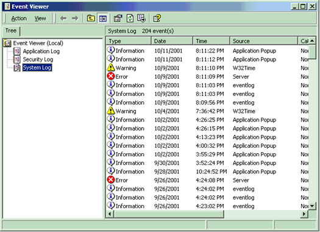

# Logging Errors

Drivers, like most Microsoft Windows system components, can log errors to the system event log. The errors are visible in the Event Viewer.

This section includes the following topics:

[Writing to the System Event Log](writing-to-the-system-event-log.md)

[Defining Custom Error Types](defining-custom-error-types.md)

[Registering as a Source of Error Messages](registering-as-a-source-of-error-messages.md)

 

 

