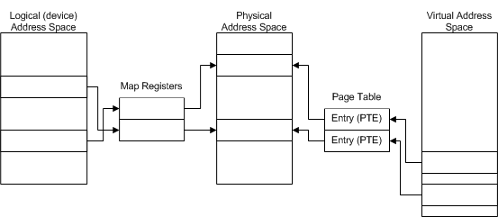
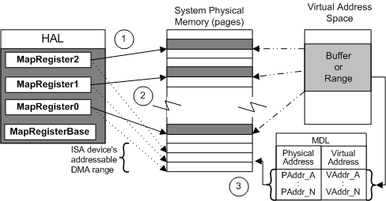

# Map Registers

Drivers that perform DMA use three different address spaces, as shown in the following figure.

On any Windows platform, a driver has access to the full virtual address space supported by the processor. On a 32-bit processor, the virtual address space represents four gigabytes. The CPU translates addresses in the virtual address space to addresses in the system's physical address space by using a page table. Each page table entry (PTE) maps one page of virtual memory to a page of physical memory, resulting in a paging operation when necessary. An MDL (memory descriptor list) provides a similar mapping for a buffer associated with driver DMA operations.

Devices vary in their ability to access the system's full virtual address space. A device uses addresses in logical (device) address space. Each HAL uses *map registers* to translate a device or logical address to a physical address (a location in physical RAM). For the device hardware, map registers perform the same function that the MDL (and page table) performs for the software (drivers): they translate addresses to physical memory.

Because these address spaces are separately addressed, a driver cannot use a pointer in virtual address space to address a location in physical memory, and vice versa. The driver must first translate the virtual address to a physical address. Similarly, a device cannot use a logical address to directly access physical memory. The device must first translate the address.

A HAL must set up adapter objects that support DMA for a wide variety of DMA devices and I/O buses on different computers. For example, most ISA DMA controllers, subordinate devices, and bus-master devices have insufficient address lines to access the full four-gigabyte system physical address space of a 32-bit processor (or the 64-gigabyte system physical address of an x86 processor running in 36-bit PAE mode). By contrast, PCI DMA devices generally have more than enough address lines to access the full system physical address space in 32-bit processors. Therefore, every HAL provides mappings between the *logical address* ranges that DMA devices can access and *physical address* ranges of each computer.

Each adapter object is associated with one or more map registers, depending on the amount of data to be transferred and the amount of available memory. During DMA transfers, the HAL uses each map register to alias a device-accessible logical page to a page of physical memory in the CPU. In effect, map registers provide scatter/gather support for drivers that use DMA, regardless of whether their devices have scatter/gather capabilities.

### 

The following figure illustrates such a physical-to-logical address mapping for the driver of an ISA DMA device that does not have scatter/gather capabilities.

The previous figure shows the following types of mappings:

1.  Each map register maps a range of physical addresses (pointed to by solid lines) to low-order logical addresses (dotted lines) for an ISA DMA device.

    Here, three map registers are used to alias three paged ranges of data in system physical memory to three page-sized ranges of low-order logical addresses for an ISA DMA device.

2.  The ISA device uses the mapped logical addresses to access system memory during DMA operations.

    For a comparable PCI DMA device, three map registers would also be used for three page-sized ranges of data. However, the mapped logical address ranges would not necessarily be identical to the corresponding physical address ranges, so a PCI device would also use logical addresses to access system memory.

3.  Each entry in the MDL maps a location in virtual address space to a physical address.

Note the correspondence between a map register and a virtual-to-physical entry in the MDL:

-   Each map register and each virtual entry in an MDL maps at most a full physical page of data for a DMA transfer operation.

-   Each map register and each virtual entry in an MDL might map less than a full page of data. For example, the initial virtual entry in an MDL can map to an offset from the physical page boundary, as shown earlier in the [Physical, Logical, and Virtual Address Mappings](#physical-logical-and-virtual-address-mappings) figure.

-   Each map register and each virtual entry in an MDL maps, at a minimum, one byte.

In an IRP requesting a read or write operation, each virtual entry in the opaque-to-drivers MDL at **Irp-&gt;MdlAddress** represents a page boundary in the system physical memory for a user buffer. Similarly, each additional map register needed for a single DMA transfer represents a page boundary in the device-accessible logical address range aliased to system physical memory.

On every Windows platform, each adapter object has an associated set of one or more map registers located at a platform-specific (and opaque-to-drivers) base address. From a driver's point of view, the map register base shown in the figure illustrating [address mapping for a sample ISA DMA device](#address-mapping-for-a-sample-isa-dma-device) is a handle for a set of map registers that could be hardware registers in a chip, in a system DMA controller, or in a bus-master adapter, or could even be HAL-created virtual registers in system memory.

The number of map registers available with an adapter object can vary for different devices and Windows platforms. For example, the HAL can make more map registers available to drivers that use system DMA on some platforms than on other platforms because the DMA controllers on different Windows platforms have different capabilities.

 

 

