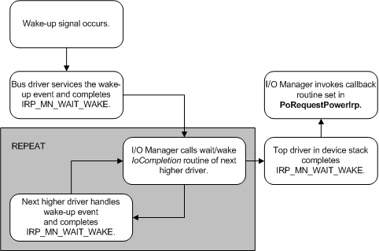

# Overview of Wait/Wake IRP Completion

A wait/wake IRP completes when a wake-up signal arrives. The wake-up signal is device-specific but is generally a normal service event for the device. For example, an incoming ring might cause a sleeping modem to awaken.

The following figure shows the steps in completing a wait/wake IRP.

When the signal occurs, control re-enters the bus driver at the point where the bus detects that the device has awakened. The bus driver services the event as required and calls [**IoCompleteRequest**](https://msdn.microsoft.com/library/windows/hardware/ff548343) to complete the [**IRP\_MN\_WAIT\_WAKE**](https://msdn.microsoft.com/library/windows/hardware/ff551766) IRP for its PDO.

The I/O manager then calls the [*IoCompletion*](https://msdn.microsoft.com/library/windows/hardware/ff548354) routine set by the next-higher driver in the device stack. In the *IoCompletion* routine, that driver services the wake-up signal as necessary and calls **IoCompleteRequest** to complete the IRP. The I/O manager continues to call *IoCompletion* routines working back up the device stack until all drivers have completed the IRP.

In its *IoCompletion* routine, any driver that enumerates more than one child device (creates more than one PDO) and has received wait/wake requests from more than one such device must send itself a wait/wake IRP to re-arm itself for wait/wake on another child. For details, see [Understanding the Path of Wait/Wake IRPs through a Device Tree](understanding-the-path-of-wait-wake-irps-through-a-device-tree.md).

After calling *IoCompletion* routines set by drivers as they passed the IRP down the stack, the I/O manager invokes the callback routine set by the power policy owner when it requested the wait/wake IRP. In the callback routine, the policy owner should return its device to the working state and complete a pending wait/wake IRP for its child's PDO, if any.

Completing the child's IRP causes the I/O manager to call *IoCompletion* routines set by drivers in the child's device stack, and so on. Eventually, the policy owner that started the original wait/wake IRP on the devnode determines that its device asserted the wake-up signal, and all the pending wait/wake IRPs will be complete.

 

 

