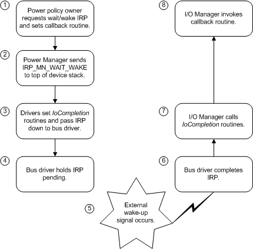

# Overview of Wait/Wake Operation

## 

The operating system's wake-up mechanism works as shown in the following figure.

1.  While the system and device are in the working state, the power policy owner for a device determines that its device should be enabled ("armed") for wake-up. The power policy owner requests a power IRP ([**PoRequestPowerIrp**](https://msdn.microsoft.com/library/windows/hardware/ff559734) with minor code [**IRP\_MN\_WAIT\_WAKE**](https://msdn.microsoft.com/library/windows/hardware/ff551766)) to be sent to its PDO to inform all drivers in its device stack. In the request, the policy owner specifies a callback routine (not the same as an [*IoCompletion*](https://msdn.microsoft.com/library/windows/hardware/ff548354) routine).

2.  The power manager, through the I/O manager, sends the IRP to the top of the device stack.

3.  Drivers set *IoCompletion* routines and pass the IRP down until it reaches the bus driver.

4.  The bus driver enables wake-up on the physical device, if it can, and marks the IRP pending. If necessary, it also requests a wait/wake IRP for its parent.

5.  Sometime later, an external wake-up signal arrives.

6.  The bus driver completes the **IRP\_MN\_WAIT\_WAKE**.

7.  I/O manager calls *IoCompletion* routines that were set as drivers passed the IRP down the stack.

8.  I/O manager calls the callback routine set by the policy owner when it requested the IRP.

The **IRP\_MN\_WAIT\_WAKE** request does not change the power state of the device or the system. It merely enables wake-up on the device so that later, if the device enters an appropriate sleep state, an external signal will cause the device (and possibly the system) to awaken.

When a wake-up signal arrives, the drivers' behavior is the same whether the device wakes the system or only itself. If the device is enabled for wake-up and the system is in a sleep state from which the device can awaken it, the device will awaken the system. If the device is enabled for wake-up and the system is in the working state, only the device will awaken.

Because computers and devices vary in design, particularly with respect to power planes, the supported system and device power states -- and thus the states that can support wait/wake -- are not the same on all hardware configurations. Therefore, any driver that owns power policy for its device and every bus driver must pay careful attention to the capabilities of the individual configuration on which it is running. For further information, see [Determining Whether a Device Can Wake the System](determining-whether-a-device-can-wake-the-system.md).

For further details on wait/wake operations, see [Understanding the Path of Wait/Wake IRPs through a Device Tree](understanding-the-path-of-wait-wake-irps-through-a-device-tree.md) and [Overview of Wait/Wake IRP Completion](overview-of-wait-wake-irp-completion.md).

 

 

--------------------
[Send comments about this topic to Microsoft](mailto:wsddocfb@microsoft.com?subject=Documentation%20feedback%20%5Bkernel\kernel%5D:%20Overview%20of%20Wait/Wake%20Operation%20%20RELEASE:%20%286/14/2017%29&body=%0A%0APRIVACY%20STATEMENT%0A%0AWe%20use%20your%20feedback%20to%20improve%20the%20documentation.%20We%20don't%20use%20your%20email%20address%20for%20any%20other%20purpose,%20and%20we'll%20remove%20your%20email%20address%20from%20our%20system%20after%20the%20issue%20that%20you're%20reporting%20is%20fixed.%20While%20we're%20working%20to%20fix%20this%20issue,%20we%20might%20send%20you%20an%20email%20message%20to%20ask%20for%20more%20info.%20Later,%20we%20might%20also%20send%20you%20an%20email%20message%20to%20let%20you%20know%20that%20we've%20addressed%20your%20feedback.%0A%0AFor%20more%20info%20about%20Microsoft's%20privacy%20policy,%20see%20http://privacy.microsoft.com/default.aspx. "Send comments about this topic to Microsoft")

