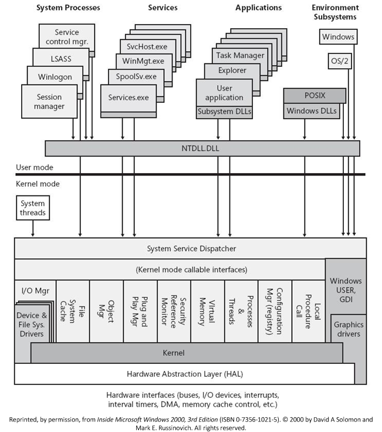

# Overview of Windows Components

The following figure shows the major internal components of the Windows operating system.

As the figure shows, the Windows operating system includes both user-mode and kernel-mode components. For more information about Windows user and kernel modes, see [User Mode and Kernel Mode](https://msdn.microsoft.com/library/windows/hardware/ff554836).

Drivers call routines that are exported by various kernel components. For example, to create a device object, you would call the [**IoCreateDevice**](https://msdn.microsoft.com/library/windows/hardware/ff548397) routine which is exported by the I/O manager. For a list of kernel-mode routines that drivers can call, see [Driver Support Routines](https://msdn.microsoft.com/library/windows/hardware/ff544200).

In addition, drivers must respond to specific calls from the operating system and can respond to other system calls. For a list of kernel mode routines that drivers may need to support, see [Standard Driver Routines](https://msdn.microsoft.com/library/windows/hardware/ff563842).

Not all kernel-mode components are pictured in the figure above. For a list of kernel mode components, see [Kernel-Mode Managers and Libraries](kernel-mode-managers-and-libraries.md).

 

 

