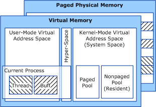

# Overview of Windows Memory Space

The following figure illustrates the NT-based operating system's virtual memory spaces and their relationship to system physical memory.

As this figure shows, virtual memory is backed by paged physical memory, and a virtual address range can be backed by discontiguous physical memory pages. User-space virtual memory and system-space memory allocated from paged pool are always *pageable*. Any user-space code or data can be paged out to secondary storage at any time, even while the process is executing.

Note that any noncurrent process's virtual addresses are not visible, so its memory space is inaccessible.

For an extensive discussion of memory management, see the *Inside Microsoft Windows Internals* book from Microsoft Press.

 

 

