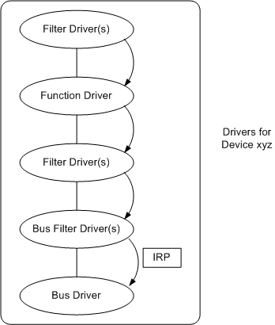

# Passing PnP IRPs Down the Device Stack

The PnP manager uses IRPs to direct drivers to start, stop, and remove devices and to query drivers about their devices. All PnP IRPs have the major function code [**IRP\_MJ\_PNP**](https://msdn.microsoft.com/library/windows/hardware/ff550772), and all PnP drivers must provide a [*DispatchPnP*](https://msdn.microsoft.com/library/windows/hardware/ff543341) routine to service this function code. The PnP manager initializes **Irp-&gt;IoStatus.Status** to STATUS\_NOT\_SUPPORTED when it sends an IRP. For more information, see [DispatchPnP Routines](dispatchpnp-routines.md).

For a list of PnP minor IRPs, see [Plug and Play Minor IRPs](plug-and-play-minor-irps.md).

All drivers for a device must have the opportunity to respond to a PnP IRP unless a driver in the stack fails the IRP. (See the following figure.)

No single driver for a device can assume that it is the only driver that will respond to a PnP IRP. Consider, for example, a function driver that responds to an [**IRP\_MN\_QUERY\_CAPABILITIES**](https://msdn.microsoft.com/library/windows/hardware/ff551664) request and completes the IRP without passing it to the next-lower driver. None of the capabilities supported by lower drivers, such as a unique instance ID or power management capabilities supported by the parent bus driver, is reported.

A PnP IRP travels back up the device stack when the parent bus driver calls [**IoCompleteRequest**](https://msdn.microsoft.com/library/windows/hardware/ff548343) and the I/O manager calls any [*IoCompletion*](https://msdn.microsoft.com/library/windows/hardware/ff548354) routines registered by the function driver or filter drivers.

A function or filter driver must do the following when it receives a PnP IRP:

-   If the driver performs actions in response to the IRP:
    1.  Perform the appropriate actions.
    2.  Set **Irp-&gt;IoStatus.Status** to an appropriate status, such as STATUS\_SUCCESS. Set **Irp-&gt;IoStatus.Information**, if appropriate for the IRP.
    3.  Set up the next stack location with [**IoSkipCurrentIrpStackLocation**](https://msdn.microsoft.com/library/windows/hardware/ff550355) or [**IoCopyCurrentIrpStackLocationToNext**](https://msdn.microsoft.com/library/windows/hardware/ff548387). Call the latter routine if you set an *IoCompletion* routine.
    4.  Set an *IoCompletion* routine, if necessary.
    5.  Do not complete the IRP. (Do not call **IoCompleteRequest**.) The parent bus driver will complete the IRP.
-   If the driver does not perform actions for this IRP, it simply prepares to pass the IRP to the next driver:
    1.  Call **IoSkipCurrentIrpStackLocation** to remove its stack location from the IRP.
    2.  Do not set any fields in **Irp-&gt;IoStatus**.
    3.  Do not set an *IoCompletion* routine.
    4.  Do not complete the IRP. (Do not call **IoCompleteRequest**.) The parent bus driver will complete the IRP.

If a function or filter driver did not fail the IRP, it passes the IRP to the next-lower driver with [**IoCallDriver**](https://msdn.microsoft.com/library/windows/hardware/ff548336). A driver has a pointer to the next-lower driver; that pointer was returned from the [**IoAttachDeviceToDeviceStack**](https://msdn.microsoft.com/library/windows/hardware/ff548300) call in the higher driver's [*AddDevice*](https://msdn.microsoft.com/library/windows/hardware/ff540521) routine.

The parent bus driver completes the IRP after performing any tasks to respond to the IRP. After the bus driver calls **IoCompleteRequest**, the I/O manager calls any *IoCompletion* routines registered by the function or filter drivers for the device.

 

 

