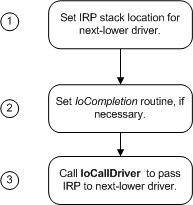
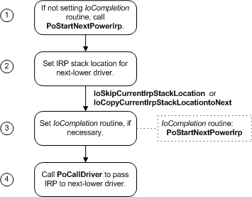

# Passing Power IRPs

Power IRPs must be passed all the way down the device stack to the PDO to ensure that power transitions are managed cleanly. Drivers handle an IRP that reduces device power as the IRP travels down the device stack. Drivers handle an IRP that applies device power in [*IoCompletion*](https://msdn.microsoft.com/library/windows/hardware/ff548354) routines as the IRP travels back up the device stack.

The following figure shows the steps that drivers need to take to pass a power IRP down a device stack in Windows 7 and Windows Vista.

As the previous figure shows, in Windows 7 and Windows Vista, a driver must do the following:

1.  Call [**IoCopyCurrentIrpStackLocationToNext**](https://msdn.microsoft.com/library/windows/hardware/ff548387) if setting an *IoCompletion* routine, or [**IoSkipCurrentIrpStackLocation**](https://msdn.microsoft.com/library/windows/hardware/ff550355) if not setting an *IoCompletion* routine.

    These two routines set the IRP stack location for the next-lower driver. Copying the current stack location ensures that the IRP stack pointer is set to the correct location when the *IoCompletion* routine runs.

    If a badly written driver makes the mistake of calling **IoSkipCurrentIrpStackLocation** and then setting a completion routine, this driver might overwrite a completion routine set by the driver below it.

2.  Call [**IoSetCompletionRoutine**](https://msdn.microsoft.com/library/windows/hardware/ff549679) to set an *IoCompletion* routine, if a complete routine is required.

3.  Call [**IoCallDriver**](https://msdn.microsoft.com/library/windows/hardware/ff548336) to pass the IRP to the next-lower driver in the stack.

The following figure shows the steps that drivers need to take to pass a power IRP down a device stack in Windows Server 2003, Windows XP, and Windows 2000.

As the previous figure shows, a driver must do the following:

1.  Depending on the type of driver, possibly call [**PoStartNextPowerIrp**](https://msdn.microsoft.com/library/windows/hardware/ff559776). For more information, see [Calling PoStartNextPowerIrp](calling-postartnextpowerirp.md).

2.  Call [**IoCopyCurrentIrpStackLocationToNext**](https://msdn.microsoft.com/library/windows/hardware/ff548387) if setting an *IoCompletion* routine, or [**IoSkipCurrentIrpStackLocation**](https://msdn.microsoft.com/library/windows/hardware/ff550355) if not setting an *IoCompletion* routine.

    These two routines set the IRP stack location for the next-lower driver. Copying the current stack location ensures that the IRP stack pointer is set to the correct location when the *IoCompletion* routine runs.

3.  Call [**IoSetCompletionRoutine**](https://msdn.microsoft.com/library/windows/hardware/ff549679) to set an *IoCompletion* routine. In the *IoCompletion* routine, most drivers [call PoStartNextPowerIrp](calling-postartnextpowerirp.md) to indicate that it is ready to handle the next power IRP.

4.  Call [**PoCallDriver**](https://msdn.microsoft.com/library/windows/hardware/ff559654) to pass the IRP to the next-lower driver in the stack.

    Drivers must use **PoCallDriver**, rather than **IoCallDriver** (as for other IRPs) to ensure that the system synchronizes power IRPs properly. For more information, see [Calling IoCallDriver vs. Calling PoCallDriver](calling-iocalldriver-versus-calling-pocalldriver.md).

Remember that *IoCompletion* routines can be called at IRQL = DISPATCH\_LEVEL. Therefore, if a driver requires additional processing at IRQL = PASSIVE\_LEVEL after lower-level drivers have finished with the IRP, the driver's completion routine should queue a work item and then return STATUS\_MORE\_PROCESSING\_REQUIRED. The worker thread must complete the IRP.

In Windows 98/Me, drivers must complete power IRPs at IRQL = PASSIVE\_LEVEL.

### Do Not Change the Function Codes in a Power IRP

In addition to the usual rules that govern the processing of IRPs, [**IRP\_MJ\_POWER**](https://msdn.microsoft.com/library/windows/hardware/ff550784) IRPs have the following special requirement: A driver that receives a power IRP must not change the major and minor function codes in any I/O stack locations in the IRP that have been set by the power manager or by higher-level drivers. The power manager relies on these function codes remaining unchanged until the IRP is completed. Violations of this rule can cause problems that are difficult to debug. For example, the operating system might stop responding, or "hang."

### Do Not Block While Handling a Power IRP

Drivers must not cause long delays while handling power IRPs.

When passing down a power IRP, a driver should return from its [*DispatchPower*](https://msdn.microsoft.com/library/windows/hardware/ff543354) routine as soon as possible after calling **IoCallDriver** (in Windows 7 and Windows Vista) or **PoCallDriver** (in Windows Server 2003, Windows XP, and Windows 2000). A driver must not wait for a kernel event or otherwise delay before returning. If a driver cannot handle a power IRP in a brief time, it should return STATUS\_PENDING and queue all incoming IRPs until the power IRP completes. (Note that this behavior is different from that of PnP IRPs and [*DispatchPnP*](https://msdn.microsoft.com/library/windows/hardware/ff543341) routines, which are allowed to block.)

If the driver must wait for a power action by another driver further down the device stack, it should return STATUS\_PENDING from its *DispatchPower* routine and set an *IoCompletion* routine for the power IRP. The driver can perform whatever tasks it requires in the *IoCompletion* routine, and then call **PoStartNextPowerIrp** (Windows Server 2003, Windows XP, and Windows 2000 only) and [**IoCompleteRequest**](https://msdn.microsoft.com/library/windows/hardware/ff548343).

For example, the power policy owner for a device typically sends a device power IRP while holding a system power IRP in order to set the device power state appropriate for the requested system power state.

In this situation, the power policy owner should set an *IoCompletion* routine in the system power IRP, pass the system power IRP to the next-lower driver, and return STATUS\_PENDING from its *DispatchPower* routine.

In the *IoCompletion* routine, it calls **PoRequestPowerIrp** to send the device power IRP, passing a pointer to a callback routine in the request. The *IoCompletion* routine should return STATUS\_MORE\_PROCESSING\_REQUIRED.

Finally, the driver passes down the system IRP from the callback routine. The driver must not wait for a kernel event in its *DispatchPower* routine and signal with the *IoCompletion* routine for the IRP it is currently handling; a system deadlock might occur. For more information, see [Handling a System Set-Power IRP in a Device Power Policy Owner](handling-a-system-set-power-irp-in-a-device-power-policy-owner.md).

In a similar situation, when the system is going to sleep, a power policy owner might need to complete some pending I/O before it sends the device IRP to power down its device. Instead of signaling an event when the I/O completes and waiting in its *DispatchPower* routine, the driver should queue a work item and return STATUS\_PENDING from the *DispatchPower* routine. In the worker thread, it waits for I/O to complete and then sends the device power IRP. For more information, see [**IoAllocateWorkItem**](https://msdn.microsoft.com/library/windows/hardware/ff548276).

 

 

