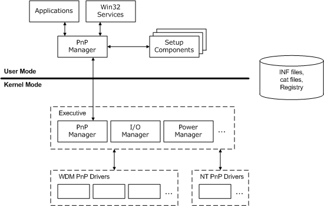

# PnP Components

The following figure shows the components that work together to support PnP.

The PnP manager has two parts: the kernel-mode PnP manager and the user-mode PnP manager. The kernel-mode PnP manager interacts with operating system components and drivers to configure, manage, and maintain devices. The user-mode PnP manager interacts with user-mode setup components, such as Class Installers, to configure and install devices. The user-mode PnP manager also interacts with applications to, for example, register an application for notification of device changes and notify the application when a device event occurs.

PnP drivers support the physical, logical, and virtual devices on a machine. The term "PnP driver" refers to any Windows driver that supports the interfaces described in this section. While most PnP drivers are also WDM drivers and thus source-compatible across Windows platforms, a few drivers support PnP without fully implementing WDM.

All drivers should support PnP and power management. If a single driver does not support PnP and power management, it constrains the PnP and power management support of the system as a whole.

See [Device Installation Overview](https://msdn.microsoft.com/library/windows/hardware/ff549455) for information about device and driver setup, including (INF) files, CAT files, and the registry.

 

 

