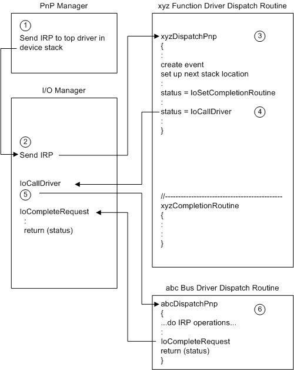
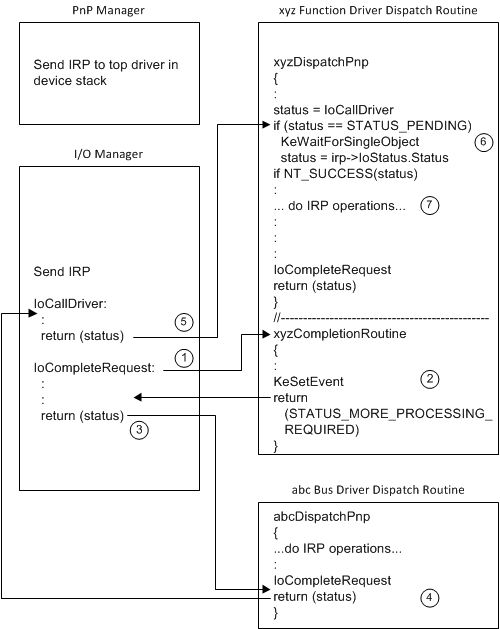

# Postponing PnP IRP Processing Until Lower Drivers Finish

Some PnP and power IRPs must be processed first by the parent bus driver for a device and then by each next-higher driver in the device stack. For example, the parent bus driver must be the first driver to perform its start operations for a device ([**IRP\_MN\_START\_DEVICE**](./irp-mn-start-device.md)), followed by each next-higher driver. For such an IRP, function and filter drivers must set an I/O completion routine, pass the IRP to the next-lower driver, and postpone any activities to process the IRP until the lower drivers have finished with the IRP.

An [*IoCompletion*](/windows-hardware/drivers/ddi/wdm/nc-wdm-io_completion_routine) routine can be called at IRQL DISPATCH\_LEVEL, but a function or filter driver might need to process the IRP at IRQL = PASSIVE\_LEVEL. To return to PASSIVE\_LEVEL from an *IoCompletion* routine, a driver can use a kernel event. The driver registers an *IoCompletion* routine that sets a kernel-mode event and then the driver waits on the event in its [*DispatchPnP*](/windows-hardware/drivers/ddi/wdm/nc-wdm-driver_dispatch) routine. When the event is set, lower drivers have completed the IRP and the driver is allowed to process the IRP.

Note that a driver must not use this technique to wait for lower drivers to finish a power IRP ([**IRP\_MJ\_POWER**](./irp-mj-power.md)). Waiting on an event in the [*DispatchPower*](/windows-hardware/drivers/ddi/wdm/nc-wdm-driver_dispatch) routine that is set in the *IoCompletion* routine can cause a deadlock. See [Passing Power IRPs](passing-power-irps.md) for more information.

The following two figures show an example of how a driver waits for lower drivers to complete a PnP IRP. The example shows what the function and bus drivers must do, plus how they interact with the PnP manager and the I/O manager.

The following notes correspond to the circled numbers in the previous figure:

1.  The PnP manager calls the I/O manager to send an IRP to the top driver in the device stack.

2.  The I/O manager calls the *DispatchPnP* routine of the top driver. In this example, there are only two drivers in the device stack (the function driver and the parent bus driver) and the function driver is the top driver.

3.  The function driver declares and initializes a kernel-mode event, sets up the stack location for the next-lower driver, and sets an *IoCompletion* routine for this IRP.

    The function driver can use [**IoCopyCurrentIrpStackLocationToNext**](/windows-hardware/drivers/ddi/wdm/nf-wdm-iocopycurrentirpstacklocationtonext) to set up the stack location.

    In the call to [**IoSetCompletionRoutine**](/windows-hardware/drivers/ddi/wdm/nf-wdm-iosetcompletionroutine), the function driver sets *InvokeOnSuccess*, *InvokeOnError*, and *InvokeOnCancel* to **TRUE** and passes the kernel-mode event as part of the context parameter.

4.  The function driver passes the IRP down the device stack with [**IoCallDriver**](/windows-hardware/drivers/ddi/wdm/nf-wdm-iocalldriver) before performing any operations to handle the IRP.

5.  The I/O manager sends the IRP to the next-lower driver in the device stack by calling that driver's *DispatchPnP* routine.

6.  The next-lower driver in this example is the lowest driver in the device stack, the parent bus driver. The bus driver performs its operations to start the device. The bus driver sets **Irp-&gt;IoStatus.Status**, sets **Irp-&gt;IoStatus.Information** if relevant to this IRP, and completes the IRP by calling [**IoCompleteRequest**](/windows-hardware/drivers/ddi/wdm/nf-wdm-iocompleterequest).

    If the bus driver calls other driver routines or sends I/O to the device in order to start it, the bus driver does not complete the PnP IRP in its *DispatchPnP* routine. Instead, it must mark the IRP pending with [**IoMarkIrpPending**](/windows-hardware/drivers/ddi/wdm/nf-wdm-iomarkirppending) and return STATUS\_PENDING from its *DispatchPnP* routine. The driver later calls **IoCompleteRequest** from another driver routine, possibly a DPC routine.

The following figure shows the second part of the example, where the higher drivers in the device stack resume their postponed IRP processing.

The following notes correspond to the circled numbers in the previous figure:

1.  When the bus driver calls **IoCompleteRequest**, the I/O manager examines the stack locations of the higher drivers and calls any *IoCompletion* routines it finds. In this example, the I/O manager locates and calls the *IoCompletion* routine for the next-higher driver, the function driver.

2.  The function driver's *IoCompletion* routine sets the kernel-mode event supplied in the context parameter and returns STATUS\_MORE\_PROCESSING\_REQUIRED.

    The IoCompletion routine must return STATUS\_MORE\_PROCESSING\_REQUIRED to prevent the I/O manager from calling *IoCompletion* routines set by higher drivers at this time. The *IoCompletion* routine uses this status to forestall completion so its driver's *DispatchPnP* routine can regain control. The I/O manager will resume calling higher drivers' *IoCompletion* routines for this IRP when this driver's *DispatchPnP* routine completes the IRP.

3.  The I/O manager stops completing the IRP and returns control to the routine that called **IoCompleteRequest**, which in this example is the bus driver's *DispatchPnP* routine.

4.  The bus driver returns from its *DispatchPnP* routine with status indicating the result of its IRP processing: either STATUS\_SUCCESS or an error status.

5.  **IoCallDriver** returns control to its caller, which in this example is the function driver's *DispatchPnP* routine.

6.  The function driver's *DispatchPnP* routine resumes processing the IRP.

    If **IoCallDriver** returns STATUS\_PENDING, the *DispatchPnP* routine has resumed execution before its *IoCompletion* routine has been called. The *DispatchPnP* routine, therefore, must wait for the kernel event to be signaled by its *IoCompletion* routine. This ensures that the *DispatchPnP* routine will not continue processing the IRP until all lower drivers have completed it.

    If **Irp-&gt;IoStatus.Status** is set to an error, a lower driver has failed the IRP and the function driver must not continue handling the IRP (except for any necessary cleanup).

7.  Once lower drivers have successfully completed the IRP, the function driver processes the IRP.

    For IRPs being handled first by the parent bus driver, the bus driver typically sets a successful status in **Irp-&gt;IoStatus.Status** and optionally sets a value in **Irp-&gt;IoStatus.Information**. Function and filter drivers leave the values in **IoStatus** as is unless they fail the IRP.

    The function driver's *DispatchPnP* routine calls **IoCompleteRequest** to complete the IRP. The I/O manager resumes I/O completion processing. In this example, there are no filter drivers above the function driver, and thus no more *IoCompletion* routines to call. When **IoCompleteRequest** returns control to the function driver *DispatchPnP* routine, the *DispatchPnP* routine returns status.

For some IRPs, if a function or filter driver fails the IRP on its way back up the device stack, the PnP manager informs the lower drivers. For example, if a function or filter driver fails an [**IRP\_MN\_START\_DEVICE**](./irp-mn-start-device.md), the PnP manager sends an [**IRP\_MN\_REMOVE\_DEVICE**](./irp-mn-remove-device.md) to the device stack.

 

