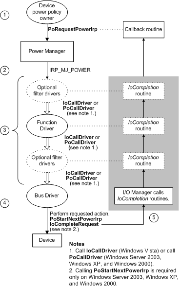

# Power IRPs for Individual Devices

A *device power IRP* specifies major IRP code [**IRP\_MJ\_POWER**](./irp-mj-power.md), one of the minor power IRP codes listed below, and the value **DevicePowerState** in the **Power.Type** member.

[**IRP\_MN\_QUERY\_POWER**](./irp-mn-query-power.md)

[**IRP\_MN\_SET\_POWER**](./irp-mn-set-power.md)

[**IRP\_MN\_WAIT\_WAKE**](./irp-mn-wait-wake.md)

[**IRP\_MN\_POWER\_SEQUENCE**](./irp-mn-power-sequence.md)

All drivers in a device stack receive such IRPs; normally, only the device power policy manager can send these IRPs. However, the power manager can send a device power IRP when performing idle detection on behalf of a device, as explained in [Using Power Manager Routines for Idle Detection](using-power-manager-routines-for-idle-detection.md).

A driver sends a device power IRP for any of the following reasons:

-   To query or change the device power state in response to a system power IRP

-   To put the device in a sleep state to conserve power

-   To return the device to the working state after it has been asleep

-   To enable the device to awaken in response to an external signal

-   To get a power sequence value when powering up a device

The following figure shows the sequence of steps that occur to send, forward, and complete a device power IRP.

As the previous figure shows, a device power IRP is sent, forwarded, and completed in the following steps:

1.  The device power policy owner calls [**PoRequestPowerIrp**](/windows-hardware/drivers/ddi/wdm/nf-wdm-porequestpowerirp) to allocate a device power IRP, specifying the PDO that is the target of the IRP and a callback routine to be invoked when the IRP is complete.

2.  The power manager allocates a device power IRP and sends it to the top driver in the device stack for the target PDO.

3.  The driver performs the following actions:

    -   Sets an [*IoCompletion*](/windows-hardware/drivers/ddi/wdm/nc-wdm-io_completion_routine) routine if one is necessary.

    -   Calls [**PoStartNextPowerIrp**](/windows-hardware/drivers/ddi/ntifs/nf-ntifs-postartnextpowerirp) (Windows Server 2003, Windows XP, and Windows 2000) if a completion routine is not used. Beginning with Windows Vista, this call is not required and such a call performs no power management operation.

    -   Calls [**IoCallDriver**](/windows-hardware/drivers/ddi/wdm/nf-wdm-iocalldriver) (Windows 7 and Windows Vista) or calls [**PoCallDriver**](/windows-hardware/drivers/ddi/ntifs/nf-ntifs-pocalldriver) (Windows Server 2003, Windows XP, and Windows 2000) to pass the IRP down to the next-lower driver.

    Each driver in the stack does this until the IRP reaches the bus driver. If a driver must fail the IRP, it should do so immediately and call [**IoCompleteRequest**](/windows-hardware/drivers/ddi/wdm/nf-wdm-iocompleterequest).

4.  The bus driver, which maintains the device PDO, performs the requested action, and then calls **IoCompleteRequest** to complete the IRP. A bus driver can fail a device power-up IRP if a device is removed or in the process of being removed.

5.  The I/O manager calls *IoCompletion* routines that were set by drivers as they passed the IRP down the stack. After all the *IoCompletion* routines have been called, the callback routine is run.

For more information about device power IRPs, see [Managing Power for Individual Devices](device-power-states.md) and [Supporting Devices that Have Wake-Up Capabilities](supporting-devices-that-have-wake-up-capabilities.md). For details on the power sequence IRP, see [**IRP\_MN\_POWER\_SEQUENCE**](./irp-mn-power-sequence.md).

 

