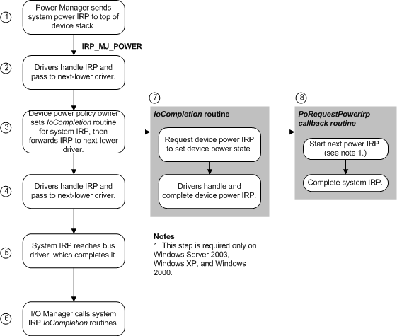

# Power IRPs for the System

## 

A *system power IRP* specifies major IRP code [**IRP\_MJ\_POWER**](https://msdn.microsoft.com/library/windows/hardware/ff550784), one of the minor power IRP codes listed below, and the value **SystemPowerState** in the **Power.Type** member of the IRP stack. Only the power manager can send such an IRP; a driver cannot send a system power IRP.

The power manager sends a system power IRP for one of the following reasons:

-   To change the system power state in response to an idle time-out, a change in system activity, a user request, or an expiring battery ([**IRP\_MN\_SET\_POWER**](https://msdn.microsoft.com/library/windows/hardware/ff551744))

-   To query devices to determine whether the system can go to sleep ([**IRP\_MN\_QUERY\_POWER**](https://msdn.microsoft.com/library/windows/hardware/ff551699))

-   To reaffirm the current system power state after a query (**IRP\_MN\_SET\_POWER**)

The power manager sends **IRP\_MN\_QUERY\_POWER** and **IRP\_MN\_SET\_POWER** requests on behalf of the system. A driver can fail an **IRP\_MN\_QUERY\_POWER** request but cannot fail **IRP\_MN\_SET\_POWER**.

For example, to change the system power state, the power manager sends a system power IRP to the top driver in the stack at each device node of the device tree. The following figure shows how drivers within a single device stack handle a system power IRP.

As the previous figure shows:

1.  The power manager calls the I/O manager to send a system power IRP to each leaf node in the device tree.

2.  Drivers handle the IRP if possible, set [*IoCompletion*](https://msdn.microsoft.com/library/windows/hardware/ff548354) routines if necessary, and call [**IoCallDriver**](https://msdn.microsoft.com/library/windows/hardware/ff548336) (Windows 7 and Windows Vista) or [**PoCallDriver**](https://msdn.microsoft.com/library/windows/hardware/ff559654) (Windows Server 2003, Windows XP, and Windows 2000) to forward the IRP down the stack. If a driver must fail the IRP, the driver does so immediately and completes the IRP. Drivers can fail **IRP\_MN\_QUERY\_POWER** IRPs, but must not fail **IRP\_MN\_SET\_POWER** IRPs that set the system power state.

3.  When the driver that owns power policy for the device receives the IRP, that driver sets an *IoCompletion* routine for the system IRP and then forwards the IRP.

4.  Any other drivers in the stack handle the IRP if possible, set *IoCompletion* routines if necessary, and forward the IRP to the next-lower driver, as in step 2.

5.  Eventually, the bus driver receives and completes the system IRP.

6.  The I/O manager calls any *IoCompletion* routines that were set as drivers passed the system IRP down the device stack.

7.  In its *IoCompletion* routine, the device power policy owner calls [**PoRequestPowerIrp**](https://msdn.microsoft.com/library/windows/hardware/ff559734) to send a device power IRP, specifying a device power state that is valid for the system power state in the system IRP. The driver sets a callback routine to be invoked when the device power IRP completes.

    If necessary, the driver consults the **DeviceState** member in its cached copy of the [**DEVICE\_CAPABILITIES**](https://msdn.microsoft.com/library/windows/hardware/ff543095) structure (see [Reporting Device Power Capabilities](reporting-device-power-capabilities.md)) to determine which device power states correspond to the system power state in the IRP.

8.  After the device IRP is complete and any device IRP completion routines have run, the power policy owner's callback routine is invoked. In the callback routine, the driver copies its returned status into the system IRP. In Windows Server 2003, Windows XP, and Windows 2000, the callback calls [**PoStartNextPowerIrp**](https://msdn.microsoft.com/library/windows/hardware/ff559776) to start the next power IRP. However, in Windows 7 and Windows Vista, calling **PoStartNextPowerIrp** is not required and such a call performs no power management operation. Finally, the callback calls [**IoCompleteRequest**](https://msdn.microsoft.com/library/windows/hardware/ff548343) to complete the system IRP.

For further information, see [Handling System Power State Requests](handling-system-power-state-requests.md).

Because some devices require an inrush of current when they power on, system inrush power IRPs are handled synchronously and serially throughout the system. Only one such IRP can be active at a time. For further information, see [Calling IoCallDriver vs. Calling PoCallDriver](calling-iocalldriver-versus-calling-pocalldriver.md).

 

 

--------------------
[Send comments about this topic to Microsoft](mailto:wsddocfb@microsoft.com?subject=Documentation%20feedback%20%5Bkernel\kernel%5D:%20Power%20IRPs%20for%20the%20System%20%20RELEASE:%20%286/14/2017%29&body=%0A%0APRIVACY%20STATEMENT%0A%0AWe%20use%20your%20feedback%20to%20improve%20the%20documentation.%20We%20don't%20use%20your%20email%20address%20for%20any%20other%20purpose,%20and%20we'll%20remove%20your%20email%20address%20from%20our%20system%20after%20the%20issue%20that%20you're%20reporting%20is%20fixed.%20While%20we're%20working%20to%20fix%20this%20issue,%20we%20might%20send%20you%20an%20email%20message%20to%20ask%20for%20more%20info.%20Later,%20we%20might%20also%20send%20you%20an%20email%20message%20to%20let%20you%20know%20that%20we've%20addressed%20your%20feedback.%0A%0AFor%20more%20info%20about%20Microsoft's%20privacy%20policy,%20see%20http://privacy.microsoft.com/default.aspx. "Send comments about this topic to Microsoft")

