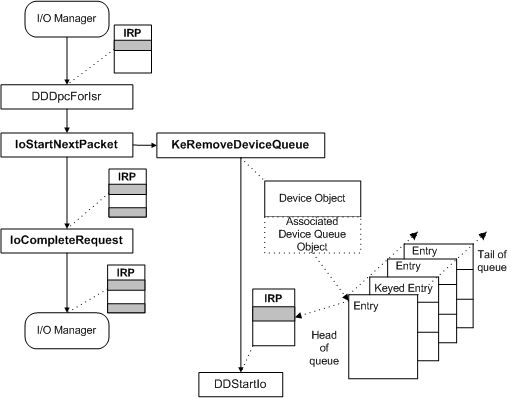

# Processing IRPs in a Lowest-Level Driver

Lowest-level physical drivers have certain standard routines that higher-level drivers do not need. The set of standard routines for lowest-level drivers also varies according to the following criteria:

-   The nature of the device each driver controls

-   Whether the driver sets up its device objects for direct or buffered I/O

-   The design of the individual driver

To illustrate the roles of the standard driver routines, the following figure shows the path a sample IRP might take as it is processed by a lowest-level mass-storage device driver. The driver in the figure has the following characteristics:

-   The device generates interrupts at the end of each I/O operation, so this driver has ISR and [*DpcForIsr*](https://msdn.microsoft.com/library/windows/hardware/ff544079) routines.

-   The driver has a [*StartIo*](https://msdn.microsoft.com/library/windows/hardware/ff563858) routine, rather than setting up internal queues for IRPs and managing its own queuing.

-   The driver uses system DMA, so it sets its device objects' **Flags** for direct I/O, and has an [*AdapterControl*](https://msdn.microsoft.com/library/windows/hardware/ff540504) routine.

As this figure shows, the I/O manager creates an IRP and sends it to the driver's dispatch routine for the given major function code. Assuming the function code is either [**IRP\_MJ\_READ**](https://msdn.microsoft.com/library/windows/hardware/ff550794) or [**IRP\_MJ\_WRITE**](https://msdn.microsoft.com/library/windows/hardware/ff550819), the dispatch routine is **DDDispatchReadWrite**.

### Calling IoGetCurrentIrpStackLocation

Any driver routine that requires IRP parameters must call [**IoGetCurrentIrpStackLocation**](https://msdn.microsoft.com/library/windows/hardware/ff549174) to obtain the driver's [I/O stack location](i-o-stack-locations.md). Such routines include dispatch routines that handle more than one major I/O function code (<strong>IRP\_MJ\_*XXX</strong><em>), handle a function that supports minor functions (</em><em>IRP\_MN\_</em>XXX<strong><em>), or handle device I/O control requests ([</em>*IRP\_MJ\_DEVICE\_CONTROL</strong>](<https://msdn.microsoft.com/library/windows/hardware/ff550744>) and/or [**IRP\_MJ\_INTERNAL\_DEVICE\_CONTROL**](https://msdn.microsoft.com/library/windows/hardware/ff550766)), along with every other driver routine that processes an IRP.

This driver's I/O stack location is the lowest one, with an indefinite number of higher-level drivers' I/O stack locations shown shaded. For simplicity, calls to **IoGetCurrentIrpStackLocation** from the [*DispatchReadWrite*](https://msdn.microsoft.com/library/windows/hardware/ff543381), *StartIo*, *AdapterControl*, and [*DpcForIsr*](https://msdn.microsoft.com/library/windows/hardware/ff544079) routines are not shown in the previous figure.

### Calling IoMarkIrpPending and IoStartPacket

The sample driver does not complete the IRP in its dispatch routine, but instead processes the IRP in its *StartIo* routine. Before it can do so, the dispatch routine calls [**IoMarkIrpPending**](https://msdn.microsoft.com/library/windows/hardware/ff549422) to indicate that the IRP is not yet completed. Then it calls [**IoStartPacket**](https://msdn.microsoft.com/library/windows/hardware/ff550370) to queue the IRP for further processing by the driver's *StartIo* routine. The dispatch routine also returns the NTSTATUS value STATUS\_PENDING.

The following figure illustrates the call to **IoStartPacket**.

If the driver is busy processing another IRP on the device, **IoStartPacket** inserts the IRP into the device queue associated with the device object. The driver can optionally supply a *Key* value as a parameter to **IoStartPacket** to impose a driver-determined order on IRPs in the device queue.

If the driver is not busy and the device queue is empty, the I/O manager immediately calls its *StartIo* routine, passing the input IRP.

For mass-storage devices, the lowest-level driver does not need to supply a [*Cancel*](https://msdn.microsoft.com/library/windows/hardware/ff540742) routine when it calls **IoStartPacket** for two reasons:

1.  A file system layered over such a driver typically handles the cancellation of file I/O requests.

2.  Mass-storage device drivers process IRPs quickly.

Usually, the highest-level driver in a chain of layered drivers handles the cancellation of IRPs.

### Calling AllocateAdapterChannel and MapTransfer

Assuming the *StartIo* routine, shown in the figure illustrating an IRP path through lowest-level driver routines, determines that the transfer request can be done by a single DMA operation, the *StartIo* routine calls [**AllocateAdapterChannel**](https://msdn.microsoft.com/library/windows/hardware/ff540573) with the entry point of the driver's *AdapterControl* routine and the IRP.

When the system DMA controller is available, the I/O manager calls the driver's *AdapterControl* routine to set up the transfer operation. The *AdapterControl* routine calls [**MapTransfer**](https://msdn.microsoft.com/library/windows/hardware/ff554402) to set up the system DMA controller. Then the driver programs its device for the DMA operation and returns. (For more information about using DMA and adapter objects, see [Input/Output Techniques](i-o-programming-techniques.md).)

### Calling IoRequestDpc from the Driver's ISR

When the device interrupts to indicate its transfer operation is complete, the driver's ISR stops the device from generating interrupts and calls [**IoRequestDpc**](https://msdn.microsoft.com/library/windows/hardware/ff549657), as shown in the figure illustrating an IRP path through lowest-level driver routines.

This call queues the driver's *DpcForIsr* routine to complete as much of the transfer operation as possible at a lower hardware priority (IRQL).

### Calling IoStartNextPacket and IoCompleteRequest

When the *DpcForIsr* routine has finished processing the transfer, it calls [**IoStartNextPacket**](https://msdn.microsoft.com/library/windows/hardware/ff550358) promptly so that the driver's *StartIo* routine will be called with the next IRP in the device queue, if any are queued. The *DpcForIsr* routine also sets the just-completed IRP's I/O status block and then calls [**IoCompleteRequest**](https://msdn.microsoft.com/library/windows/hardware/ff548343) for the IRP.

The following figure illustrates this driver's calls to **IoStartNextPacket** and **IoCompleteRequest**.

Drivers should call **IoStartNextPacket** or [**IoStartNextPacketByKey**](https://msdn.microsoft.com/library/windows/hardware/ff550363) to begin the next requested I/O operation as soon as possible, preferably before they call **IoCompleteRequest**.

If any IRPs are queued for the device, **IoStartNextPacket** calls [**KeRemoveDeviceQueue**](https://msdn.microsoft.com/library/windows/hardware/ff553156) to remove the next IRP from the queue. The I/O manager then calls the driver's *StartIo* routine, passing the dequeued IRP. If no IRPs are currently in the device queue, **IoStartNextPacket** merely returns to the caller.

### Setting the I/O Status Block in an IRP

Every lowest-level driver must set the IRP's [I/O status block](i-o-status-blocks.md) before calling [**IoCompleteRequest**](https://msdn.microsoft.com/library/windows/hardware/ff548343). (In the previous figure, the second shaded area denotes the status block.) The I/O status block supplies information to higher-level drivers and, ultimately, to the original requester of the I/O operation. Any higher-level driver layered above the driver in the previous figure might have set up an [*IoCompletion*](https://msdn.microsoft.com/library/windows/hardware/ff548354) routine that reads the I/O status block set by this driver. Higher-level drivers usually do not modify the I/O status block in an IRP that has been completed by a device driver, unless the higher-level driver is retrying the IRP, in which case it reinitializes the I/O status block.

Every higher-level driver that completes an IRP without sending it on to the next lower driver also must set the I/O status block in that IRP before calling **IoCompleteRequest**. For good overall I/O throughput, a higher-level driver should check the parameters in its own I/O stack location of each IRP and, if the parameters are invalid, should set the I/O status block and complete the request itself. Whenever possible, a driver should avoid passing an invalid request on to lower drivers in the chain.

Assuming the transfer operation in the previous figure is successful, the *DpcForIsr* routine, shown in the figure illustrating an IRP path through lowest-level driver routines, sets STATUS\_SUCCESS in **Status** and the number of bytes transferred in **Information** for the IRP's I/O status block.

Many of the standard driver routines also return NTSTATUS-type values. For more information about NTSTATUS constants like STATUS\_SUCCESS, see [Logging Errors](logging-errors.md).

 

 

