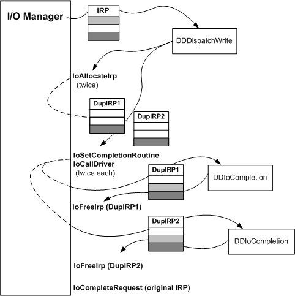

# Processing IRPs in an Intermediate-Level Driver

Higher-level drivers have a different set of standard routines than lowest-level device drivers, with an overlapping subset of standard routines common to both types of drivers.

The set of routines for intermediate and highest-level drivers also varies according to the following criteria:

-   The nature of the underlying physical device

-   Whether an underlying device driver sets up device objects for direct or buffered I/O

-   The design of the individual higher-level driver

The following figure illustrates the path an IRP might take through the standard routines of an intermediate [*mirror driver*](https://msdn.microsoft.com/library/windows/hardware/ff556308#wdkgloss-mirror-driver) layered somewhere over the lowest-level device driver described in the previous section.

The driver shown in the following figure has the following characteristics:

-   The driver is layered over more than one physical device and possibly over more than one device driver.

-   The driver sometimes allocates additional IRPs for lower-level drivers, depending on the requested operation in the input IRP.

-   The driver has at least one file system driver layered above it, and that file system driver might be layered over other intermediate drivers at a higher level than this one.

### 

As the figure shows, the I/O manager creates an IRP and sends it to the driver's dispatch routine for the given major function code. Assuming the function code is [**IRP\_MJ\_WRITE**](https://msdn.microsoft.com/library/windows/hardware/ff550819), the dispatch routine is **DDDispatchWrite**. The intermediate driver's I/O stack location is shown in the middle, with an indefinite number of I/O stack locations for higher- and lower-level drivers shown shaded.

### Allocating IRPs

The mirror driver's purpose is to send write requests to several physical devices, and to send read requests alternately to the drivers of these devices. For write requests, the driver creates duplicate IRPs for each device on which the data is to be written, assuming the parameters in the input IRP are valid.

The previous figure shows a call to [**IoAllocateIrp**](https://msdn.microsoft.com/library/windows/hardware/ff548257) but higher-level drivers can call other support routines to allocate IRPs for lower-level drivers. See [Creating IRPs for Lower-Level Drivers](creating-irps-for-lower-level-drivers.md).

When the dispatch routine calls **IoAllocateIrp**, it specifies the number of I/O stack locations needed for the IRP. The driver must specify a stack location for each lower driver in the chain, getting the appropriate value from the device objects of each driver just below the mirror driver. Optionally, the driver can add one to this value when it calls **IoAllocateIrp** to get a stack location of its own for each IRP it allocates, as the driver in the previous figure does.

This intermediate driver's dispatch routine calls [**IoGetCurrentIrpStackLocation**](https://msdn.microsoft.com/library/windows/hardware/ff549174) (not shown) with the original IRP, to check parameters.

It calls [**IoSetNextIrpStackLocation**](https://msdn.microsoft.com/library/windows/hardware/ff550321) because it allocated its own stack location in each newly created IRP and [**IoGetCurrentIrpStackLocation**](https://msdn.microsoft.com/library/windows/hardware/ff549174) to create a context for itself that it uses later in the [*IoCompletion*](https://msdn.microsoft.com/library/windows/hardware/ff548354) routine.

Next, it calls [**IoGetNextIrpStackLocation**](https://msdn.microsoft.com/library/windows/hardware/ff549266) with each newly created IRP so that it can set up the next lower-level drivers' I/O stack locations in the IRPs it allocated. The mirror driver's dispatch routine copies the IRP function codes and parameters (pointer to the transfer buffer, length in bytes to be transferred for **IRP\_MJ\_WRITE**) into the I/O stack locations for the next-lower drivers. These drivers, in turn, will set up the I/O stack locations for the drivers just below them, if any.

### Calling IoSetCompletionRoutine and IoCallDriver

The dispatch routine in the previous figure calls [**IoSetCompletionRoutine**](https://msdn.microsoft.com/library/windows/hardware/ff549679) for each IRP it allocated. Because the driver in the previous figure must dispose of the IRPs it allocated, this driver sets its *IoCompletion* routine to be called when lower drivers complete its IRPs, whether the I/O operation completed successfully, failed, or was canceled.

Because the driver in the previous figure mirrors in parallel, it passes both IRPs that it allocated on to the next-lower-level drivers by calling [**IoCallDriver**](https://msdn.microsoft.com/library/windows/hardware/ff548336) twice, once for each target device object representing a mirrored partition.

### Processing IRPs in the Driver's IoCompletion Routine

When either set of lower-level drivers completes the requested operation, the I/O manager calls the intermediate mirror driver's *IoCompletion* routine. The mirror driver maintains a count in its own I/O stack location for the original IRP, to track when the lower drivers have completed all the duplicate IRPs.

Assuming that the I/O status block indicates that one set of lower drivers has completed the duplicate IRP shown in the [previous figure](#irp-path-through-intermediate-driver-routines), the mirror driver's *IoCompletion* routine decrements its count but cannot complete the original IRP until it decrements the count to zero. If the decremented count is not yet zero, the *IoCompletion* routine calls [**IoFreeIrp**](https://msdn.microsoft.com/library/windows/hardware/ff549113) with the first-returned IRP (DupIRP1 in the previous figure) that the driver allocated and returns STATUS\_MORE\_PROCESSING\_REQUIRED.

When the mirror driver's *IoCompletion* routine is called again with the DupIRP2 shown in the previous figure, the *IoCompletion* routine decrements the count in the original IRP and determines that both sets of lower-level drivers have carried out the requested operations.

Assuming the I/O status block in DupIRP2 also is set with STATUS\_SUCCESS, the *IoCompletion* routine copies the I/O status block from DupIRP2 into the original IRP and frees DupIRP2. It calls [**IoCompleteRequest**](https://msdn.microsoft.com/library/windows/hardware/ff548343) with the original IRP and returns STATUS\_MORE\_PROCESSING\_REQUIRED. Returning this status prevents the I/O manager from attempting any further completion processing on DupIRP2; because the IRP is not associated with a thread, its completion processing should end with the driver that created it.

If either set of lower-level drivers does not complete the mirror driver's IRPs successfully, the mirror driver's *IoCompletion* routine should log an error and attempt appropriate mirrored-data recovery. For more information, see [Logging Errors](logging-errors.md).

 

 

