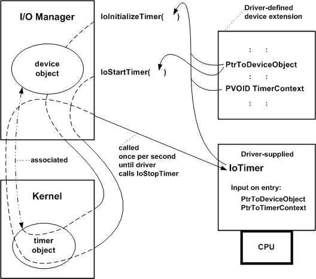

# Registering and Enabling an IoTimer Routine

Any driver can register an [*IoTimer*](https://msdn.microsoft.com/library/windows/hardware/ff550381) routine, after it creates one or more device objects, by calling [**IoInitializeTimer**](https://msdn.microsoft.com/library/windows/hardware/ff549344). The driver can then start the timer by calling [**IoStartTimer**](https://msdn.microsoft.com/library/windows/hardware/ff550373). The following figure illustrates these calls.

After calling [**IoCreateDevice**](https://msdn.microsoft.com/library/windows/hardware/ff548397) to create device objects, a driver can call **IoInitializeTimer** with the entry point of its *IoTimer* routine, along with pointers to a driver-created device object and a context area in which the driver maintains whatever context its *IoTimer* routine uses. The I/O manager associates the device object with a kernel-allocated timer object and sets up the timer object to time out every second.

After the driver calls **IoStartTimer**, its *IoTimer* routine is called once per second until the driver calls [**IoStopTimer**](https://msdn.microsoft.com/library/windows/hardware/ff550377). A driver can reenable calls to its *IoTimer* routine with **IoStartTimer**. (Frequently, when a driver calls **IoStartTimer**, it supplies the device object pointer obtained from the I/O stack location of the current IRP.)

On entry, the *IoTimer* routine is passed the device object pointer<em>,</em> along with the context pointer that the driver supplied when it called **IoInitializeTimer**.

Drivers must not call **IoStopTimer** from within an *IoTimer* routine.

The I/O manager unregisters the timer routine for a specified device object and frees its associated context when the driver calls [**IoDeleteDevice**](https://msdn.microsoft.com/library/windows/hardware/ff549083).

 

 

