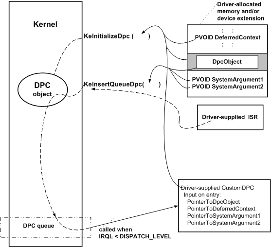

# Registering and Queuing a CustomDpc Routine

A driver registers a [*CustomDpc*](/windows-hardware/drivers/ddi/wdm/nc-wdm-kdeferred_routine) routine for a device object by calling [**KeInitializeDpc**](/windows-hardware/drivers/ddi/wdm/nf-wdm-keinitializedpc) after it has created the device object. The driver can make this call from its [*AddDevice*](/windows-hardware/drivers/ddi/wdm/nc-wdm-driver_add_device) routine, or from [*DispatchPnP*](/windows-hardware/drivers/ddi/wdm/nc-wdm-driver_dispatch) code that handles [**IRP\_MN\_START\_DEVICE**](./irp-mn-start-device.md) requests.

Just before the driver's ISR returns control, it can call [**KeInsertQueueDpc**](/windows-hardware/drivers/ddi/wdm/nf-wdm-keinsertqueuedpc) to queue the *CustomDpc* routine for execution. The following figure illustrates calls to these routines.

As the previous figure shows, a driver that has a *CustomDpc* routine must provide the storage for a DPC object. Because the driver must pass a pointer to the DPC object from its ISR, the storage must be in resident, system-space memory. Most drivers with *CustomDpc* routines provide storage for their DPC objects in the device extension, but the storage can be in a controller extension if the driver uses a [controller object](./introduction-to-controller-objects.md) or in nonpaged pool allocated by the driver.

When the driver calls **KeInitializeDpc**, it must pass the entry point for its *CustomDpc* routine, along with pointers to the driver-allocated storage for the DPC object and to a driver-defined context area, which is passed to the *CustomDpc* routine when it is called. Because the context area must be accessible at IRQL = DISPATCH\_LEVEL, it also must be in resident memory.

Unlike a *DpcForIsr* routine, a *CustomDpc* routine is not associated with a device object. Nevertheless, drivers typically include pointers to the target device object and current IRP in the context information supplied to the *CustomDpc* routine. Like a *DpcForIsr* routine, the *CustomDpc* routine uses this information to complete an interrupt-driven I/O operation at a lower IRQL than the ISR.

As the previous figure shows, the ISR passes pointers to the DPC object and to two additional parameters, which are driver-defined, to [**KeInsertQueueDpc**](/windows-hardware/drivers/ddi/wdm/nf-wdm-keinsertqueuedpc). If all processors in the machine currently have code running at an IRQL greater than or equal to DISPATCH\_LEVEL, the DPC object is queued until the IRQL falls below DISPATCH\_LEVEL on a processor. Then, the kernel dequeues the DPC object and the driver's *CustomDpc* routine is run on the processor at IRQL DISPATCH\_LEVEL.

Only a single instantiation of any one DPC object can be queued at any given moment. Thus if an ISR calls **KeInsertQueueDpc** more than once with the same *Dpc* pointer before the driver's *CustomDpc* routine is run, the *CustomDpc* routine runs only once after IRQL falls below DISPATCH\_LEVEL on a processor.

A *CustomDpc* routine is responsible for doing whatever is necessary to complete the I/O operation that caused the interrupt.

The ISR and *CustomDpc* routines can be run concurrently on an SMP machine. Therefore, when writing *CustomDpc* routines, follow the guidelines set out in the previous section, [Registering and Queuing a DpcForIsr Routine](registering-and-queuing-a-dpcforisr-routine.md).

 

