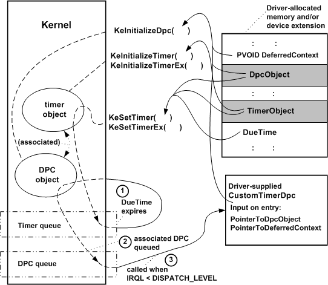

# Registering and Queuing a CustomTimerDpc Routine

A driver can register a [*CustomTimerDpc*](https://msdn.microsoft.com/library/windows/hardware/ff542983) routine by calling the following routines, usually from its [*AddDevice*](https://msdn.microsoft.com/library/windows/hardware/ff540521) routine:

1.  [**KeInitializeDpc**](https://msdn.microsoft.com/library/windows/hardware/ff552130) to register its routine

2.  [**KeInitializeTimer**](https://msdn.microsoft.com/library/windows/hardware/ff552168) or [**KeInitializeTimerEx**](https://msdn.microsoft.com/library/windows/hardware/ff552173) to set up a timer object

Subsequently, the driver can call [**KeSetTimer**](https://msdn.microsoft.com/library/windows/hardware/ff553286) or [**KeSetTimerEx**](https://msdn.microsoft.com/library/windows/hardware/ff553292) to specify an expiration time and to add the timer object to the system's timer queue. When the expiration time is reached, the system dequeues the timer object and calls the *CustomTimerDpc* routine. The following figure illustrates these calls.

As the previous figure shows, the driver must supply storage for both a DPC object and a timer object. Most drivers provide the storage for these objects in a [device extension](device-extensions.md) or in other driver-allocated, resident memory.

In the call to **KeSetTimer**, the driver passes pointers to the *Dpc* and *Timer* objects, along with a *DueTime* expressed in units of 100 nanoseconds, as shown in the previous figure. A positive value for *DueTime* specifies an *absolute expiration time* (since January 1, 1601) at which the *CustomTimerDpc* routine should be called. A negative value for *DueTime* specifies a *relative expiration time*.

Because an absolute timer expires at a specific system time, the wait duration of an absolute timer is not affected if the system time changes before the timer expires. On the other hand, a relative timer always expires after the specified number of time units elapses, regardless of changes to the absolute system time.

To invoke a *CustomTimerDpc* routine repeatedly, use **KeSetTimerEx** to set the timer and specify a recurring interval in the *Period* parameter. **KeSetTimerEx** is just like **KeSetTimer** except for this additional parameter.

As shown in the previous figure, the call to **KeSetTimer** or **KeSetTimerEx** queues the timer object for a specified interval as follows:

1.  When the *DueTime* expires, the timer object is dequeued and set to the Signaled state.

2.  If every processor in the machine is currently running code at an IRQL greater than or equal to DISPATCH\_LEVEL, the DPC object associated with the timer object is put in a DPC queue. Otherwise, the *CustomTimerDpc* routine is called.

3.  If the DPC object was already in the queue when the *DueTime* interval expired, the *CustomTimerDpc* routine is called as soon as the IRQL on any processor in the machine falls below DISPATCH\_LEVEL.

    **Note**  The *CustomTimerDpc* routine, like all DPC routines, is called at IRQL = DISPATCH\_LEVEL. While a DPC routine runs, all threads are prevented from running on the same processor. Driver developers should carefully design their *CustomTimerDpc* routines to run for as brief a time as possible.

     

The smallest time interval that can be specified to **KeSetTimer** and **KeSetTimerEx** is approximately ten milliseconds, so a driver can use a *CustomTimerDpc* routine when timing smaller intervals than an [*IoTimer*](https://msdn.microsoft.com/library/windows/hardware/ff550381) routine, which is run once per second, can handle.

Only one instantiation of a particular timer object can be queued at any moment. Calling **KeSetTimer** or **KeSetTimerEx** again with the same *Timer* object pointer cancels the queued timer object and resets it.

Setting up a [*CustomTimerDpc*](https://msdn.microsoft.com/library/windows/hardware/ff542983) routine is exactly like setting up a [*CustomDpc*](https://msdn.microsoft.com/library/windows/hardware/ff542972) routine, with an additional step to initialize the timer object. In fact, their prototypes are identical, but *CustomTimerDpc* routine cannot use the two *SystemArgument* pointers declared in its prototype.

 

 

