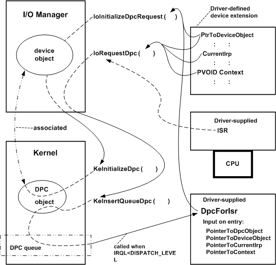

# Registering and Queuing a DpcForIsr Routine

A driver registers a [*DpcForIsr*](/windows-hardware/drivers/ddi/wdm/nc-wdm-io_dpc_routine) routine for a device object by calling [**IoInitializeDpcRequest**](/windows-hardware/drivers/ddi/wdm/nf-wdm-ioinitializedpcrequest) after it has created the device object. The driver can make this call from its [*AddDevice*](/windows-hardware/drivers/ddi/wdm/nc-wdm-driver_add_device) routine, or from [*DispatchPnP*](/windows-hardware/drivers/ddi/wdm/nc-wdm-driver_dispatch) code that handles [**IRP\_MN\_START\_DEVICE**](./irp-mn-start-device.md) requests.

To queue the *DpcForIsr* routine for execution, the driver's ISR calls [**IoRequestDpc**](/windows-hardware/drivers/ddi/wdm/nf-wdm-iorequestdpc) just before it returns. The following figure illustrates calls to these routines.

As the previous figure shows, calling **IoInitializeDpcRequest** associates a DPC object with a driver-supplied *DpcForIsr* routine and a driver-created device object. The I/O manager allocates memory for the DPC object and calls [**KeInitializeDpc**](/windows-hardware/drivers/ddi/wdm/nf-wdm-keinitializedpc) on the driver's behalf.

When the ISR is called to handle a device interrupt at DIRQL, it should return control to the system as soon as possible for better overall system and driver performance. Usually, an ISR merely clears the interrupt, gathers whatever context information the *DpcForIsr* routine needs to complete the operation that caused the interrupt, calls [**IoRequestDpc**](/windows-hardware/drivers/ddi/wdm/nf-wdm-iorequestdpc), and returns.

When the ISR calls **IoRequestDpc**, it passes a pointer to the device object, a pointer to the *DeviceObject*-&gt;**CurrentIrp**, and a pointer to a driver-determined context. The I/O manager calls [**KeInsertQueueDpc**](/windows-hardware/drivers/ddi/wdm/nf-wdm-keinsertqueuedpc) on the driver's behalf, which queues the DPC object. When IRQL falls below DISPATCH\_LEVEL on a processor, the kernel dequeues the DPC object and runs the driver's *DpcForIsr* routine on that processor at IRQL DISPATCH\_LEVEL.

The *DpcForIsr* routine is responsible for doing whatever is necessary to complete the I/O requested in the current IRP. On entry, the routine receives a pointer to the DPC object, along with pointers to the device object, IRP, and context area, which were passed in the ISR's call to **IoRequestDpc**. The context area must be in resident memory, and is usually in the device extension. Alternatively, it can be in nonpaged pool allocated by the driver, or in a controller extension if the driver uses a [controller object](./introduction-to-controller-objects.md).

Because ISR and *DpcForIsr* routines can run concurrently on SMP machines, you must follow these guidelines:

-   The ISR must call **IoRequestDpc** just before it returns control. Otherwise, the *DpcForIsr* routine might be run on another processor before the ISR has finished setting up the context area for the *DpcForIsr* routine.

-   The *DpcForIsr* routine and any other driver routine that shares a context area with the ISR must call [**KeSynchronizeExecution**](/windows-hardware/drivers/ddi/wdm/nf-wdm-kesynchronizeexecution), specifying a driver-supplied [*SynchCritSection*](/windows-hardware/drivers/ddi/wdm/nc-wdm-ksynchronize_routine) routine that accesses the shared context area in a multiprocessor-safe manner.

-   If a driver uses the device extension to maintain context about its device I/O operations, the *DpcForIsr* routine should never call [**IoStartNextPacket**](/windows-hardware/drivers/ddi/ntifs/nf-ntifs-iostartnextpacket) for the input device object (nor dequeue an IRP for the input device object, if the driver manages its own IRP queuing) until just before it calls [**IoCompleteRequest**](/windows-hardware/drivers/ddi/wdm/nf-wdm-iocompleterequest).

    Otherwise, the driver's [*StartIo*](/windows-hardware/drivers/ddi/wdm/nc-wdm-driver_startio) (or queue-management routines) might start another I/O operation that overwrites the shared context area before the *DpcForIsr* routine can complete the current operation. This is because the ISR can be called again if the device interrupts while or before the *DpcForIsr* routine executes (assuming interrupts are still enabled).

Even on a uniprocessor machine, the ISR could be called again if the device interrupts while or before the *DpcForIsr* routine is run. If this occurs, the *DpcForIsr* routine is run only once. In other words, there is no one-to-one correspondence between an ISR's calls to **IoRequestDpc** and instantiations of the *DpcForIsr* routine if a driver overlaps I/O operations for its target device objects.

 

