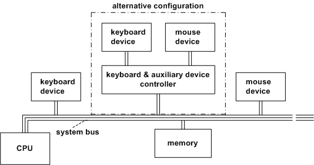
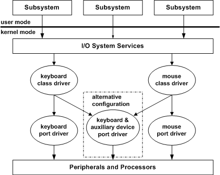

# Sample Device and Driver Configuration

This section illustrates the relationship between the hardware and driver configurations, using the keyboard and mouse devices as an example. Configurations differ for other devices. For complete information about any device configuration, see the device-specific documentation in the Windows Driver Kit (WDK).

### 

The following figure shows two possible hardware configurations for the keyboard and mouse devices:

-   Each connected directly somewhere on the system bus

-   Both connected through a keyboard and auxiliary device controller

### 

The following figure illustrates the corresponding layered drivers for I/O operations on the devices shown in the previous figure.

Note that drivers of keyboard and mouse devices, whatever the hardware configuration, can use the system's keyboard class and mouse class drivers to handle hardware-independent operations. These are called [*class drivers*](https://msdn.microsoft.com/library/windows/hardware/ff556274#wdkgloss-class-driver) because each supplies system-required but hardware-independent support for a particular class of device.

A corresponding [*port driver*](https://msdn.microsoft.com/library/windows/hardware/ff556325#wdkgloss-port-driver) implements the device-specific support to carry out required I/O operations on each physical device. The system's (i8042) keyboard and auxiliary device port driver for x86-based platforms manages device-specific operations for both mouse and keyboard. In a hardware configuration where each device is separately connected, as shown in the figure illustrating the keyboard and mouse hardware configurations, each system class driver can be layered over separate device-specific port drivers, or a single driver for each device could be implemented as a separate, monolithic (lowest-level) driver.

A new intermediate driver, such as a PnP filter driver, could be added to the configuration in the figure illustrating the keyboard and mouse driver layers. For example, a filter driver added above the keyboard class driver might filter keyboard input in a platform-specific manner before passing it through the I/O services to the subsystem that requested it. Such a filter driver must recognize the same IRPs and IOCTLs as the keyboard class driver.

 

 

