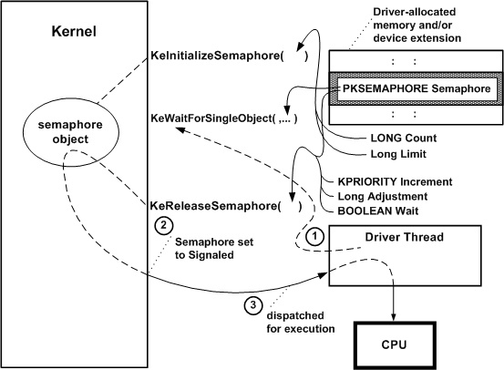

# Semaphore Objects

Any driver can use a semaphore object to synchronize operations between its driver-created threads and other driver routines. For example, a driver-dedicated thread might put itself into a wait state when there are no outstanding I/O requests for the driver, and the driver's dispatch routines might set the semaphore to the Signaled state just after they queue an IRP.

The dispatch routines of highest-level drivers, which are run in the context of the thread requesting an I/O operation, might use a semaphore to protect a resource shared among the dispatch routines. Lower-level driver dispatch routines for synchronous I/O operations also might use a semaphore to protect a resource shared among that subset of dispatch routines or with a driver-created thread.

Any driver that uses a semaphore object must call [**KeInitializeSemaphore**](https://msdn.microsoft.com/library/windows/hardware/ff552150) before it waits on or releases the semaphore. The following figure illustrates how a driver with a thread can use a semaphore object.

As the previous figure shows, such a driver must provide the storage for the semaphore object, which should be resident. The driver can use the [device extension](device-extensions.md) of a driver-created device object, the controller extension if it uses a [controller object](using-controller-objects.md), or nonpaged pool allocated by the driver.

When the driver's [*AddDevice*](https://msdn.microsoft.com/library/windows/hardware/ff540521) routine calls **KeInitializeSemaphore**, it must pass a pointer to the driver's resident storage for the semaphore object. In addition, the caller must specify a *Count* for the semaphore object, as shown in the previous figure, that determines its initial state (nonzero for Signaled).

The caller also must specify a *Limit* for the semaphore, which can be either of the following:

-   **Limit = 1**

    When this semaphore is set to the Signaled state, a single thread waiting for the semaphore to be reset to the Not-Signaled state becomes eligible for execution and can access whatever resource is protected by the semaphore.

    This type of semaphore is also called a *binary semaphore* because a thread either has or does not have exclusive access to the semaphore-protected resource.

-   **Limit &gt; 1**

    When this semaphore is set to the Signaled state, some number of threads waiting for the semaphore object to be set to the Not-Signaled state become eligible for execution and can access whatever resource is protected by the semaphore.

    This type of semaphore is called a *counting semaphore* because the routine that sets the semaphore to the Signaled state also specifies how many waiting threads can have their states changed from waiting to ready. The number of such waiting threads can be the *Limit* set when the semaphore was initialized or some number less than this preset *Limit*.

Few device or intermediate drivers have a single driver-created thread; even fewer have a set of threads that might wait for a semaphore to be acquired or released. Few system-supplied drivers use semaphore objects, and, of those that do, even fewer use a binary semaphore. Although a binary semaphore might seem to be similar in functionality to a [mutex object](mutex-objects.md), a binary semaphore does not provide the built-in protection against deadlocks that a mutex object has for system threads running in SMP machines.

After a driver with an initialized semaphore is loaded, it can synchronize operations on the semaphore that protects a shared resource. For example, a driver with a device-dedicated thread that manages the queuing of IRPs, such as the system floppy controller driver, might synchronize IRP queuing on a semaphore, as shown in the previous figure:

1.  The thread calls [**KeWaitForSingleObject**](https://msdn.microsoft.com/library/windows/hardware/ff553350) with a pointer to the driver-supplied storage for the initialized semaphore object to put itself into a wait state.

2.  IRPs begin to come in that require device I/O operations. The driver's dispatch routines insert each such IRP into an interlocked queue under spin-lock control and call [**KeReleaseSemaphore**](https://msdn.microsoft.com/library/windows/hardware/ff553143) with a pointer to the semaphore object, a driver-determined priority boost for the thread (*Increment*, as shown in the previous figure), an *Adjustment* of 1 that is added to the semaphore's Count as each IRP is queued, and a Boolean *Wait* set to **FALSE**. A nonzero semaphore Count sets the semaphore object to the Signaled state, thereby changing the waiting thread's state to ready.

3.  The kernel dispatches the thread for execution as soon as a processor is available: that is, no other thread with a higher priority is currently in the ready state and there are no kernel-mode routines to be run at a higher IRQL.

    The thread removes an IRP from the interlocked queue under spin-lock control, passes it on to other driver routines for further processing, and calls [**KeWaitForSingleObject**](https://msdn.microsoft.com/library/windows/hardware/ff553350) again. If the semaphore is still set to the Signaled state (that is, its Count remains nonzero, indicating that more IRPs are in the driver's interlocked queue), the kernel again changes the thread's state from waiting to ready.

    By using a counting semaphore in this manner, such a driver thread "knows" there is an IRP to be removed from the interlocked queue whenever that thread is run.

Calling [**KeReleaseSemaphore**](https://msdn.microsoft.com/library/windows/hardware/ff553143) with the *Wait* parameter set to **TRUE** indicates the caller's intention to immediately call a **KeWait*Xxx*Object**(s) support routine on return from **KeReleaseSemaphore**.

Consider the following guidelines for setting the *Wait* parameter to KeReleaseSemaphore:

A pageable thread or pageable driver routine that runs at IRQL PASSIVE\_LEVEL should never call **KeReleaseSemaphore** with the *Wait* parameter set to **TRUE**. Such a call causes a fatal page fault if the caller happens to be paged out between the calls to **KeReleaseSemaphore** and **KeWait*Xxx*Object**(s).

Any standard driver routine that runs at an IRQL greater than PASSIVE\_LEVEL cannot wait for a nonzero interval on any dispatcher objects without bringing down the system; see [Kernel Dispatcher Objects](kernel-dispatcher-objects.md) for details. However, such a routine can call **KeReleaseSemaphore** while running at an IRQL less than or equal to DISPATCH\_LEVEL.

For a summary of the IRQLs at which standard driver routines run, see [Managing Hardware Priorities](managing-hardware-priorities.md). For IRQL requirements of a specific support routine, see the routine's reference page.

 

 

