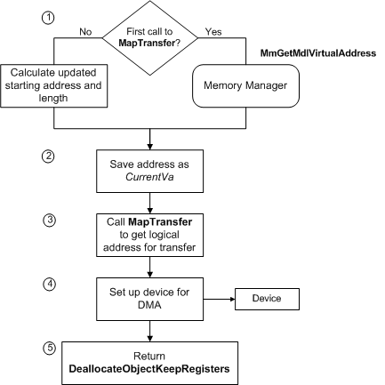

# Setting Up a Transfer Operation

When [**AllocateAdapterChannel**](https://msdn.microsoft.com/library/windows/hardware/ff540573) transfers control to a driver's [*AdapterControl*](https://msdn.microsoft.com/library/windows/hardware/ff540504) routine, it has allocated a set of map registers. However, the driver must map system physical memory for the current IRP's transfer request to the bus-master adapter's logical address range, as follows:

1.  Call [**MmGetMdlVirtualAddress**](https://msdn.microsoft.com/library/windows/hardware/ff554539) with the MDL at **Irp-&gt;MdlAddress** to get an index for the system physical address where the transfer should start.

    The return value is a required parameter (*CurrentVa*) to [**MapTransfer**](https://msdn.microsoft.com/library/windows/hardware/ff554402).

2.  Call **MapTransfer** to map the system physical address ranges for the IRP's buffer to the bus-master adapter's logical address range.

The driver can then set up the adapter for the transfer operation. The following figure shows the steps involved in setting up the transfer.

As the previous figure shows, a driver's *AdapterControl* routine sets up a bus-master DMA operation as follows:

1.  The *AdapterControl* routine gets the address at which to start the transfer. For the initial transfer required to satisfy an IRP, the *AdapterControl* routine calls [**MmGetMdlVirtualAddress**](https://msdn.microsoft.com/library/windows/hardware/ff554539), passing a pointer to the MDL at **Irp-&gt;MdlAddress**, which describes the buffer for this DMA transfer.

    **MmGetMdlVirtualAddress** returns a virtual address that the driver can use as an index for the system physical address where the transfer should start.

    If the IRP requires more than one transfer operation, the driver calculates an updated starting address, as described later in this section.

2.  The *AdapterControl* routine saves the address returned by **MmGetMdlVirtualAddress** or calculated in Step 1. This address is a required parameter (*CurrentVa*) to [**MapTransfer**](https://msdn.microsoft.com/library/windows/hardware/ff554402).

3.  The *AdapterControl* routine calls **MapTransfer**, which returns a logical address at which the driver can program the bus-master adapter to begin the transfer operation. In the call to **MapTransfer**, the driver supplies the following parameters:
    -   The adapter object pointer returned by [**IoGetDmaAdapter**](https://msdn.microsoft.com/library/windows/hardware/ff549220)

    -   A pointer to the MDL at **Irp-&gt;MdlAddress** for the current IRP

    -   The *MapRegisterBase* handle passed to the driver's *AdapterControl* routine by **AllocateAdapterChannel** (see [Allocating the Bus-Master Adapter Object](allocating-the-bus-master-adapter-object.md))

    -   The value returned by **MmGetMdlVirtualAddress** if this is the first call to **MapTransfer** for the current IRP

        Otherwise, the driver supplies an updated *CurrentVa* value, indicating the next physical-to-logical mapping to be done. (How to calculate an updated *CurrentVa* is described later in this section.)

    -   A pointer to a variable (*Length*), which indicates the number of bytes for this transfer

        If the driver has enough map registers to transfer all the requested data in a single DMA operation and has no device-specific constraints on its DMA operations, the *Length* can be set to the value of **Length** in the driver's I/O stack location of the IRP. At most, the input length in bytes can be (PAGE\_SIZE \* the *NumberOfMapRegisters* returned by **IoGetDmaAdapter**). Otherwise, the driver must split up the request, as explained in [Splitting Transfer Requests](splitting-dma-transfer-requests.md), and must update the value of *Length* in subsequent calls to **MapTransfer** for the current IRP.

    -   A Boolean value (*WriteToDevice*), indicating the direction of the transfer operation (TRUE to transfer data from memory to the device)

4.  The *AdapterControl* routine sets up the device for the DMA operation.

5.  The *AdapterControl* routine returns **DeallocateObjectKeepRegisters**.

If the driver must call **MapTransfer** more than once to satisfy the current IRP, it supplies the same adapter object pointer, *Mdl* pointer, *MapRegisterBase* handle, and transfer direction in every call to **MapTransfer**. However, the driver must supply updated *CurrentVa* and *Length* values in its second and subsequent calls to **MapTransfer**. Use the following formulas to calculate these values:

-   *CurrentVa* = *CurrentVa* + (*Length* requested in preceding call to **MapTransfer**)

-   *Length* = Minimum (remaining **Length** to be transferred, (PAGE\_SIZE \* *NumberOfMapRegisters* returned by **IoGetDmaAdapter**))

The context information each driver should maintain about its DMA transfers depends on the needs of its particular device. Typical context might include the current virtual address in the MDL (*CurrentVa*), the number of bytes transferred so far, the number of bytes remaining to transfer, and possibly a pointer to the current IRP.

For drivers of devices with scatter/gather capabilities, the *Length* parameter to **MapTransfer** is both an input and output parameter. On return from **MapTransfer**, it indicates how many bytes of data the system has mapped. That is, the return value of *Length*, in combination with the returned logical address, indicates the range of logical addresses the bus-master adapter can use for this piece of the transfer in this DMA operation.

**Note**   Since *Length* is overwritten by **MapTransfer**, follow this implementation guideline:
Never pass a pointer to the **Length** in the driver's I/O stack location of an IRP as the *Length* parameter to **MapTransfer** if your device supports scatter/gather.

Doing this could destroy the value in the current IRP, making it impossible to determine whether the driver has transferred all the requested data.

 

At the end of each DMA operation, the driver must call [**FlushAdapterBuffers**](https://msdn.microsoft.com/library/windows/hardware/ff545917) with a valid adapter object pointer and the *MapRegisterBase* handle to be sure that all the data has been transferred, and to release the physical-to-logical mappings for the current DMA operation. If the driver must set up additional DMA operations to satisfy the current IRP, it must call **FlushAdapterBuffers** after each transfer operation is complete.

When all the requested transfer is complete or the driver must return an error status for the IRP, the driver should call [**FreeMapRegisters**](https://msdn.microsoft.com/library/windows/hardware/ff546513) immediately after its last call to **FlushAdapterBuffers** in order to get the best possible throughput for the bus-master adapter. In its call to **FreeMapRegisters**, the driver must pass the adapter object pointer that it passed in the preceding call to **AllocateAdapterChannel**.

 

 

