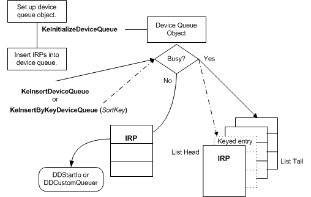

# Setting Up and Using Device Queues

A driver sets up a device queue object by calling [**KeInitializeDeviceQueue**](https://msdn.microsoft.com/library/windows/hardware/ff552126) at driver or device initialization. After starting its device(s), the driver inserts IRPs into this queue by calling [**KeInsertDeviceQueue**](https://msdn.microsoft.com/library/windows/hardware/ff552180) or [**KeInsertByKeyDeviceQueue**](https://msdn.microsoft.com/library/windows/hardware/ff552178). The following figure illustrates these calls.

As this figure shows, the driver must provide the storage for a device queue object, which must be resident. Drivers that set up a device queue object usually provide the necessary storage in the [device extension](device-extensions.md) of a driver-created device object, but the storage can be in a controller extension if the driver uses a [controller object](using-controller-objects.md) or in nonpaged pool allocated by the driver.

If the driver provides storage for the device queue object in a device extension, it calls **KeInitializeDeviceQueue** after creating the device object and before starting the device. In other words, the driver can initialize the queue from its [*AddDevice*](https://msdn.microsoft.com/library/windows/hardware/ff540521) routine or when it handles a PnP [**IRP\_MN\_START\_DEVICE**](https://msdn.microsoft.com/library/windows/hardware/ff551749) request. In the call to **KeInitializeDeviceQueue**, the driver passes a pointer to the storage it provides for the device queue object.

After starting its device(s), the driver can insert an IRP into its device queue by calling **KeInsertDeviceQueue**, which places the IRP at the tail of the queue, or **KeInsertByKeyDeviceQueue**, which places the IRP into the queue according to a driver-determined *SortKey* value, as shown in the previous figure.

Each of these support routines returns a Boolean value indicating whether the IRP was inserted into the queue. Each of these calls also sets the state of the device queue object to Busy if the queue is currently empty (Not-Busy). However, if the queue is empty (Not-Busy), neither **KeInsert*Xxx*DeviceQueue** routine inserts the IRP into the queue. Instead, it sets the state of the device queue object to Busy and returns **FALSE**. Because the IRP has not been queued, the driver must pass it on to another driver routine for further processing.

**When setting up supplemental device queues, follow this implementation guideline:**

When a call to **KeInsert*Xxx*DeviceQueue** returns **FALSE**, the caller must pass the IRP it attempted to queue on for further processing to another driver routine.
However, the call to **KeInsert*Xxx*DeviceQueue** changes the state of the device queue object to Busy, so the next IRP to come in is inserted in the queue unless the driver calls **KeRemove*Xxx*DeviceQueue** first.

When the device queue object's state is set to Busy, the driver can dequeue an IRP for further processing or reset the state to Not-Busy by calling one of the following support routines:

-   [**KeRemoveDeviceQueue**](https://msdn.microsoft.com/library/windows/hardware/ff553156) to remove the IRP at the head of the queue

-   [**KeRemoveByKeyDeviceQueue**](https://msdn.microsoft.com/library/windows/hardware/ff553152) to remove an IRP chosen according to a driver-determined *SortKey* value

-   [**KeRemoveEntryDeviceQueue**](https://msdn.microsoft.com/library/windows/hardware/ff553163) to remove a particular IRP in the queue or to determine whether a particular IRP is in the queue

    **KeRemoveEntryDeviceQueue** returns a Boolean indicating whether the IRP was in the device queue.

Calling any of these routines to remove an entry from a device queue that is empty but Busy changes the queue state to Not-Busy.

Each device queue object is protected by a built-in executive spin lock (not shown in the [Using a Device Queue Object](#ddk-setting-up-and-using-device-queues-kg) figure). As a result, a driver can insert IRPs into the queue and remove them in a multiprocessor-safe manner from any driver routine running at less than or equal to IRQL = DISPATCH\_LEVEL. Because of this IRQL restriction, a driver cannot call any **Ke*Xxx*DeviceQueue** routine from its ISR or [*SynchCritSection*](https://msdn.microsoft.com/library/windows/hardware/ff563928) routines, which run at DIRQL.

See [Managing Hardware Priorities](managing-hardware-priorities.md) and [Spin Locks](spin-locks.md) for more information. For IRQL requirements for a specific support routine, see the routine's reference page.

 

 

