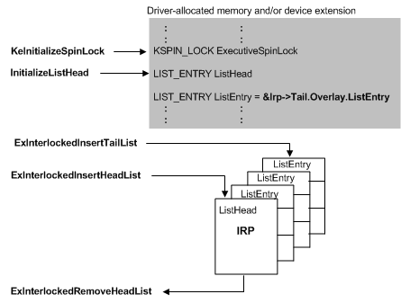

# Setting Up and Using Interlocked Queues

## 

New drivers should use the [cancel-safe IRP queue](cancel-safe-irp-queues.md) framework in preference to the methods outlined in this section.

Drivers with device-dedicated threads or drivers that use executive worker threads, such as most system FSDs, are the most likely types of drivers to manage their own run-time internal queuing of IRPs in an interlocked queue. All PnP drivers, including WDM drivers, also must queue certain IRPs internally while making PnP and power state transitions.

Usually, these drivers set up a doubly linked interlocked queue; every IRP contains a member of type [**LIST\_ENTRY**](https://msdn.microsoft.com/library/windows/hardware/ff554296), which a driver can use to doubly link IRPs that it is currently holding. A driver cannot requeue IRPs for retries if it sets up a singly linked interlocked queue.

### 

A driver must set up its interlocked queue at device initialization. The following figure illustrates a doubly linked interlocked queue, the support routines a driver must call to set up such a queue, and a set of **ExInterlocked*Xxx*** routines a driver can call to insert IRPs into and remove IRPs from the queue.

As this figure shows, a driver must provide the storage for the queue itself and for the following in order to set up a doubly linked interlocked queue:

-   An executive spin lock, which the driver must call [**KeInitializeSpinLock**](https://msdn.microsoft.com/library/windows/hardware/ff552160) to initialize. Usually, a driver initializes the spin lock when it sets up the device extension(s) for its device object(s) in its [*AddDevice*](https://msdn.microsoft.com/library/windows/hardware/ff540521) routine.

-   The list head for the queue, which the driver must initialize by calling [**InitializeListHead**](https://msdn.microsoft.com/library/windows/hardware/ff547799).

Most drivers that use doubly linked interlocked queues provide the necessary storage in the device extension of a driver-created device object. The queue and executive spin lock can instead be in a controller extension (if the driver uses a [controller object](using-controller-objects.md)) or in nonpaged pool allocated by the driver.

While the driver is accepting I/O requests, it can insert an IRP into its queue by calling either of the following support routines if the *ListHead* is of type **LIST\_ENTRY**, as shown in the previous figure:

[**ExInterlockedInsertTailList**](https://msdn.microsoft.com/library/windows/hardware/ff545402) to place the IRP at the end of the queue

[**ExInterlockedInsertHeadList**](https://msdn.microsoft.com/library/windows/hardware/ff545397) to place the IRP at the front of the queue. Drivers usually call this routine only when they must retry a particular request.

The driver must pass pointers to the IRP (*ListEntry*), as well the *ListHead* and executive spin lock (*Lock*) pointers that it previously initialized, to each of these **ExInterlockedInsert*Xxx*List** routines. Only pointers to the *ListHead* and *Lock* are required when the driver dequeues an IRP by calling [**ExInterlockedRemoveHeadList**](https://msdn.microsoft.com/library/windows/hardware/ff545427). To prevent deadlocks, the driver must not be holding an ExecutiveSpinLock that it passes to any **ExInterlocked*Xxx*** routine.

Because an interlocked queue is protected by the executive spin lock, the driver can insert IRPs into its doubly linked queue and remove them in a multiprocessor-safe manner from any driver routine running at less than or equal to IRQL = DISPATCH\_LEVEL.

A queue with a ListHead of type **LIST\_ENTRY**, as shown in the previous figure, is a doubly linked list. One with a ListHead of type [**SLIST\_HEADER**](https://msdn.microsoft.com/library/windows/hardware/ff563810) is a sequenced, singly linked list. A driver initializes the ListHead for a sequenced singly linked interlocked queue by calling [**ExInitializeSListHead**](https://msdn.microsoft.com/library/windows/hardware/ff545321).

A driver that never retries I/O operations can use [**ExInterlockedPushEntrySList**](https://msdn.microsoft.com/library/windows/hardware/ff545422) and [**ExInterlockedPopEntrySList**](https://msdn.microsoft.com/library/windows/hardware/ff545414) to manage its queuing of IRPs internally in a sequenced, singly linked interlocked queue. Any driver that uses this type of interlocked queue also must provide resident storage for a ListHead of type **SLIST\_HEADER** and for an ExecutiveSpinLock, as shown in the [previous figure](#ddk-using-an-interlocked-queue-kg). It must initialize the spin lock and set up its queue before calling **ExInterlockedPushEntrySList** to insert the initial entry into its queue.

For more information, see [Managing Hardware Priorities](managing-hardware-priorities.md) and [Spin Locks](spin-locks.md). For IRQL requirements for a specific support routine, see the routine's reference page.

 

 

--------------------
[Send comments about this topic to Microsoft](mailto:wsddocfb@microsoft.com?subject=Documentation%20feedback%20%5Bkernel\kernel%5D:%20Setting%20Up%20and%20Using%20Interlocked%20Queues%20%20RELEASE:%20%286/14/2017%29&body=%0A%0APRIVACY%20STATEMENT%0A%0AWe%20use%20your%20feedback%20to%20improve%20the%20documentation.%20We%20don't%20use%20your%20email%20address%20for%20any%20other%20purpose,%20and%20we'll%20remove%20your%20email%20address%20from%20our%20system%20after%20the%20issue%20that%20you're%20reporting%20is%20fixed.%20While%20we're%20working%20to%20fix%20this%20issue,%20we%20might%20send%20you%20an%20email%20message%20to%20ask%20for%20more%20info.%20Later,%20we%20might%20also%20send%20you%20an%20email%20message%20to%20let%20you%20know%20that%20we've%20addressed%20your%20feedback.%0A%0AFor%20more%20info%20about%20Microsoft's%20privacy%20policy,%20see%20http://privacy.microsoft.com/default.aspx. "Send comments about this topic to Microsoft")

