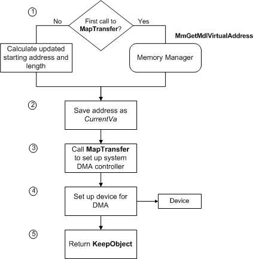

# Setting Up the System DMA Controller for Packet-Based DMA

When [**AllocateAdapterChannel**](https://msdn.microsoft.com/library/windows/hardware/ff540573) transfers control to a driver's [*AdapterControl*](https://msdn.microsoft.com/library/windows/hardware/ff540504) routine, the driver "owns" the system DMA controller and a set of map registers. Then, the driver must set up the DMA controller for a transfer operation, as shown in the following figure.

If the driver has a [*StartIo*](https://msdn.microsoft.com/library/windows/hardware/ff563858) routine, [**AllocateAdapterChannel**](https://msdn.microsoft.com/library/windows/hardware/ff540573) passes a pointer to **DeviceObject-&gt;CurrentIrp** in the *PIrp* parameter to the *AdapterControl* routine. If, however, the driver manages its own queue of IRPs, the driver should include a pointer to the current IRP as part of the context it passes to *AdapterControl*.

As the previous figure shows, the driver's *AdapterControl* routine sets up the DMA transfer, as follows:

1.  The *AdapterControl* routine gets the address at which to start the transfer. For the initial transfer required to satisfy an IRP, the *AdapterControl* routine calls [**MmGetMdlVirtualAddress**](https://msdn.microsoft.com/library/windows/hardware/ff554539), passing a pointer to the MDL at **Irp-&gt;MdlAddress**, which describes the buffer for this DMA transfer.

    **MmGetMdlVirtualAddress** returns a virtual address that the driver can use as an index for the system physical address where the transfer should start.

    If the IRP requires more than one transfer operation, the driver calculates an updated starting address, as described later in this section.

2.  The *AdapterControl* routine saves the address returned by **MmGetMdlVirtualAddress** or calculated in step 1. This address is a required parameter (*CurrentVa*) to [**MapTransfer**](https://msdn.microsoft.com/library/windows/hardware/ff554402).

3.  The *AdapterControl* routine calls **MapTransfer** to set up the system DMA controller, supplying the following parameters:

    -   The adapter object pointer returned by [**IoGetDmaAdapter**](https://msdn.microsoft.com/library/windows/hardware/ff549220)

    -   A pointer (*Mdl*) to the MDL at **Irp-&gt;MdlAddress** for the current IRP

    -   The *MapRegisterBase* handle passed to the driver's *AdapterControl* routine by **AllocateAdapterChannel**

    -   The value (*CurrentVa*) returned by **MmGetMdlVirtualAddress** if this is the first call to **MapTransfer** for the IRP

        Otherwise, the driver supplies an updated *CurrentVa* value, indicating where in the buffer the next transfer operation should start.

    -   A pointer to a variable (*Length*) indicating the number of bytes for this transfer

        If the driver can transfer all the requested data with a single call to **MapTransfer** and has no device-specific constraints on its DMA operations, *Length* can be set to the value of **Length** in the driver's I/O stack location of the IRP. At most, the length in bytes can be (PAGE\_SIZE \* the *NumberOfMapRegisters* returned by [**IoGetDmaAdapter**](https://msdn.microsoft.com/library/windows/hardware/ff549220)). Otherwise, the driver must split up the request, as explained in [Splitting Transfer Requests](splitting-dma-transfer-requests.md), and must update the value of *Length* in subsequent calls to **MapTransfer** for the current IRP.

    -   A Boolean value (*WriteToDevice*), indicating the direction of the transfer operation (TRUE to transfer data from system memory to the device)

    **MapTransfer** returns a logical address. Drivers that use system DMA must ignore this value.

4.  The *AdapterControl* routine sets up the device for the DMA operation.

5.  The *AdapterControl* routine returns **KeepObject**.

When the device indicates that its current DMA operation has completed, the driver should call [**FlushAdapterBuffers**](https://msdn.microsoft.com/library/windows/hardware/ff545917), usually from the driver's [*DpcForIsr*](https://msdn.microsoft.com/library/windows/hardware/ff544079) routine.

The *DpcForIsr* routine or another driver routine that completes a DMA operation calls **FlushAdapterBuffers** to ensure that any data cached in the system DMA controller is read into system memory or written out to the device. The same routine also must call **MapTransfer** again if it is necessary to reprogram the system DMA controller to transfer more data for the current IRP. Similarly, it must call **FlushAdapterBuffers** again following each transfer operation.

If a driver must call **MapTransfer** more than once for the current IRP, it supplies the same adapter object pointer, *Mdl* pointer, *MapRegisterBase* handle, and transfer direction in every call. However, the driver must update the *CurrentVa* and *Length* parameters before it makes the second and any subsequent calls to **MapTransfer**. To calculate an updated value for each of these parameters, use the following formulas:

-   *CurrentVa* = *CurrentVa* + (*Length* requested in the preceding call to **MapTransfer**)

-   *Length* = Minimum (remaining **Length** to be transferred, (PAGE\_SIZE \* *NumberOfMapRegisters* returned by **IoGetDmaAdapter**))

The context information each driver should maintain about its DMA transfers depends on the needs of its particular device. Typical context might include the current virtual address in the MDL (*CurrentVa*), the number of bytes transferred so far, the number of bytes remaining to transfer, possibly a pointer to the current IRP, and any other information the driver writer deems useful.

When the requested transfer is complete, or if the driver must return an error status for the IRP, the driver should call [**FreeAdapterChannel**](https://msdn.microsoft.com/library/windows/hardware/ff546507) promptly to release the system DMA controller for other drivers and this driver to use.

 

 

