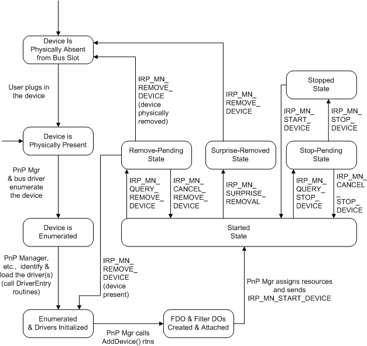

# State Transitions for PnP Devices

## 

On a PnP system, a device transitions through various PnP states as it is configured, started, possibly stopped to rebalance resources, and possibly removed. This section provides an overview of the PnP device states. The overview is a road map for much of the PnP support required in a driver. Other parts of this documentation describe each state transition in detail.

The following figure shows the PnP states for a device and how a device transitions from one state to another.

Starting at the top left of the previous figure, a PnP device is physically present in the system because either the user just inserted the device or the device was present at boot time. The device is not yet known to the system software.

To begin software configuration for the device, the PnP manager and the parent bus driver enumerate the device. The PnP manager, possibly with help from user-mode components, identifies the drivers for the device, including the function driver and any optional filter drivers. The PnP manager calls the [**DriverEntry**](https://msdn.microsoft.com/library/windows/hardware/ff544113) routine of each driver if the driver is not yet loaded. For more information about reporting and enumerating a PnP device, see [Adding a PnP Device to a Running System](adding-a-pnp-device-to-a-running-system.md).

Once a driver is initialized, it must be ready to initialize its devices. The PnP manager calls a driver's [*AddDevice*](https://msdn.microsoft.com/library/windows/hardware/ff540521) routine for each device the driver controls.

When a driver receives an [**IRP\_MN\_START\_DEVICE**](https://msdn.microsoft.com/library/windows/hardware/ff551749) request from the PnP manager, the driver starts the device and is ready to process I/O requests for the device. For information about handling an **IRP\_MN\_START\_DEVICE** request, see [Starting a Device](starting-a-device.md).

If the PnP manager must reconfigure the hardware resources of an active device, it sends [**IRP\_MN\_QUERY\_STOP\_DEVICE**](https://msdn.microsoft.com/library/windows/hardware/ff551725) and [**IRP\_MN\_STOP\_DEVICE**](https://msdn.microsoft.com/library/windows/hardware/ff551755) requests to the device's drivers. After it reconfigures the hardware resources, the PnP manager directs the drivers to restart the device by sending an [**IRP\_MN\_START\_DEVICE**](https://msdn.microsoft.com/library/windows/hardware/ff551749) request. For information about handling stop IRPs, see [Stopping a Device](stopping-a-device.md). (The drivers for a boot-configured device can receive **IRP\_MN\_QUERY\_STOP\_DEVICE** and **IRP\_MN\_STOP\_DEVICE** requests before the device has been started, although this step is not shown in the previous figure.)

On Windows 98/Me, the PnP manager also sends **IRP\_MN\_QUERY\_STOP\_DEVICE** and **IRP\_MN\_STOP\_DEVICE** requests when a device is being disabled. Drivers on these systems also receive an **IRP\_MN\_STOP\_DEVICE** request after a failed start.

When a PnP device is being physically removed from the system or has already been removed, the PnP manager sends various remove IRPs to the device's drivers, directing them to remove the device's software representation (device objects, and so forth). For information about handling remove IRPs, see [Removing a Device](removing-a-device.md).

At some point after all of a driver's devices have been removed, the PnP manager calls the driver's [*Unload*](https://msdn.microsoft.com/library/windows/hardware/ff564886) routine and unloads the driver.

 

 

--------------------
[Send comments about this topic to Microsoft](mailto:wsddocfb@microsoft.com?subject=Documentation%20feedback%20%5Bkernel\kernel%5D:%20State%20Transitions%20for%20PnP%20Devices%20%20RELEASE:%20%286/14/2017%29&body=%0A%0APRIVACY%20STATEMENT%0A%0AWe%20use%20your%20feedback%20to%20improve%20the%20documentation.%20We%20don't%20use%20your%20email%20address%20for%20any%20other%20purpose,%20and%20we'll%20remove%20your%20email%20address%20from%20our%20system%20after%20the%20issue%20that%20you're%20reporting%20is%20fixed.%20While%20we're%20working%20to%20fix%20this%20issue,%20we%20might%20send%20you%20an%20email%20message%20to%20ask%20for%20more%20info.%20Later,%20we%20might%20also%20send%20you%20an%20email%20message%20to%20let%20you%20know%20that%20we've%20addressed%20your%20feedback.%0A%0AFor%20more%20info%20about%20Microsoft's%20privacy%20policy,%20see%20http://privacy.microsoft.com/default.aspx. "Send comments about this topic to Microsoft")

