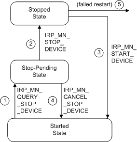

# Stopping a Device to Rebalance Resources

The following figure shows the sequence of IRPs involved in stopping and restarting a device to rebalance resources.

The following notes correspond to the circled numbers in the previous figure:

1.  The PnP manager issues an [**IRP\_MN\_QUERY\_STOP\_DEVICE**](https://msdn.microsoft.com/library/windows/hardware/ff551725) to ask whether the drivers for a device can stop the device and release its hardware resources.

    If all the drivers in the device stack return STATUS\_SUCCESS, the drivers have put the device into a state (stop-pending) from which the device can be quickly stopped.

    The PnP manager queries as many device stacks as necessary to rebalance the required resources.

2.  The PnP manager issues an [**IRP\_MN\_STOP\_DEVICE**](https://msdn.microsoft.com/library/windows/hardware/ff551755) to stop the device.

    On Windows 2000 and later versions of Windows, the PnP manager sends a stop IRP only if a previous query-stop IRP for the device completed successfully. In response to a stop IRP, drivers release the device's hardware resources (such as its I/O ports) and hold any IRPs that require access to the device.

3.  After successfully rebalancing resources, the PnP manager issues [**IRP\_MN\_START\_DEVICE**](https://msdn.microsoft.com/library/windows/hardware/ff551749) requests to restart any devices that it stopped during the rebalance.

4.  Otherwise, the PnP manager cancels a query-stop IRP by sending an [**IRP\_MN\_CANCEL\_STOP\_DEVICE**](https://msdn.microsoft.com/library/windows/hardware/ff550826).

    In response to an **IRP\_MN\_CANCEL\_STOP\_DEVICE**, the drivers for a device return the device to the started state and resume processing I/O requests for the device.

    The PnP manager cancels the query-stop for a device stack if one driver in the stack failed the request or if the overall rebalance operation failed and it is canceling all its query-stop requests. When the PnP manager cancels the query-stop on just one device stack, it sends the **IRP\_MN\_CANCEL\_STOP\_DEVICE** request because any drivers attached above the driver that failed the query have the device in the stop-pending state. When the **IRP\_MN\_CANCEL\_STOP\_DEVICE** succeeds, drivers have returned the device to the started state.

5.  If a driver fails to restart the device after rebalancing resources, the PnP manager sends remove IRPs to the device stack (on Windows 2000 and later versions of Windows).

    The PnP manager first sends an [**IRP\_MN\_SURPRISE\_REMOVAL**](https://msdn.microsoft.com/library/windows/hardware/ff551760) request. Then it sends an [**IRP\_MN\_REMOVE\_DEVICE**](https://msdn.microsoft.com/library/windows/hardware/ff551738) request, but only after all open handles to the device are closed.

Rebalancing the hardware resources of a PnP device must be transparent to applications and end users. Users might experience a temporary delay in operation, but data must not be lost. You must take that into consideration when you handle stop IRPs.

 

 

