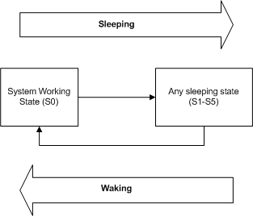

# System Power States

System power states describe the power consumption of the system as a whole. The operating system supports six system power states, referred to as S0 (fully on and operational) through S5 (power off). Each state is characterized by the following:

-   Power consumption: how much power does the computer use?

-   Software resumption: from what point does the operating system restart?

-   Hardware latency: how long does it take to return the computer to the working state?

-   System hardware context (such as the content of volatile processor registers, memory caches, and RAM): how much system hardware context is retained? Must the operating system reboot to return to the working state?

State S0 is the working state. States S1, S2, S3, and S4 are sleeping states, in which the computer appears off because of reduced power consumption but retains enough context to return to the working state without restarting the operating system. State S5 is the shutdown or off state.

A system is *waking* when it is in transition from the shutdown state (S5) or any sleeping state (S1-S4) to the working state (S0), and it is going to sleep when it is in transition from the working state to any sleep state or the shutdown state. The following figure shows the possible system power state transitions.

As the previous figure shows, the system cannot enter one sleep state directly from another; it must always enter the working state before entering any sleep state. For example, a system cannot transition from state S2 to S4, nor from state S4 to S2. It must first return to S0, from which it can enter the next sleep state. Because a system in an intermediate sleep state has already lost some operating context, it must return to the working state to restore that context before it can make an additional state transition.

 

 

