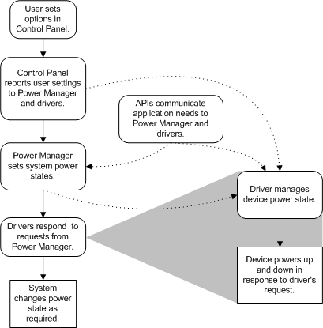

# System-Wide Overview of Power Management

Power management requires support from system and device hardware and from system software and drivers. Required hardware support is covered in the industry specifications, as described in the previous section. This topic covers the software support—specifically, what drivers must do to conform to operating system requirements and to manage power as appropriate for their devices.

The following figure shows a system-wide overview of power management.

Applications and users can affect power management decisions through Control Panel and by calling power management routines. Users can use Control Panel to set system and device power options, including custom power settings. Control Panel notifies the power manager and drivers of changes to the active power policy and associated power settings. Beginning with Windows Vista, the power manager notifies a driver by calling the [**power setting callback**](https://msdn.microsoft.com/library/windows/hardware/ff559727) that a driver registers to receive notifications. In Windows Server 2003, Windows XP, and Windows 2000, this notification is performed through WMI.

The power manager administers the system-wide *power policy*, the rules that govern the system's power usage. (For more information, see [System Power Policy](system-power-policy.md).) Using information from Control Panel and APIs, the power manager can determine when applications are using, or might need to use, various devices, so that it can adjust the system's power policy appropriately.

The power manager also provides an interface for drivers, comprising [power management support routines](https://msdn.microsoft.com/library/windows/hardware/ff559835), [power management minor IRPs](https://msdn.microsoft.com/library/windows/hardware/ff559822), and required driver entry points.

When the power manager requests a change to the system power state, drivers respond by putting their devices in an appropriate device power state. In addition, drivers can perform idle detection for their devices and put unused devices in a sleep state. Bus-specific mechanisms report device power capabilities, set and report device status, and change device power. Exactly how and when device power is changed depends on the type of device and the capabilities of the device hardware.

Although ACPI hardware realizes the greatest power savings, the hardware need not be ACPI-compliant for power management in drivers to be effective.

 

 

