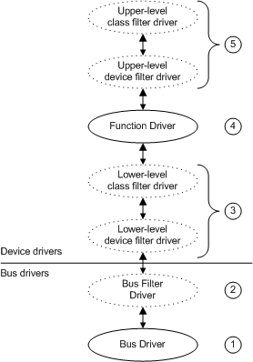

# Types of WDM Drivers

There are three kinds of WDM drivers: bus drivers, function drivers, and filter drivers.

-   A [bus driver](bus-drivers.md) drives an individual I/O bus device and provides per-slot functionality that is device-independent. Bus drivers also detect and report child devices that are connected to the bus.
-   A [function driver](function-drivers.md) drives an individual device.
-   A [filter driver](filter-drivers.md) filters I/O requests for a device, a class of devices, or a bus.

In this context, a *bus* is any device to which other physical, logical, or virtual devices are attached; a bus includes traditional buses such as SCSI and PCI, as well as parallel ports, serial ports, and i8042 ports.

It is important for driver developers to understand the different kinds of WDM drivers and to know which kind of driver they are writing. For example, whether a driver handles each [Plug and Play](implementing-plug-and-play.md) IRP and how to handle such IRPs depends on what kind of driver is being written (bus driver, function driver, or filter driver).

### 

The following figure shows the relationship between the bus driver, function driver, and filter drivers for a device.

Each device typically has a bus driver for the parent I/O bus, a function driver for the device, and zero or more filter drivers for the device. A driver design that requires many filter drivers does not yield optimal performance.

The drivers in the previous figure are the following:

1.  A *bus driver* services a bus controller, adapter, or bridge. Bus drivers are required drivers; there is one bus driver for each type of bus on a machine. Microsoft provides bus drivers for most common buses. IHVs and OEMs can provide other bus drivers.

2.  A *bus filter driver* typically adds value to a bus and is supplied by Microsoft or a system OEM. There can be any number of bus filter drivers for a bus.

3.  *Lower-level filter drivers* typically modify the behavior of device hardware. They are optional and are typically supplied by IHVs. There can be any number of lower-level filter drivers for a device.

4.  A *function driver* is the main driver for a device. A function driver is typically written by the device vendor and is required (unless the device is being used in [*raw mode*](https://msdn.microsoft.com/library/windows/hardware/ff556331#wdkgloss-raw-mode)).

5.  *Upper-level filter drivers* typically provide added-value features for a device. They are optional and are typically provided by IHVs.

The following topics describe the three general types of WDM drivers—bus drivers, function drivers, filter drivers—in detail. Also included is an example of WDM driver layering that uses sample USB drivers.

## In this section

-   [Bus Drivers](bus-drivers.md)
-   [Function Drivers](function-drivers.md)
-   [Filter Drivers](filter-drivers.md)
-   [WDM Driver Layers: An Example](wdm-driver-layers---an-example.md)

 

 

