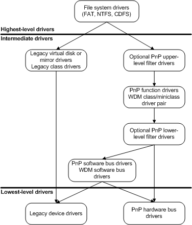

# Types of Windows Drivers

There are two basic types of Microsoft Windows drivers:

-   *User-mode drivers* execute in user mode, and they typically provide an interface between a Win32 application and kernel-mode drivers or other operating system components.

    For example, in Windows Vista, all printer drivers execute in user mode. For more information about printer driver components, see [Introduction to Printing](https://msdn.microsoft.com/library/windows/hardware/ff551767).

-   *Kernel-mode drivers* execute in kernel mode as part of the executive, which consists of kernel-mode operating system components that manage I/O, Plug and Play memory, processes and threads, security, and so on. Kernel-mode drivers are typically layered. Generally, higher-level drivers typically receive data from applications, filter the data, and pass it to a lower-level driver that supports device functionality.

    Some kernel-mode drivers are also *WDM drivers*, which conform to the [Windows Driver Model](windows-driver-model.md) (WDM). All WDM drivers support Plug and Play, and power management. WDM drivers are source-compatible (but not binary-compatible) across Windows 98/Me and Windows 2000 and later operating systems.

    Like the operating system itself, kernel-mode drivers are implemented as discrete, modular components that have a well-defined set of required functionalities. All kernel-mode drivers supply a set of system-defined [standard driver routines](https://msdn.microsoft.com/library/windows/hardware/ff563842).

The following figure divides kernel-mode drivers into several types.

As shown in the figure, there are three basic types of kernel-mode drivers in a driver stack: highest-level, intermediate, and lowest-level. Each type differs only slightly in structure but greatly in functionality:

1.  *Highest-level drivers*. Highest-level drivers include file system drivers (FSDs) that support file systems, such as:

    -   NTFS

    -   File allocation table (FAT)

    -   CD-ROM file system (CDFS)

    Highest-level drivers always depend on support from underlying lower-level drivers, such as intermediate-level function drivers and lowest-level hardware bus drivers.

2.  *Intermediate drivers*, such as a virtual disk, mirror, or device-type-specific [*class driver*](https://msdn.microsoft.com/library/windows/hardware/ff556274#wdkgloss-class-driver). Intermediate drivers depend on support from underlying lower-level drivers. Intermediate drivers are subdivided further as follows:

    -   [*Function drivers*](function-drivers.md) control specific peripheral devices on an I/O bus.

    -   [*Filter drivers*](filter-drivers.md) insert themselves above or below function drivers.

    -   *Software bus drivers* present a set of child devices to which still higher-level class, function, or filter drivers can attach themselves.

        For example, a driver that controls a multifunction adapter with an on-board set of heterogeneous devices is a software bus driver.

    -   Any system-supplied *class driver* that exports a system-defined class/miniclass interface is, in effect, an intermediate driver with one or more linked *miniclass drivers* (sometimes called *minidrivers*). Each linked class/minidriver pair provides functionality that is equivalent to that of a function driver or a software bus driver.

3.  *Lowest-level drivers* control an I/O bus to which peripheral devices are connected. Lowest-level drivers do not depend on lower-level drivers.

    -   Hardware [*bus drivers*](bus-drivers.md) are system-supplied and usually control dynamically configurable I/O buses.

        Hardware bus drivers work with the Plug and Play manager to configure and reconfigure system hardware resources, for all child devices that are connected to the I/O buses that the driver controls. These hardware resources include mappings for device memory and interrupt requests (IRQs). (Hardware bus drivers subsume some of the functionality that the HAL component provided in releases of the Windows NT-based operating system earlier than Windows 2000.)

    -   [*Legacy drivers*](https://msdn.microsoft.com/library/windows/hardware/ff556305#wdkgloss-legacy-driver) that directly control a physical device are lowest-level drivers.

 

 

