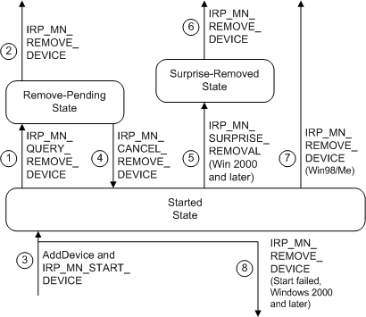

# Understanding When Remove IRPs Are Issued

## 

The following figure shows the typical sequence of IRPs involved in removing the drivers for a device.

The following notes correspond to the circled numbers in the previous figure:

1.  Query remove

    The PnP manager issues an [**IRP\_MN\_QUERY\_REMOVE\_DEVICE**](https://msdn.microsoft.com/library/windows/hardware/ff551705) to ask whether a device can be removed without disrupting the machine. It also sends this IRP when a user requests to update driver(s) for the device and (on Windows 2000 and later) when Device Manager disables the device. (On Windows 98/Me, the PnP manager sends stop IRPs in this situation; see [Stopping a Device](stopping-a-device.md) for details.)

    If all drivers in the device stack return STATUS\_SUCCESS, the drivers have put the device into the remove-pending state. In this state, the drivers must not start any operations that prevent the device from being removed.

    In this "clean" removal case, the PnP manager sends a query-remove IRP before it sends a remove IRP. See step 5 for a description of "surprise" removal.

    Although it is not shown in the above diagram, a bus driver might receive an **IRP\_MN\_QUERY\_REMOVE\_DEVICE** for a device that is not started. This can happen if a user requests to dynamically remove a device that is physically present on the machine but is disabled.

2.  Remove after successful query

    The PnP manager issues an [**IRP\_MN\_REMOVE\_DEVICE**](https://msdn.microsoft.com/library/windows/hardware/ff551738) to remove the drivers for a device.

    Drivers must succeed this request. The drivers for the device perform any necessary clean-up, detach from the device stack, and delete the FDO and any filter DOs. The parent bus driver retains the PDO until the user physically removes the device from the machine.

    Note that drivers might receive an [**IRP\_MN\_STOP\_DEVICE**](https://msdn.microsoft.com/library/windows/hardware/ff551755) prior to a remove IRP, but it is not required. On Windows 2000 and later, **IRP\_MN\_STOP\_DEVICE** is used only to pause a device for resource rebalancing; it is not a step toward removal. If a user removes the device hardware while the device is stopped, the PnP manager sends a remove IRP at some point after the stop IRP, but a stop is not a prerequisite for a remove.

3.  Reenumerate the device

    If the device is reenumerated after drivers have deleted their device objects, the PnP manager calls the drivers' [*AddDevice*](https://msdn.microsoft.com/library/windows/hardware/ff540521) routines and issues an [**IRP\_MN\_START\_DEVICE**](https://msdn.microsoft.com/library/windows/hardware/ff551749) to reinstate the device. (Also see the [Device States from the PnP Perspective](state-transitions-for-pnp-devices.md#ddk-state-transitions-for-pnp-devices-kg) figure.)

4.  Cancel a query remove

    The PnP manager issues an [**IRP\_MN\_CANCEL\_REMOVE\_DEVICE**](https://msdn.microsoft.com/library/windows/hardware/ff550823) to cancel a query-remove request.

    In response to an **IRP\_MN\_CANCEL\_REMOVE\_DEVICE**, the drivers return the device to its started state.

5.  Surprise remove (Windows 2000 and later versions of Windows)

    On Windows 2000 and later systems, if a user unplugs a device from the machine without using the Unplug or Eject Hardware program, the PnP manager sends an [**IRP\_MN\_SURPRISE\_REMOVAL**](https://msdn.microsoft.com/library/windows/hardware/ff551760) IRP.

    This case is called "surprise" removal because the drivers receive no advance warning.

    In response to an **IRP\_MN\_SURPRISE\_REMOVAL** IRP, the drivers for the device fail any outstanding I/O and release the hardware resources used by the device. The drivers must ensure that no components attempt to access the device because it is no longer present.

    All drivers must handle an **IRP\_MN\_SURPRISE\_REMOVAL** IRP and must set status to STATUS\_SUCCESS.

    An **IRP\_MN\_SURPRISE\_REMOVAL** cannot be canceled.

6.  Remove after surprise remove (Windows 2000 and later versions of Windows)

    When all open handles to the device are closed, the PnP manager sends an [**IRP\_MN\_REMOVE\_DEVICE**](https://msdn.microsoft.com/library/windows/hardware/ff551738) request to the drivers for the device. Each driver detaches from the device stack and deletes its device object.

7.  Surprise remove (Windows 98/Me)

    On Windows 98/Me, a driver does not receive an [**IRP\_MN\_SURPRISE\_REMOVAL**](https://msdn.microsoft.com/library/windows/hardware/ff551760) when a device is removed without warning. The PnP manager sends only an **IRP\_MN\_REMOVE\_DEVICE**. WDM drivers must have code to handle both an **IRP\_MN\_SURPRISE\_REMOVAL** followed by an **IRP\_MN\_REMOVE\_DEVICE** (the Windows 2000 and later behavior for surprise removal) and an **IRP\_MN\_REMOVE\_DEVICE** without a prior surprise-remove IRP (the Windows 98/Me behavior).

8.  Remove after a failed start (Windows 2000 and later)

    If one of the drivers for a device fails an **IRP\_MN\_START\_DEVICE**, the PnP manager sends an **IRP\_MN\_REMOVE\_DEVICE** request to the device stack. Such a remove IRP ensures that all drivers for the device are notified that the device was not successfully started. In response to the **IRP\_MN\_REMOVE\_DEVICE** IRP, the drivers for the device undo their start operations (if they succeeded the start IRP) and undo their *AddDevice* operations. The PnP manager marks such a device as "failed start."

    This behavior applies to Windows 2000 and later platforms only. On Windows 98/Me, the PnP manager sends an **IRP\_MN\_STOP\_DEVICE** in response to a failed start.

A driver for a PnP device can receive an **IRP\_MN\_SURPRISE\_REMOVAL** in more situations than those shown in the figure illustrating typical remove IRP transitions. For example, a user could insert a PC Card into the machine and then remove it before the device is started. In that case, the PnP manager issues a surprise-remove IRP after the drivers' *AddDevice* routines are called but before issuing the **IRP\_MN\_START\_DEVICE** request. A driver for a PnP device must be prepared to handle remove IRPs at any time after the driver's *AddDevice* routine is called.

 

 

--------------------
[Send comments about this topic to Microsoft](mailto:wsddocfb@microsoft.com?subject=Documentation%20feedback%20%5Bkernel\kernel%5D:%20Understanding%20When%20Remove%20IRPs%20Are%20Issued%20%20RELEASE:%20%286/14/2017%29&body=%0A%0APRIVACY%20STATEMENT%0A%0AWe%20use%20your%20feedback%20to%20improve%20the%20documentation.%20We%20don't%20use%20your%20email%20address%20for%20any%20other%20purpose,%20and%20we'll%20remove%20your%20email%20address%20from%20our%20system%20after%20the%20issue%20that%20you're%20reporting%20is%20fixed.%20While%20we're%20working%20to%20fix%20this%20issue,%20we%20might%20send%20you%20an%20email%20message%20to%20ask%20for%20more%20info.%20Later,%20we%20might%20also%20send%20you%20an%20email%20message%20to%20let%20you%20know%20that%20we've%20addressed%20your%20feedback.%0A%0AFor%20more%20info%20about%20Microsoft's%20privacy%20policy,%20see%20http://privacy.microsoft.com/default.aspx. "Send comments about this topic to Microsoft")

