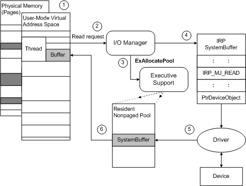

# Using Buffered I/O

A driver that services an interactive or slow device, or one that usually transfers relatively small amounts of data at a time, should use the [buffered I/O](methods-for-accessing-data-buffers.md) transfer method. Using buffered I/O for small, interactive transfers improves overall physical memory usage, because the memory manager does not need to lock down a full physical page for each transfer, as it does for drivers that request direct I/O. Generally, video, keyboard, mouse, serial, and parallel drivers request buffered I/O.

The I/O manager determines that an I/O operation is using buffered I/O as follows:

-   For [**IRP\_MJ\_READ**](https://msdn.microsoft.com/library/windows/hardware/ff550794) and [**IRP\_MJ\_WRITE**](https://msdn.microsoft.com/library/windows/hardware/ff550819) requests, DO\_BUFFERED\_IO is set in the **Flags** member of the [**DEVICE\_OBJECT**](https://msdn.microsoft.com/library/windows/hardware/ff543147) structure. For more information, see [Initializing a Device Object](initializing-a-device-object.md).

-   For [**IRP\_MJ\_DEVICE\_CONTROL**](https://msdn.microsoft.com/library/windows/hardware/ff550744) and [**IRP\_MJ\_INTERNAL\_DEVICE\_CONTROL**](https://msdn.microsoft.com/library/windows/hardware/ff550766) requests, the IOCTL code's value contains METHOD\_BUFFERED as the *TransferType* value in the IOCTL value. For more information, see [Defining I/O Control Codes](defining-i-o-control-codes.md).

The following figure illustrates how the I/O manager sets up an **IRP\_MJ\_READ** request for a transfer operation that uses buffered I/O.

The figure shows an overview of how drivers can use the **SystemBuffer** pointer in the IRP to transfer data for a read request, when a driver has ORed the device object's **Flags** with DO\_BUFFERED\_IO:

1.  Some range of user-space virtual addresses represents the current thread's buffer, and that buffer's contents might be stored somewhere within a range of page-based physical addresses (dark shading in the previous figure).

2.  The I/O manager services the current thread's read request, for which the thread passes a range of user-space virtual addresses representing a buffer.

3.  The I/O manager checks the user-supplied buffer for accessibility and calls [**ExAllocatePoolWithTag**](https://msdn.microsoft.com/library/windows/hardware/ff544520) to create a nonpaged system-space buffer (**SystemBuffer**) the size of the user-supplied buffer.

4.  The I/O manager provides access to the newly allocated **SystemBuffer** in the IRP it sends to the driver.

    If the figure showed a write request, the I/O manager would copy data from the user buffer into the system buffer before it sent the IRP to the driver.

5.  For the read request shown in the previous figure, the driver reads data from the device into the system-space buffer. The memory for this buffer is nonpaged and the driver can safely access the buffer without first locking it. When the read request has been satisfied, the driver calls [**IoCompleteRequest**](https://msdn.microsoft.com/library/windows/hardware/ff548343) with the IRP.

6.  When the original thread is again active, the I/O manager copies the read-in data from the system buffer into the user buffer. It also calls [**ExFreePool**](https://msdn.microsoft.com/library/windows/hardware/ff544590) to release the system buffer.

After the I/O manager has created a system-space buffer for the driver, the requesting user-mode thread can be swapped out and its physical memory can be reused by another thread, possibly by a thread belonging to another process. However, the system-space virtual address range supplied in the IRP remains valid until the driver calls [**IoCompleteRequest**](https://msdn.microsoft.com/library/windows/hardware/ff548343) with the IRP.

Drivers that transfer large amounts of data at a time, in particular, drivers that do multipage transfers, should not attempt to use buffered I/O. As the system runs, nonpaged pool can become fragmented so that the I/O manager cannot allocate large, contiguous system-space buffers to send in IRPs for such a driver.

Typically, a driver uses buffered I/O for some types of IRPs, such as [**IRP\_MJ\_DEVICE\_CONTROL**](https://msdn.microsoft.com/library/windows/hardware/ff550744) requests, even if it also uses [direct I/O](methods-for-accessing-data-buffers.md). Drivers that use direct I/O typically only do so for [**IRP\_MJ\_READ**](https://msdn.microsoft.com/library/windows/hardware/ff550794) and [**IRP\_MJ\_WRITE**](https://msdn.microsoft.com/library/windows/hardware/ff550819) requests, and possibly driver-defined [**IRP\_MJ\_INTERNAL\_DEVICE\_CONTROL**](https://msdn.microsoft.com/library/windows/hardware/ff550766) requests that require large data transfers.

Every **IRP\_MJ\_DEVICE\_CONTROL** and **IRP\_MJ\_INTERNAL\_DEVICE\_CONTROL** request includes an I/O control code. If the I/O control code indicates that the IRP must be supported by using buffered I/O, the I/O manager uses a single system buffer to represent the user application's input and output buffers. A driver that supports such an I/O control code must read input data (if any) from the buffer and then supply output data (if any) by overwriting the input data. For more information, see [Defining I/O Control Codes](defining-i-o-control-codes.md).

 

 

