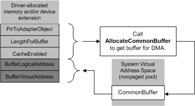

# Using Common-Buffer Bus-Master DMA

As described in [Using Bus-Master DMA](using-bus-master-dma.md), some drivers for bus-master DMA devices use common-buffer DMA exclusively, and some use common-buffer DMA in combination with packet-based DMA.

Use common-buffer DMA economically. Setting up a common buffer can tie up some (or all, depending on the size of the requested buffer) of the map registers associated with the adapter object that represents the bus-master adapter.

Setting up common-buffer areas economically, such as by using **PAGE\_SIZE** chunks or a single allocation, leaves more map registers available for packet-based DMA operations. It also leaves more system memory free for other purposes, which produces better overall driver and system performance.

To set up a common buffer for bus-master DMA, a bus-master DMA device driver must call [**AllocateCommonBuffer**](https://msdn.microsoft.com/library/windows/hardware/ff540575) with the adapter object pointer returned by [**IoGetDmaAdapter**](https://msdn.microsoft.com/library/windows/hardware/ff549220). Typically, a driver makes this call from its [*DispatchPnP*](https://msdn.microsoft.com/library/windows/hardware/ff543341) routine for [**IRP\_MN\_START\_DEVICE**](https://msdn.microsoft.com/library/windows/hardware/ff551749) requests. A driver should allocate a common buffer only if it will use the buffer repeatedly for its DMA operations while the driver remains loaded. The following diagram illustrates such a call to **AllocateCommonBuffer**.

The requested size for the buffer, shown in the previous diagram as LengthForBuffer, determines how many map registers must be used to provide a virtual-to-logical mapping for the common buffer. Use the [**BYTES\_TO\_PAGES**](https://msdn.microsoft.com/library/windows/hardware/ff540709) macro to determine the maximum number of pages needed (**BYTES\_TO\_PAGES** (*LengthForBuffer*)). This value cannot be greater than the *NumberOfMapRegisters* returned by [**IoGetDmaAdapter**](https://msdn.microsoft.com/library/windows/hardware/ff549220).

In addition, the caller must supply the following:

-   A Boolean value that indicates whether caching should be enabled

    **Note**    This value is ignored. The operating system determines whether to enable cached memory in the common buffer that is to be allocated. That decision is based on the processor architecture and device bus. 

    On computers with x86-based, x64-based, and Itanium-based processors, cached memory is enabled. 

    On computers with ARM or ARM 64-based processors, the operating system does not automatically enable cached memory for all devices. The system relies on the ACPI_CCA method for each device to determine whether the device is cache-coherent. 

-   A pointer to a driver-defined variable that will contain the device-accessible base *Logical Address* for the buffer (BufferLogicalAddress in the previous diagram) on return from **AllocateCommonBuffer**

If the call succeeds, **AllocateCommonBuffer** returns a driver-accessible base virtual address for the buffer (BufferVirtualAddress in the previous diagram), which the driver must save in its device extension, controller extension, or other driver-accessible resident storage area (nonpaged pool allocated by the driver).

**AllocateCommonBuffer** returns **NULL** if it cannot allocate memory for the buffer. If the returned base virtual address is **NULL**, the driver either must use the system's packet-based DMA support exclusively or the driver must fail the **IRP\_MN\_START\_DEVICE** request, returning STATUS\_INSUFFICIENT\_RESOURCES.

Otherwise, the driver can use the allocated common buffer as a driver- and adapter-accessible storage area for DMA transfers.

When the PnP manager sends an IRP that stops or removes the device, the driver must call [**FreeCommonBuffer**](https://msdn.microsoft.com/library/windows/hardware/ff546511) to release each common buffer it has allocated.

 

 

