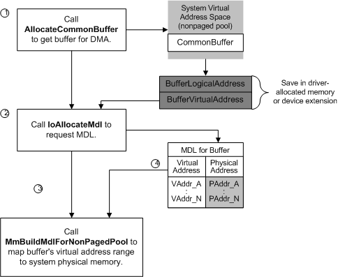

# Using Common-Buffer System DMA

A driver that uses a system DMA controller's auto-initialize mode must allocate memory for a buffer into which or from which DMA transfers can be carried out. The driver calls [**AllocateCommonBuffer**](/windows-hardware/drivers/ddi/wdm/nc-wdm-pallocate_common_buffer) to get this buffer, typically from the [*DispatchPnP*](/windows-hardware/drivers/ddi/wdm/nc-wdm-driver_dispatch) routine that handles an [**IRP\_MN\_START\_DEVICE**](./irp-mn-start-device.md) request. The following figure shows how a driver allocates the buffer and maps its virtual address range to system physical memory.

As the previous figure shows, a driver takes the following steps to allocate a buffer for system DMA:

1.  The driver calls [**AllocateCommonBuffer**](/windows-hardware/drivers/ddi/wdm/nc-wdm-pallocate_common_buffer), passing a pointer to the adapter object that was returned by [**IoGetDmaAdapter**](/windows-hardware/drivers/ddi/wdm/nf-wdm-iogetdmaadapter), along with the length in bytes requested for its buffer. To use memory economically, the input *Length* value for the buffer should either be less than or equal to PAGE\_SIZE or should be an integral multiple of PAGE\_SIZE.

2.  If **AllocateCommonBuffer** returns a **NULL** pointer, the driver should free any system resources it has already claimed and return STATUS\_INSUFFICIENT\_RESOURCES in response to the **IRP\_MN\_START\_DEVICE** request.

    Otherwise, **AllocateCommonBuffer** allocates the requested amount of memory in system virtual address space and returns two different types of pointers to that buffer:

    -   The *LogicalAddress* of the buffer (BufferLogicalAddress in the previous figure), for which the driver must provide storage but which it should ignore thereafter

    -   The virtual address of the buffer (BufferVirtualAddress in the previous figure), which the driver also must store so that it can build an MDL describing its buffer for DMA operations

    The driver should store these pointers in the device extension or other driver-allocated resident memory.

3.  The driver calls [**IoAllocateMdl**](/windows-hardware/drivers/ddi/wdm/nf-wdm-ioallocatemdl) to allocate an MDL for the buffer. The driver passes the *VirtualAddress* of the buffer returned by **AllocateCommonBuffer** and the *Length* of its buffer to allocate an MDL.

4.  The driver calls [**MmBuildMdlForNonPagedPool**](/windows-hardware/drivers/ddi/wdm/nf-wdm-mmbuildmdlfornonpagedpool) with the pointer returned by **IoAllocateMdl** to map the virtual address range for its resident buffer to system physical memory.

After allocating a common buffer and mapping its virtual address range, the driver of a subordinate device can begin to process an IRP that requests a DMA transfer. To do so, the driver calls the following general sequence of support routines:

1.  At the driver writer's discretion, [**RtlMoveMemory**](/windows-hardware/drivers/ddi/wdm/nf-wdm-rtlmovememory) to copy data from a locked-down user buffer into the driver-allocated common buffer for a transfer to the device

2.  **AllocateAdapterChannel** when the driver is ready to program its device for DMA and needs the system DMA controller

3.  [**MapTransfer**](/windows-hardware/drivers/ddi/wdm/nc-wdm-pmap_transfer), with the MDL that describes the driver-allocated common buffer, to set up the system DMA controller for the transfer operation

    Note that the driver calls **MapTransfer** only once to set up the system DMA controller to use its common buffer. During a transfer, the driver can call [**ReadDmaCounter**](/windows-hardware/drivers/ddi/wdm/nc-wdm-pread_dma_counter) to determine how many bytes remain to be transferred, and if necessary, call **RtlMoveMemory** to copy more data to or from a user buffer.

4.  [**FlushAdapterBuffers**](/windows-hardware/drivers/ddi/wdm/nc-wdm-pflush_adapter_buffers) when the driver has completed its DMA transfer to/from the subordinate device

5.  [**FreeAdapterChannel**](/windows-hardware/drivers/ddi/wdm/nc-wdm-pfree_adapter_channel) as soon as all the requested data has been transferred or if the driver must fail the IRP because of a device I/O error

The adapter object pointer returned by **IoGetDmaAdapter** is a required parameter to each of these support routines except **RtlMoveMemory**.

Individual drivers call this sequence of support routines at different points, depending on how each driver is implemented to service its device. For example, one driver's [*StartIo*](/windows-hardware/drivers/ddi/wdm/nc-wdm-driver_startio) routine might make the call to **AllocateAdapterChannel**, another driver might make this call from a routine that removes IRPs from a driver-created interlocked queue, and still another driver might make this call when its subordinate DMA device indicates it is ready to transfer data.

 

