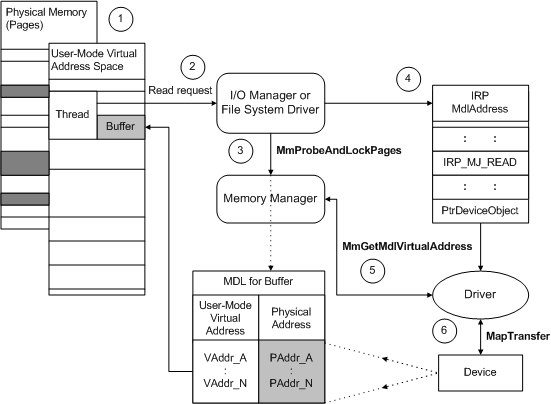

# Using Direct I/O with DMA

## 

The following figure illustrates how the I/O manager sets up an [**IRP\_MJ\_READ**](https://msdn.microsoft.com/library/windows/hardware/ff550794) request for a DMA transfer operation that uses direct I/O.

The previous figure illustrates how drivers can use the IRP's **MdlAddress** to transfer data for a read request. The driver in the figure uses packet-based system or bus-master DMA, and has ORed the device object's **Flags** with DO\_DIRECT\_IO.

1.  Some range of user-space virtual addresses represents the current thread's buffer, and that buffer's contents might actually be stored on some number of physically discontiguous pages (dark shading in the previous figure). The I/O manager creates an MDL to describe this buffer. An MDL is an opaque data structure, defined by the memory manager, that maps a particular virtual address range to one or more page-based physical address ranges. For more information, see [Using MDLs](using-mdls.md).

2.  The I/O manager services the current thread's read request, for which the thread passes a range of user-space virtual addresses that represent a buffer.

3.  The I/O manager or file system driver (FSD) checks the user-supplied buffer for accessibility and calls [**MmProbeAndLockPages**](https://msdn.microsoft.com/library/windows/hardware/ff554664) with the previously created MDL. **MmProbeAndLockPages** also fills in the corresponding physical address range in the MDL.

    As the previous figure shows, an MDL for a virtual range can have several corresponding page-based physical address entries, and the virtual range for a buffer might begin and end at some byte offset from the start of the first and last pages described by an MDL.

4.  The I/O manager provides a pointer to the MDL (**MdlAddress**) in an IRP that requests a transfer operation. Until the I/O manager or file system calls [**MmUnlockPages**](https://msdn.microsoft.com/library/windows/hardware/ff556381) after the driver completes the IRP, the physical pages described in the MDL remain locked down and assigned to the buffer. However, the virtual addresses in such an MDL can become invisible (and invalid), even before the IRP is sent to the device driver or to any intermediate driver that might be layered above the device driver.

5.  If the driver uses packet-based system or bus-master DMA, its [*AdapterControl*](https://msdn.microsoft.com/library/windows/hardware/ff540504) routine calls [**MmGetMdlVirtualAddress**](https://msdn.microsoft.com/library/windows/hardware/ff554539) with the IRP's **MdlAddress** pointer to get the base virtual address for the MDL's page-based entries.

6.  The *AdapterControl* routine then calls [**MapTransfer**](https://msdn.microsoft.com/library/windows/hardware/ff554402) with the base address returned by **MmGetMdlVirtualAddress**, to read data from the device directly into physical memory. (For more information, see [Adapter Objects and DMA](adapter-objects-and-dma.md).)

Drivers should always check buffer lengths. Note that the I/O manager does not create an MDL for a zero-length buffer.

 

 

--------------------
[Send comments about this topic to Microsoft](mailto:wsddocfb@microsoft.com?subject=Documentation%20feedback%20%5Bkernel\kernel%5D:%20Using%20Direct%20I/O%20with%20DMA%20%20RELEASE:%20%286/14/2017%29&body=%0A%0APRIVACY%20STATEMENT%0A%0AWe%20use%20your%20feedback%20to%20improve%20the%20documentation.%20We%20don't%20use%20your%20email%20address%20for%20any%20other%20purpose,%20and%20we'll%20remove%20your%20email%20address%20from%20our%20system%20after%20the%20issue%20that%20you're%20reporting%20is%20fixed.%20While%20we're%20working%20to%20fix%20this%20issue,%20we%20might%20send%20you%20an%20email%20message%20to%20ask%20for%20more%20info.%20Later,%20we%20might%20also%20send%20you%20an%20email%20message%20to%20let%20you%20know%20that%20we've%20addressed%20your%20feedback.%0A%0AFor%20more%20info%20about%20Microsoft's%20privacy%20policy,%20see%20http://privacy.microsoft.com/default.aspx. "Send comments about this topic to Microsoft")

