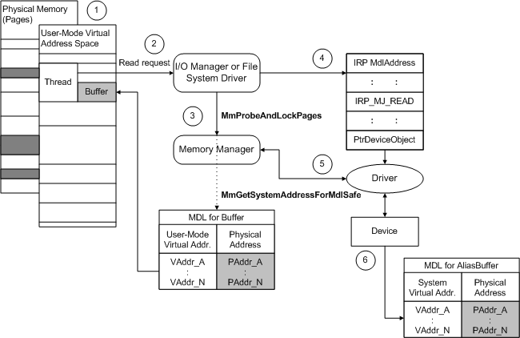

# Using Direct I/O with PIO

A driver that uses programmed I/O (PIO) rather than DMA must doubly map user-space buffers into a system-space address range. The following figure illustrates how the I/O manager sets up an [**IRP\_MJ\_READ**](https://msdn.microsoft.com/library/windows/hardware/ff550794) request for a PIO transfer operation that uses direct I/O.

The figure shows how a device that uses PIO handles the same task.

1.  Some range of user-space virtual addresses represents the current thread's buffer, and that buffer's contents might actually be stored on some number of physically discontiguous pages. If the buffer length is nonzero, the I/O manager creates an MDL to describe this buffer.

2.  The I/O manager services the current thread's read request, for which the thread passes a range of user-space virtual addresses representing a buffer.

3.  The I/O manager or FSD checks the user-supplied buffer for accessibility. If the I/O manager has created an MDL, it calls [**MmProbeAndLockPages**](https://msdn.microsoft.com/library/windows/hardware/ff554664) with an MDL, which specifies the range of virtual addresses for the user buffer. **MmProbeAndLockPages** also fills in the corresponding physical address range in the MDL.

4.  The I/O manager provides a pointer to the MDL (**MdlAddress**) in an IRP that requests a transfer operation. Until the I/O manager or file system calls [**MmUnlockPages**](https://msdn.microsoft.com/library/windows/hardware/ff556381) after the driver completes the IRP, the physical pages described in the MDL remain locked down and assigned to the buffer. However, the virtual addresses in such an MDL can become invisible (and invalid), even before the IRP is sent to the device driver or to any intermediate driver that might be layered above the device driver.

5.  If the driver requires system (virtual) addresses, the driver calls [**MmGetSystemAddressForMdlSafe**](https://msdn.microsoft.com/library/windows/hardware/ff554559) with the IRP's **MdlAddress** pointer to doubly map the user-space virtual addresses in the MDL to a system-space address range. In the figure above, AliasBuff represents the MDL that describes the doubly-mapped addresses.

6.  The driver uses the system-space virtual address range from the doubly mapped MDL (AliasBuff) to read data into memory.

When the driver completes the IRP by calling [**IoCompleteRequest**](https://msdn.microsoft.com/library/windows/hardware/ff548343), the I/O manager or file system releases the MDL's doubly mapped system-space range if the driver called **MmGetSystemAddressForMdlSafe**. The I/O manager or file system unlocks the pages described in the MDL, and disposes of the MDL and IRP on the driver's behalf. For better performance, drivers should avoid doubly mapping MDL physical addresses to system space, as described in step 3, unless they must use virtual addresses. Doing so uses system page-table entries unnecessarily and can decrease both driver performance and scalability. In addition, the system might crash if it runs out of page-table entries, because most older drivers cannot handle this situation.

The current user thread's buffers and the thread itself are guaranteed to be resident in physical memory only while that thread is current. For the thread shown in the previous figure, its user buffer's contents could be paged out to secondary storage while another process's threads are run. When another process's thread is run, the system physical memory for the requesting thread's buffer can be overwritten unless the memory manager has locked down and preserved the corresponding physical pages that contain the original thread's buffer.

However, the original thread's virtual addresses for its buffer do not remain visible while another thread is current, even if the memory manager preserves the buffer's physical pages. Consequently, drivers cannot use a virtual address returned by [**MmGetMdlVirtualAddress**](https://msdn.microsoft.com/library/windows/hardware/ff554539) to access memory. Callers of this routine must pass its results to [**MapTransfer**](https://msdn.microsoft.com/library/windows/hardware/ff554402) (along with the IRP's **MdlAddress** pointer) in order to transfer data using packet-based system or bus-master DMA.

 

 

