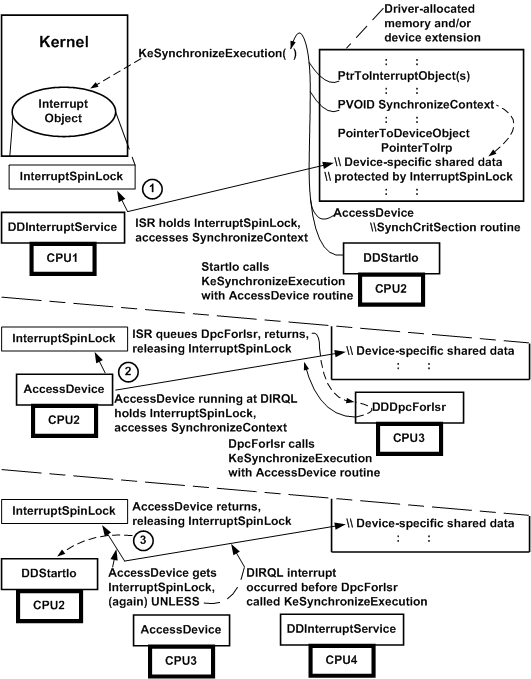

# Using Spin Locks: An Example

Minimizing the time that a driver holds spin locks can significantly improve both the performance of the driver and of the system overall. For example, consider the following figure, which shows how an interrupt spin lock protects device-specific data that must be shared between an ISR and the [*StartIo*](https://msdn.microsoft.com/library/windows/hardware/ff563858) and [*DpcForIsr*](https://msdn.microsoft.com/library/windows/hardware/ff544079) routines in an SMP machine.

1.  While the driver's ISR runs at DIRQL on one processor, its *StartIo* routine runs at DISPATCH\_LEVEL on a second processor. The kernel interrupt handler holds the InterruptSpinLock for the driver's ISR, which accesses protected, device-specific data, such as state or pointers to device registers (SynchronizeContext), in the driver's device extension. The *StartIo* routine, which is ready to access SynchronizeContext, calls [**KeSynchronizeExecution**](https://msdn.microsoft.com/library/windows/hardware/ff553302), passing a pointer to the associated interrupt objects, the shared SynchronizeContext, and the driver's [*SynchCritSection*](https://msdn.microsoft.com/library/windows/hardware/ff563928) routine (AccessDevice in the previous figure).

    Until the ISR returns, thereby releasing the driver's InterruptSpinLock, **KeSynchronizeExecution***spins* on the second processor, preventing AccessDevice from touching SynchronizeContext. However, **KeSynchronizeExecution** also raises IRQL on the second processor to the SynchronizeIrql of the interrupt objects, thereby preventing another device interrupt from occurring on that processor so that AccessDevice can be run at DIRQL as soon as the ISR returns. However, higher DIRQL interrupts for other devices, clock interrupts, and power-fail interrupts can still occur on either processor.

2.  When the ISR queues the driver's *DpcForIsr* and returns, AccessDevice runs on the second processor at the SynchronizeIrql of the associated interrupt objects and accesses SynchronizeContext. Meanwhile, the *DpcForIsr* is run on another processor at DISPATCH\_LEVEL IRQL. The *DpcForIsr* also is ready to access SynchronizeContext, so it calls **KeSynchronizeExecution** using the same parameters that the *StartIo* routine did in Step 1.

    When **KeSynchronizeExecution** acquires the spin lock and runs AccessDevice on behalf of the *StartIo* routine, the driver-supplied synchronization routine AccessDevice is given exclusive access to SynchronizeContext. Because AccessDevice runs at the SynchronizeIrql, the driver's ISR cannot acquire the spin lock and access the same area until the spin lock is released, even if the device interrupts on another processor while AccessDevice is executing.

3.  AccessDevice returns, releasing the spin lock. The *StartIo* routine resumes running at DISPATCH\_LEVEL on the second processor. **KeSynchronizeExecution** now runs AccessDevice on the third processor, so it can access SynchronizeContext on behalf of the *DpcForIsr*. However, if a device interrupt had occurred before the *DpcForIsr* called **KeSynchronizeExecution** in Step 2, the ISR might run on another processor before **KeSynchronizeExecution** could acquire the spin lock and run AccessDevice on the third processor.

As the previous figure shows, while a routine running on one processor holds a spin lock, every other routine trying to acquire that spin lock gets no work done. Each routine trying to acquire an already held spin lock simply spins on its current processor until the holder releases the spin lock. When a spin lock is released, one and only one routine can acquire it; every other routine currently trying to acquire the same spin lock will continue to spin.

The holder of any spin lock runs at a raised IRQL: either at DISPATCH\_LEVEL for an executive spin lock, or at a DIRQL for an interrupt spin lock. Callers of [**KeAcquireSpinLock**](https://msdn.microsoft.com/library/windows/hardware/ff551917) and **KeAcquireInStackQueuedSpinLock** run at DISPATCH\_LEVEL until they call [**KeReleaseSpinLock**](https://msdn.microsoft.com/library/windows/hardware/ff553145) or **KeReleaseInStackQueuedSpinLock** to release the lock. Callers of [**KeSynchronizeExecution**](https://msdn.microsoft.com/library/windows/hardware/ff553302) automatically raise IRQL on the current processor to the SynchronizeIrql of the interrupt objects until the caller-supplied *SynchCritSection* routine exits and **KeSynchronizeExecution** returns control. For more information, see [Calling Support Routines That Use Spin Locks](calling-support-routines-that-use-spin-locks.md).

**Keep in mind the following fact about using spin locks:**

All code that runs at a lower IRQL cannot get any work done on the set of processors occupied by a spin-lock holder and by other routines trying to acquire the same spin lock.

Consequently, minimizing the time a driver holds spin locks results in significantly better driver performance and contributes significantly to better overall system performance.

As the previous figure shows, the kernel interrupt handler executes routines running at the same IRQL in a multiprocessor machine on a first-come, first-served basis. The kernel also does the following:

-   When a driver routine calls **KeSynchronizeExecution**, the kernel causes the driver's *SynchCritSection* routine to run on the same processor from which the call to **KeSynchronizeExecution** occurred (see Steps 1 and 3).

-   When a driver's ISR queues its *DpcForIsr*, the kernel causes the DPC to run on the first available processor on which IRQL falls below DISPATCH\_LEVEL. This is not necessarily the same processor from which the [**IoRequestDpc**](https://msdn.microsoft.com/library/windows/hardware/ff549657) call occurred (see Step 2).

A driver's interrupt-driven I/O operations might tend to be serialized in a uniprocessor machine, but the same operations can be truly asynchronous in an SMP machine. As the previous figure shows, a driver's ISR could run on CPU4 in an SMP machine before its *DpcForIsr* begins processing an IRP for which the ISR has already handled a device interrupt on CPU1.

In other words, you should not assume that an interrupt spin lock can protect operation-specific data that the ISR saves when it runs on one processor from being overwritten by the ISR when a device interrupt occurs on another processor before the *DpcForIsr* or [*CustomDpc*](https://msdn.microsoft.com/library/windows/hardware/ff542972) routine runs.

Although a driver could try to serialize all interrupt-driven I/O operations to preserve data collected by the ISR, that driver would not run much faster in an SMP machine than in a uniprocessor machine. To get the best possible driver performance while remaining portable across uniprocessor and multiprocessor platforms, drivers should use some other technique to save operation-specific data obtained by the ISR for subsequent processing by the *DpcForIsr*.

For example, an ISR can save operation-specific data in the IRP it passes to the *DpcForIsr*. A refinement of this technique is to implement a *DpcForIsr* that consults an ISR-augmented count, processes the count's number of IRPs using ISR-supplied data, and resets the count to zero before returning. Of course, the count must be protected by the driver's interrupt spin lock because its ISR and a *SynchCritSection* would maintain its value dynamically.

 

 

