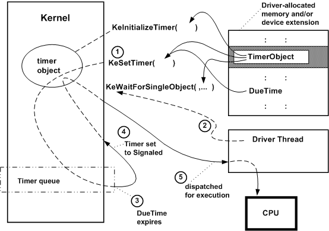

# Using Timer Objects

The following figure illustrates the use of a notification timer to set up a timeout interval for an operation and then wait while other driver routines process an I/O request.

As the previous figure shows, a driver must provide storage for the timer object, which must be initialized by a call to [**KeInitializeTimer**](https://msdn.microsoft.com/library/windows/hardware/ff552168) with a pointer to this storage. A driver typically makes this call from its [*AddDevice*](https://msdn.microsoft.com/library/windows/hardware/ff540521) routine.

Within the context of a particular thread, such as a driver-created thread or a thread requesting a synchronous I/O operation, the driver can wait for its timer object as shown in the previous figure:

1.  The thread calls [**KeSetTimer**](https://msdn.microsoft.com/library/windows/hardware/ff553286) with a pointer to the timer object and a given *DueTime* value, expressed in units of 100 nanoseconds. A positive value for *DueTime* specifies an absolute time at which the timer object should be removed from the kernel's timer queue and set to the Signaled state. A negative value for *DueTime* specifies an interval relative to the current system time.

    Note that the thread (or driver routine running in a system thread) passes a **NULL** pointer for the DPC object (shown previously in the figure illustrating [using timer and DPC objects for a CustomTimerDpc routine](registering-and-queuing-a-customtimerdpc-routine.md)) when it calls **KeSetTimer** if it waits on the timer object instead of queuing a [*CustomTimerDpc*](https://msdn.microsoft.com/library/windows/hardware/ff542983) routine.

2.  The thread calls [**KeWaitForSingleObject**](https://msdn.microsoft.com/library/windows/hardware/ff553350) with a pointer to the timer object, which puts the thread into a wait state while the timer object is in the kernel's timer queue.

3.  The given *DueTime* expires.

4.  The kernel dequeues the timer object, sets it to the Signaled state, and changes the thread's state from waiting to ready.

5.  The kernel dispatches the thread for execution as soon as a processor is available: that is, no other thread with a higher priority is currently in the ready state and there are no kernel-mode routines to be run at a higher IRQL.

Driver routines that run at IRQL &gt;= DISPATCH\_LEVEL can time out requests by using a timer object with an associated DPC object to queue a driver-supplied [*CustomTimerDpc*](https://msdn.microsoft.com/library/windows/hardware/ff542983) routine. Only driver routines that run within a nonarbitrary thread context can wait for a nonzero interval on a timer object, as shown in the previous figure.

Like every other thread, a driver-created thread is represented by a kernel thread object, which is also a dispatcher object. Consequently, a driver need not have its driver-created thread use a timer object to voluntarily put itself into a wait state for a given interval. Instead, the thread can call [**KeDelayExecutionThread**](https://msdn.microsoft.com/library/windows/hardware/ff551986) with a caller-supplied interval. For more information about this technique, see [Polling a Device](avoid-polling-devices.md).

[**DriverEntry**](https://msdn.microsoft.com/library/windows/hardware/ff544113), [*Reinitialize*](https://msdn.microsoft.com/library/windows/hardware/ff561022), and [*Unload*](https://msdn.microsoft.com/library/windows/hardware/ff564886) routines also run in a system thread context, so drivers can call **KeWaitForSingleObject** with a driver-initialized timer object or **KeDelayExecutionThread** while they are initializing or unloading. A device driver can call [**KeStallExecutionProcessor**](https://msdn.microsoft.com/library/windows/hardware/ff553295) for a very short interval (preferably something less than 50 microseconds) if it must wait for the device to update state during its initialization.

However, higher-level drivers generally use another synchronization mechanism in their [**DriverEntry**](https://msdn.microsoft.com/library/windows/hardware/ff544113) and [*Reinitialize*](https://msdn.microsoft.com/library/windows/hardware/ff561022) routines instead of using a timer object. Higher-level drivers should always be designed to layer themselves over any lower-level driver of a particular type or types of device. Therefore, a higher-level driver tends to become slow to load if it waits on a timer object or calls **KeDelayExecutionThread** because such a driver must wait for an interval long enough to accommodate the slowest possible device supporting it. Note also that a "safe" but minimum interval for such a wait is very difficult to determine.

Similarly, PnP drivers should not wait for other actions to occur, but instead should use the PnP manager's [notification](using-pnp-notification.md) mechanism.

 

 

