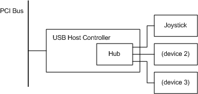
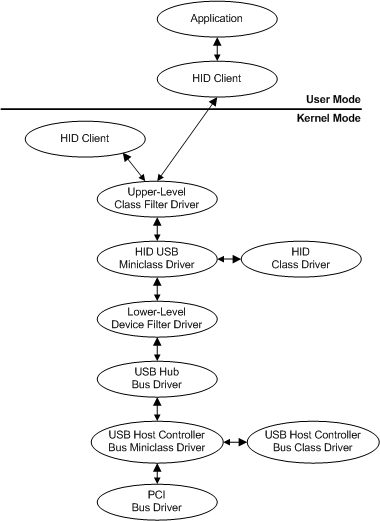

# WDM Driver Layers: An Example

This section describes a possible set of WDM drivers for USB hardware to illustrate WDM driver layers.

The following figure shows a sample PnP hardware configuration for a USB joystick.

In this figure, the USB joystick plugs into a port on a USB hub. The USB hub in this example resides on the USB Host Controller board and is plugged into the single port on the USB host controller board. The USB host controller plugs into a PCI bus. From a PnP perspective, the USB hub, the USB host controller, and the PCI bus are all bus devices because they each provide ports. The joystick is not a bus device.

The following figure shows a sample set of drivers that might be loaded for the USB joystick hardware in the previous figure.

Starting at the bottom of the previous figure, the drivers in the sample stack include:

-   A PCI driver that drives the PCI bus. This is a PnP bus driver. The PCI bus driver is provided with the system by Microsoft.

-   The bus driver for the USB host controller is implemented as a class/miniclass driver pair. The USB host controller class and miniclass drivers are provided with the system by Microsoft.

-   The USB hub bus driver that drives the USB hub. The USB hub driver is provided with the system by Microsoft.

-   Three drivers for the joystick device; one of them is a class/miniclass pair.

    The function driver, the main driver for the joystick device, is the HID class driver/HID USB miniclass driver pair. (HID represents "Human Interface Device".) The HID USB miniclass driver supports the USB-specific semantics of HID devices, relying on the HID class driver DLL for general HID support.

    A function driver can be specific to a particular device, or, as in the case of HID, a function driver can service a group of devices. In this example, the HID class driver/HID USB miniclass driver pair services any HID-compliant device in the system on a USB bus. A HID class driver/HID 1394 miniclass driver pair would service any HID-compliant device on a 1394 bus.

    A function driver can be written by the device vendor or by Microsoft. In this example, the function driver (the HID class/HID USB miniclass driver pair) is written by Microsoft.

    There are two filter drivers for the joystick device in this example: an upper-level class filter that adds a macro button feature and a lower-level device filter that enables the joystick to emulate a mouse device.

    The upper-level filter is written by someone who needs to filter the joystick I/O and the lower-level filter driver is written by the joystick vendor.

-   The kernel-mode and user-mode HID clients and the application are not drivers but are shown for completeness.

 

 

