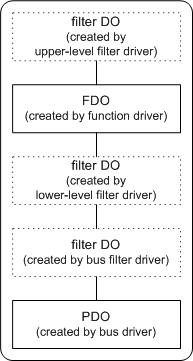

# When Are WDM Device Objects Created?

## 

This section describes each kind of device object and mentions when each is created.

The following figure shows the possible kinds of device objects that can be attached in a device stack, representing the drivers handling I/O requests for a device.

Starting at the bottom of this figure:

-   A bus driver creates a PDO for each device that it enumerates on its bus.

    A bus driver creates a PDO for a child device when it enumerates the device. A bus driver enumerates a device in response to an [**IRP\_MN\_QUERY\_DEVICE\_RELATIONS**](https://msdn.microsoft.com/library/windows/hardware/ff551670) request for **BusRelations** from the PnP manager. The bus driver creates a PDO for a child device if the device has been added to the bus since the last time the bus driver responded to a query-relations request for **BusRelations** (or if this is the first query-relations request since the machine was booted).

    A PDO represents the device to the bus driver, as well as to other kernel-mode system components such as the power manager, the PnP manager, and the I/O manager.

    Other drivers for a device attach device objects on top of the PDO, but the PDO is always at the bottom of the device stack.

-   Optional bus filter drivers create filter DOs for each device they filter.

    When the PnP manager detects a new device in a **BusRelations** list, it determines whether there are any bus filter drivers for the device. If so, for each such driver the PnP manager ensures it is loaded (calls [**DriverEntry**](https://msdn.microsoft.com/library/windows/hardware/ff544113) if necessary) and calls the driver's [*AddDevice*](https://msdn.microsoft.com/library/windows/hardware/ff540521) routine. If the bus filter driver filters operations for this device, the filter driver creates a device object and attaches it to the device stack in its *AddDevice* routine. If more than one bus filter driver exists and is relevant to this device, each such filter driver creates and attaches its own device object.

-   Optional, lower-level filter drivers create filter DOs for each device they filter.

    If an optional, lower-level filter driver exists for this device, the PnP manager ensures that such a driver is loaded after the bus driver and any bus filter drivers. The PnP manager calls the filter driver's *AddDevice* routine. In its *AddDevice* routine, the lower-level filter driver creates a filter DO for the device and attaches it to the device stack. If more than one lower-level filter driver exists, each such driver would create and attach its own filter DO.

-   The function driver creates an FDO for the device.

    The PnP manager ensures that the function driver for the device is loaded and calls the function driver's *AddDevice* routine. The function driver creates an FDO and attaches it to the device stack.

-   Optional, upper-level filter drivers create a filter DO for each device they filter.

    If any optional, upper-level filter drivers exist for the device, the PnP manager ensures they are loaded after the function driver and calls their *AddDevice* routines. Each such filter driver attaches its device object to the device stack.

In summary, the device stack contains a device object for each driver that is involved in handling I/O to a particular device. The parent bus driver has a PDO, the function driver has an FDO, and each optional filter driver has a filter DO.

Note that all devices, bus adapter/controller devices and nonbus devices, have a PDO and an FDO in their device stack. The PDO for a bus adapter/controller is created by the bus driver for the parent bus. For example, if a SCSI adapter plugs into a PCI bus, the PCI bus driver creates a PDO for the SCSI adapter.

If a device is being used in raw mode, there are no function or filter drivers (no FDO or filter DOs). There is just a PDO for the parent bus driver and zero or more bus filter DOs.

See [Creating a Device Object](creating-a-device-object.md) for information about which driver routines are responsible for creating and attaching device objects.

The device stack plus some additional information constitutes the *devnode* for a device. The PnP manager maintains information in a device's devnode such as whether the device has been started and which drivers, if any, have registered for notification of changes on the device. The kernel debugger command **!devnode** displays information about a devnode.

 

 

--------------------
[Send comments about this topic to Microsoft](mailto:wsddocfb@microsoft.com?subject=Documentation%20feedback%20%5Bkernel\kernel%5D:%20When%20Are%20WDM%20Device%20Objects%20Created?%20%20RELEASE:%20%286/14/2017%29&body=%0A%0APRIVACY%20STATEMENT%0A%0AWe%20use%20your%20feedback%20to%20improve%20the%20documentation.%20We%20don't%20use%20your%20email%20address%20for%20any%20other%20purpose,%20and%20we'll%20remove%20your%20email%20address%20from%20our%20system%20after%20the%20issue%20that%20you're%20reporting%20is%20fixed.%20While%20we're%20working%20to%20fix%20this%20issue,%20we%20might%20send%20you%20an%20email%20message%20to%20ask%20for%20more%20info.%20Later,%20we%20might%20also%20send%20you%20an%20email%20message%20to%20let%20you%20know%20that%20we've%20addressed%20your%20feedback.%0A%0AFor%20more%20info%20about%20Microsoft's%20privacy%20policy,%20see%20http://privacy.microsoft.com/default.aspx. "Send comments about this topic to Microsoft")

