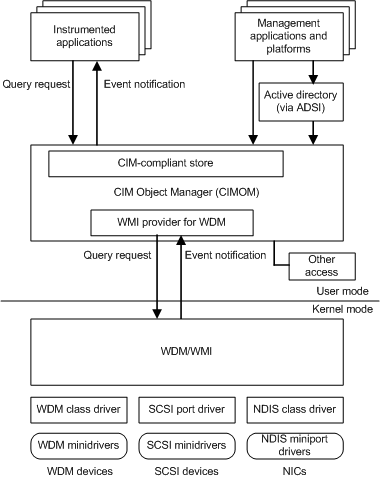

# WMI Architecture

To support WMI, your driver registers as a WMI provider. A WMI provider is a Win32 dynamic-link library (DLL) that handles WMI requests and supplies WMI instrumentation data. See [Registering as a WMI Data Provider](registering-as-a-wmi-data-provider.md) to learn how a driver registers as a WMI provider.

After your driver is registered as a WMI provider, WMI consumers then request data or invoke methods exposed by providers.

Query requests travel from user-mode consumers down to the WMI kernel-mode service, which in turn sends IRP requests to your driver.

For instance, when a WMI client requests a given data block, the WMI kernel component sends a query request to the driver to retrieve or set data. The driver handles WMI requests as described in [Handling WMI Requests](handling-wmi-requests.md).

The following figure shows this data flow:

 

 

